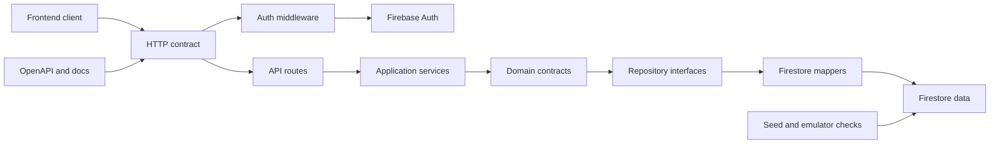
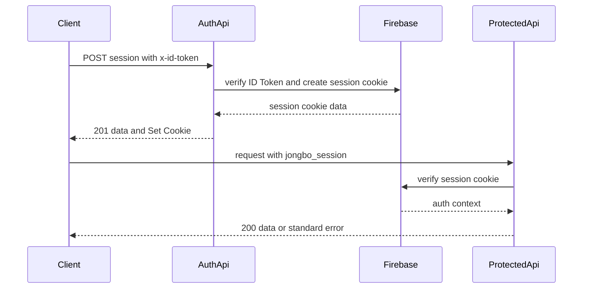

# 技術設計: backend-foundation

## 1. Overview

### Summary

現行BEのHono route、Zod入力検証、Firebase Admin SDK、Firestore repositoryを活かし、保存スキーマ、camelCase Domain/API DTO、session認証、error envelope、OpenAPI/Swagger、seed・index・Rulesを同じ契約から検証できる構成へ整理する。新しい業務計算層は追加せず、後続の `backend-integrity-lifecycle` が利用する境界を固定する。

### Goals

- リーグ内埋め込み `rule` をDB・Domain・APIの正本にする。
- League作成・更新時に `rule.uma` 合計0をBEで検証し、FEが同じ条件を表示検証できる契約を公開する。
- snake_case保存とcamelCase DTOの変換境界を一箇所にする。
- `x-id-token` によるsession交換と `jongbo_session` Cookieによる保護API認証を固定する。
- 成功、エラー、204、CORS、OpenAPI/Swaggerの契約を一致させる。
- seed、index、Rules、契約テストを同じ正本の検証資材として揃える。

### Non-Goals

- Session/Matchの業務制約、点数計算、順位・統計の再計算、削除ライフサイクル。
- FEのAPI client、adapter、画面、共通UI。
- 独立rule masterの導入、既存本番データの自動移行、リアルタイム同期。

## 2. Boundary Commitments

### This spec owns

- Firestoreのcollection/path、保存フィールド、埋め込みrule、IDとuser_stats論理キー。
- `rule.uma` の三麻・四麻別合計0不変条件と、League作成・更新時の検証エラー契約。
- Repository mapperとcamelCase Domain/API型の対応。
- Auth session endpoint、Cookie属性、保護API middleware、CORS、認証エラー。
- HTTP response/error/status、route schema、Hono RPC型、OpenAPI/Swaggerと静的API/auth文書。
- seed、Firestore index、Rules、契約テストの契約整合。

### Out of Boundary

- Match入力の三麻/四麻制約、raw score、point、rankの業務計算。
- Match/Session変更時のseason、league、user_stats集計と削除・active season遷移。
- FE型の生成後のadapter、画面状態、UIの具体的な実装。ただしFEが `rule.uma` 合計0違反を表示検証するための契約は本仕様で公開する。
- rule変更後に過去Matchを旧ruleで固定するか、再計算するか。
- 既存本番データのバックアップ・backfill・切り替え実行。

### Allowed Dependencies

| 方向 | 依存先 | Criticality | 契約 |
|---|---|---:|---|
| Inbound | Firebase Auth | P0 | ID Tokenをsession交換で検証する |
| Inbound | `backend-integrity-lifecycle` | P0 | League rule、DTO、repository境界を利用する |
| Inbound | `frontend-foundation-ui` | P0 | API DTO、Cookie、error envelope、AppType、uma合計0検証条件を利用する |
| Outbound | Firestore | P0 | snake_case正本を保存する |
| Outbound | Firebase Admin SDK | P0 | Auth検証と管理者Firestore接続を行う |
| External | Hono/Zod | P1 | HTTP routingと入力検証を担う |

### Revalidation Triggers

- `rule` のフィールド、snake/camel mapping、日時/null semanticsの変更。
- `rule.uma` 合計0の対象値、三麻・四麻のnull規則、validation error detailsの変更。
- 認証ヘッダー、Cookie名/属性、CORS origin、保護routeの変更。
- HTTP status、error code/details、成功 envelope、route schemaの変更。
- `user_stats` 論理キー、Firestore index、Rules、seed fieldの変更。
- OpenAPI schemaまたは `AppType` の変更。

## 3. Architecture

### Technology Alignment

| Layer | Existing technology | Role |
|---|---|---|
| Runtime/API | Hono `^4.12.7`, `@hono/node-server` `^1.19.4` | route、middleware、runtime entrypoint |
| Validation | Zod `^4.3.6`, `@hono/zod-validator` `^0.7.6` | request boundary validation |
| Auth/Data | Firebase Admin `^13.4.0`, Firestore | Auth verificationと永続化 |
| Language | TypeScript `^5.8.3` | Domain、route、contract types |
| Docs | OpenAPI 3.0.3, `@hono/swagger-ui` `^0.6.1` | runtime contract publication |

### Dependency Direction

`route schemas / response contracts → presentation routes and middleware → application services → domain types and repository interfaces → Firestore repositories and Firebase adapters`

Presentationはinfrastructureの具体実装を直接参照せず、dependencies composition rootだけが接続する。DomainはFirestoreのsnake_caseやHono Contextを参照しない。APIのcamelCase DTOを保存層へ持ち込まず、Repository mapperで変換する。



### Session Authentication Flow



## 4. Canonical Data Model

### Collection and Path Contract

| Resource | Canonical path | Storage responsibility | API/Domain form |
|---|---|---|---|
| User | `users/{userId}` | profile and timestamps | `User` |
| League | `leagues/{leagueId}` | name, embedded rule, counters, active season cache, league records | `LeagueSummary` / `LeagueDetail` |
| League member | `leagues/{leagueId}/members/{userId}` | membership snapshot | `LeagueMember` |
| Season | `leagues/{leagueId}/seasons/{seasonId}` | status, member snapshot, counters, standings, progressions, records | `SeasonSummary` / `SeasonDetail` |
| Session | `leagues/{leagueId}/seasons/{seasonId}/sessions/{sessionId}` | time, members, count, creator | `Session` |
| Match | `.../sessions/{sessionId}/matches/{matchId}` | match index, played time, result snapshot | `Match` |
| User stats | `user_stats/{statsId}` | derived aggregate read model | `UserStats` |

`rules/{ruleId}` は正本コレクションとして作成・参照しない。既存文書に残る場合は新規書き込みを行わず、移行計画の対象として検査する。

### Embedded League Rule

永続形は次のsnake_caseとし、API/Domainでは対応するcamelCaseを使う。

```text
rule.game_type: "sanma" | "yonma"
rule.uma.first: integer
rule.uma.second: integer
rule.uma.third: integer
rule.uma.fourth: integer | null
rule.oka.starting_points: integer
rule.oka.return_points: integer
```

`sanma` では `uma.fourth = null`、`yonma` では `uma.fourth` を必須とする。`scoreCalculation` は現在の公開契約に含めない。

### Rule Invariant and Point Calculation Relationship

- `yonma` の有効条件は `first + second + third + fourth = 0`、`sanma` の有効条件は `first + second + third = 0` かつ `fourth = null` とする。nullは合計に加算しない。
- BEはLeague create/updateの永続化前にこの条件を検証し、違反時は `validation_error` として全体を拒否する。nameやmemberだけが更新されるPATCHでruleが省略された場合は、既存ruleを再検証対象にせず、ruleが入力されたときだけこのvalidatorを実行する。
- API errorの標準形は次のとおりとする。

```json
{
  "error": {
    "code": "validation_error",
    "message": "rule.uma total must be 0",
    "details": {
      "field": "rule.uma",
      "gameType": "yonma",
      "expectedTotal": 0,
      "actualTotal": 10
    }
  }
}
```

- FEはこの同じ合計対象と `expectedTotal=0` を入力表示時に使い、field-levelの無効表示を行う。BEのerror responseはFE表示の補助情報であり、FEがBE検証を省略する根拠にはならない。
- `uma` はrank bonusのゼロサム成分、`oka` は別の補正、raw score合計は別の入力不変条件として扱う。`backend-integrity-lifecycle` が raw score保存条件と既存点数計算を満たす場合、point calculationは `uma` の合計0を前提に総ポイントのゼロサムを維持する。無効なumaを丸め、均等配分、補正して計算してはならない。

### User Stats Logical Key

| scopeType | `leagueId` | `seasonId` | canonical stats ID |
|---|---|---|---|
| `overall` | `null` | `null` | `overall_{userId}` |
| `league` | required | `null` | `league_{leagueId}_{userId}` |
| `season` | required | required | `season_{leagueId}_{seasonId}_{userId}` |

論理キーと文書IDの両方を検証し、一意キーが同じ書き込みは同じ文書を更新する。既存の自動ID文書は無承認で削除・改名しない。

### Mapping Rules

- Firestore timestampsは保存時にTimestamp、API出力時にISO 8601文字列へ変換する。
- `fourthCount`、`fourthRate`、`seasonRecords`、`leagueRecords`、`endedAt`、`activeSeason` の不在/NULLは契約で定めた `null` として返す。
- Mapperは不正な必須フィールドを黙って既定値へ変換せず、契約違反として検出する。既存データの互換読み取りが必要な場合は個別の明示ルールを追加する。
- API/Domainの型に `any` を使わず、エラーは判別可能な `ErrorCode` unionで表す。

### Index and Rules Contract

- `members` collection groupの `user_id ASC` を宣言する。
- `user_stats` の `user_id`、`scope_type`、`league_id`、`season_id` によるscope検索を宣言済みindexで支える。必要な組み合わせはrepository queryとEmulatorで検証する。
- `sessions` の `started_at`、`matches` の `match_index`、`seasons` の `created_at` の並び順が契約どおり動くことを検証する。
- 本番Rulesはデフォルト拒否とし、アプリはAdmin SDK経由でFirestoreを利用する。直接クライアントread/writeを許可するRulesは本仕様では作らない。

## 5. Components and Interfaces

### Component Summary

| Component | Intent | Requirements | Key dependency | Contracts |
|---|---|---|---|---|
| Canonical Contracts | Domain/API/storage shapeとrule invariantの意味を定義する | 1.1-1.3, 2.1-2.3, 8.1, 8.3, 8.4 | なし | Type, API |
| Rule Invariant Validator | League ruleのuma合計とvalidation detailsを判定し、点数計算の前提を公開する | 8.1, 8.2, 8.4 | Canonical Contracts | Service, API |
| Repository Mappers | snake_caseとcamelCase、Timestampを変換する | 1.1-1.4, 2.1-2.4 | Firestore | Service, Data |
| Session Auth Boundary | ID Token交換、Cookie、auth contextを管理する | 3.1-3.5, 5.4 | Firebase Auth | Service, API, State |
| HTTP Contract Boundary | route、validator、status、error envelopeを統一する | 4.1-4.5, 7.2 | Hono/Zod | API, Type |
| Contract Publication | OpenAPI、Swagger、静的文書、FE向けrule validation契約を同期する | 6.1-6.2, 7.3, 8.3 | HTTP Contract | API |
| Seed and Infrastructure | seed、index、Rulesの再現性を担保する | 1.4, 5.1-5.3, 6.2-6.3 | Firestore Emulator | Data, State |
| Contract Test Suite | 境界と後続仕様の回帰を検出する | 4.1-4.5, 7.1-7.3, 8.1-8.4 | 全コンポーネント | Test |

### Canonical Contracts

公開Domain型は既存の `User`、`LeagueSummary`、`LeagueDetail`、`SeasonSummary`、`SeasonDetail`、`Session`、`Match`、`UserStats` を正本とし、route responseはこれらを `{ data: T }` に包む。入力型はrouteごとのZod schemaから推論し、保存型はRepository境界に閉じ込める。

```ts
type ErrorCode =
  | "validation_error"
  | "authentication_error"
  | "forbidden"
  | "not_found"
  | "conflict"
  | "internal_error";

type ErrorEnvelope = {
  error: {
    code: ErrorCode;
    message: string;
    details: Record<string, unknown>;
  };
};

type DataEnvelope<T> = { data: T };

type UmaTotalValidationDetails = {
  field: "rule.uma";
  gameType: "sanma" | "yonma";
  expectedTotal: 0;
  actualTotal: number;
};

type AuthContext = {
  uid: string;
  email: string | null;
  name: string | null;
  emailVerified: boolean;
};
```

### Session Auth Boundary

```ts
type SessionExchangeResult = {
  authenticated: true;
  expiresAt: string;
};

interface SessionAuthService {
  exchangeIdToken(idToken: string): Promise<SessionExchangeResult>;
  verifySessionCookie(cookie: string): Promise<AuthContext>;
}
```

### Rule Invariant Validator

```ts
type LeagueRuleValidation =
  | { valid: true; total: 0 }
  | {
      valid: false;
      details: UmaTotalValidationDetails;
    };

interface LeagueRuleValidator {
  validateUmaTotal(rule: LeagueRule): LeagueRuleValidation;
}
```

`LeagueRuleValidator` はDomainの純粋な契約判定とし、League create/update serviceがRepository writeより前に呼び出す。Zod schemaのshape検証と、Domain validatorのsum検証を別の責務として保持し、同じ入力が異なる層で別判定にならないようにする。FEはこの判定結果の意味をミラーし、runtime共有コードの導入は `frontend-foundation-ui` の境界で決める。

- `POST /api/auth/session` はbodyではなく `x-id-token` ヘッダーを入力とする。
- `jongbo_session` は `path=/`、`httpOnly=true`、`sameSite=lax`、productionのみ `secure=true`、既定寿命5日とする。正の環境変数で寿命を上書きできる。
- `DELETE /api/auth/session` はCookieを削除し、`204 No Content`を返す。
- 保護API middlewareはCookieのみを検証し、ID Tokenヘッダーをfallbackにしない。
- Firebase SDKの内部エラー、受信Token、Cookie値はレスポンスdetailsと通常ログから除外する。

### HTTP Contract Boundary

| Group | Routes | Auth |
|---|---|---|
| Health | `GET /api/health` | public |
| Auth | `POST/DELETE /api/auth/session` | public |
| Docs | `GET /doc`, `GET /ui` | public |
| Users | search, me, user, joining seasons, stats | session cookie |
| Leagues | list/create/get/update/members/delete | session cookie |
| Seasons | list/create/get/update/members/delete | session cookie |
| Sessions | list/create/get/update/delete | session cookie |
| Matches | list/create/get/update/delete | session cookie |

成功statusはGET=200、作成POST=201、JSONを返すPATCH=200、削除=204とする。Validationはroute boundaryで実行し、error handlerは全失敗をErrorEnvelopeへ正規化する。`console.error`等へは認証情報を渡さず、予期しない障害の外部messageは `internal_error` に置き換える。

League create/updateでは、`rule` が入力された場合に `LeagueRuleValidator` をservice writeの前提として実行する。`actualTotal !== 0` の場合は400 `validation_error`、`details.field = "rule.uma"`、`expectedTotal = 0`、実際の合計を返し、League全体を保存しない。

`createApp` の `AppType = ReturnType<typeof createApp>` をHono RPCの契約入口とし、手書きの別API型を作らない。FEは `frontend-foundation-ui` でこの契約から必要な型を参照する。

### Contract Publication

- `/doc` は公開route、request schema、response schema、security scheme、status、error responseを含むOpenAPI 3.0.3を返す。
- `/ui` は `/doc` と同じruntime documentを表示する。
- `backend/docs/api-reference.md` と `backend/docs/auth-design.md` はヘッダー/Cookie方式、全route、status、error envelopeをruntime documentと一致させる。
- `backend/docs/firestore.yaml` は実際の保存正本のみを記載し、独立 `rules` collectionを正本として残さない。

## 6. File Structure Plan

### Existing files to modify

| Component | Path | Responsibility |
|---|---|---|
| Seed and Infrastructure | `backend/docs/firestore.yaml` | Firestore canonical schema |
| Contract Publication | `backend/docs/api-design.md` | API responsibility and data contract |
| Contract Publication | `backend/docs/api-reference.md` | Endpoint examples and status/error contract |
| Session Auth Boundary | `backend/docs/auth-design.md` | Auth and Cookie lifecycle |
| Seed and Infrastructure | `backend/firestore.indexes.json` | Required Firestore indexes |
| Seed and Infrastructure | `backend/firestore.rules` | Default-deny production Rules |
| Canonical Contracts | `backend/src/domain/*/types.ts` | camelCase Domain types and nullable semantics |
| Rule Invariant Validator | `backend/src/domain/league/rule.ts` | `rule.uma` sum validation and typed validation details |
| HTTP Contract Boundary | `backend/src/domain/shared/errors.ts` | typed error codes and safe details |
| Repository Mappers | `backend/src/infrastructure/firestore/utils.ts` | timestamp and persistence conversion helpers |
| Repository Mappers | `backend/src/infrastructure/firestore/repositories/*.ts` | entity-specific mapping and canonical writes |
| HTTP Contract Boundary | `backend/src/presentation/app.ts` | CORS, public/protected route registration, error normalization |
| Session Auth Boundary | `backend/src/presentation/middleware/auth.ts` | Cookie-only protected API auth |
| Session Auth Boundary | `backend/src/presentation/session.ts` | Cookie name and attributes |
| HTTP Contract Boundary | `backend/src/presentation/response.ts` | data/error response helpers |
| Contract Publication | `backend/src/presentation/openapi.ts` | runtime OpenAPI document |
| HTTP Contract Boundary | `backend/src/presentation/schemas/*.ts` | request validation schemas |
| HTTP Contract Boundary | `backend/src/presentation/routes/*.ts` | route-level contract wiring |
| Seed and Infrastructure | `backend/src/scripts/seedFirestore.ts` | canonical emulator/auth/Firestore seed |
| Session Auth Boundary | `backend/src/presentation/bindings.ts` | typed AuthContext binding |
| HTTP Contract Boundary | `backend/src/presentation/dependencies.ts` | composition root for interfaces and adapters |

### New files to add

| Component | Path | Responsibility |
|---|---|---|
| HTTP Contract Boundary | `backend/src/presentation/contracts.ts` | shared ErrorCode and envelope types used by response/OpenAPI/tests |
| Contract Test Suite | `backend/test/contracts/data-contract.test.ts` | mapper, null, timestamp, user_stats uniqueness tests |
| Contract Test Suite | `backend/test/contracts/auth-contract.test.ts` | session exchange, Cookie, protected route, CORS tests |
| Contract Test Suite | `backend/test/contracts/http-contract.test.ts` | status, envelope, route auth matrix, OpenAPI checks |
| Contract Test Suite | `backend/test/contracts/emulator-contract.test.ts` | seed, index, Rules, and representative query checks |

Each file has one boundary owner. `backend/src/presentation/dependencies.ts` is the only composition point allowed to connect application services to Firestore implementations.

## 7. Integration and Migration Notes

### Implementation order

1. Define canonical contracts and safe error types.
2. Align repository mappers, user_stats logical key, index, and seed fixtures.
3. Fix session exchange/middleware/CORS and normalize response handling.
4. Update runtime/static contract documents and Hono RPC exposure.
5. Run contract tests against unit fixtures and Emulator.

### Migration safety

- Existing production data is read-only input until backup and a migration plan are approved.
- Do not delete `rules` documents, rewrite IDs, or delete duplicate stats automatically in this spec.
- Before enabling canonical `user_stats` writes, inspect legacy auto-ID records and choose compatible read, backfill, or rollback behavior.
- If any existing record cannot be mapped without guessing, stop deployment and create a migration decision rather than defaulting a field.

## 8. Testing Strategy

| Test | Verifies | Requirements |
|---|---|---|
| Mapper contract | all entity fields, embedded rule, snake/camel, Timestamp/ISO, null values | 1.1-1.4 |
| Rule invariant contract | League create/update rejects non-zero uma total, returns field/expected/actual details, and does not partially persist | 8.1-8.2 |
| Stats uniqueness | logical key lookup and repeated upsert do not create duplicates | 2.1-2.4 |
| Auth integration | valid header exchange, invalid/missing token, Cookie attributes, Cookie-only protected routes, logout 204 | 3.1-3.5 |
| HTTP contract | data/error envelope, status matrix, validation before service, League uma validation, route auth matrix | 4.1-4.5, 8.1-8.2 |
| Infrastructure smoke | seed shape, required queries/indexes, default-deny Rules, no separate rule source | 5.1-5.4, 6.2-6.3 |
| Documentation contract | `/doc` and `/ui` route/schema/security entries match static docs and AppType | 6.1-6.2, 7.2 |
| Handoff regression | canonical fixtures, FE uma display validation, and point calculation preconditions remain consumable by downstream BE and FE boundaries | 7.1-7.3, 8.3-8.4 |

Tests must not log tokens or service account data. Production data is never used as a test fixture; Emulator and in-memory contract fixtures are used instead.

## 9. Open Questions and Risks

- `backend-integrity-lifecycle` must decide whether a league rule is immutable after the first Match and how old Match results are recalculated. This is a downstream gate, not an assumption hidden in this design.
- `backend-integrity-lifecycle` must preserve `uma` zero-sum as a point calculation precondition, keep `oka` and raw score invariants separate, and verify total point conservation with its existing formula.
- If FE later needs direct Firestore access, this design's default-deny Rules must be replaced by an explicit document-level authorization matrix and revalidated with `frontend-foundation-ui`.
- If configurable rounding/score calculation is required, add a new requirement and extend the embedded rule contract before touching downstream calculation code.

## 10. Requirements Traceability

| Requirement | Summary | Components | Interfaces / Flows |
|---|---|---|---|
| 1.1, 1.2, 1.3, 1.4 | canonical data, embedded rule, mapping, seed | Canonical Contracts, Repository Mappers, Seed and Infrastructure | persistence flow |
| 2.1, 2.2, 2.3, 2.4 | stats key and migration safety | Canonical Contracts, Repository Mappers | User Stats Logical Key |
| 3.1, 3.2, 3.3, 3.4, 3.5 | auth lifecycle and CORS | Session Auth Boundary, HTTP Contract Boundary | Session Authentication Flow |
| 4.1, 4.2, 4.3, 4.4, 4.5 | API envelope, status, validation, route surface | HTTP Contract Boundary | route matrix |
| 5.1, 5.2, 5.3, 5.4 | indexes, Rules, access, logging | Repository Mappers, Session Auth Boundary, Seed and Infrastructure | Index and Rules Contract |
| 6.1, 6.2, 6.3 | docs and seed synchronization | Contract Publication, Seed and Infrastructure | `/doc`, `/ui`, seed |
| 7.1, 7.2, 7.3 | contract tests and downstream handoff | Contract Test Suite, Contract Publication | Hono RPC and handoff regression |
| 8.1, 8.2, 8.3, 8.4 | uma total invariant, API error, FE mirror validation, point calculation precondition | Rule Invariant Validator, HTTP Contract Boundary, Contract Test Suite | League create/update flow and downstream handoff |
