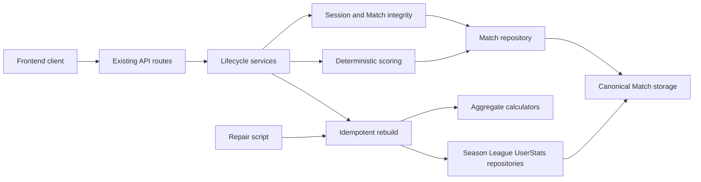
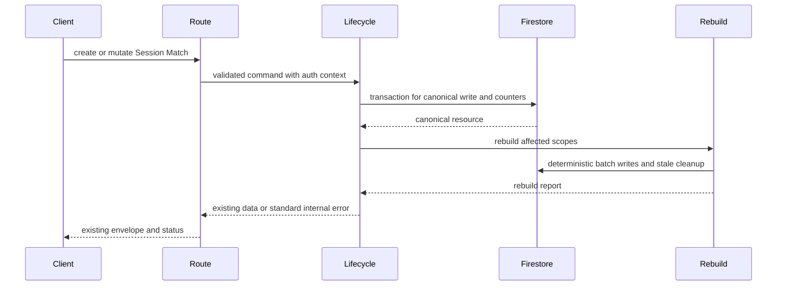
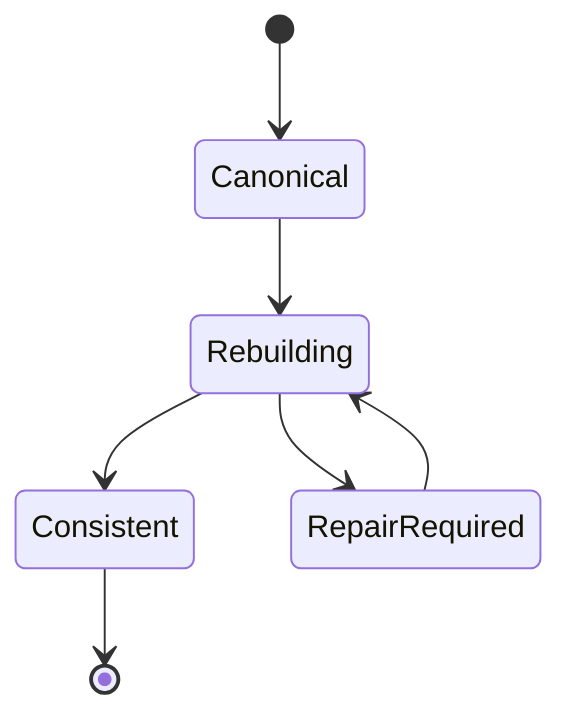

# 技術設計: backend-integrity-lifecycle

## 1. Overview

### Summary

現行の `SessionService`、`MatchService`、`SeasonService`、`LeagueService`、`StatsRebuilder`、scoring/aggregation domain、Firestore repositoryを拡張し、canonical Matchを唯一の対局結果ソースとするライフサイクルを構成する。Sessionの固定参加者と三麻/四麻制約を境界で検証し、Match writeをtransactionで直列化し、派生Season/League/UserStatsを冪等rebuildする。公開APIのroute、DTO、認証、status、ErrorEnvelope、保存collection/pathは `backend-foundation` の契約を利用し、再定義しない。

### Goals

- SessionメンバーとMatch参加者を固定し、三麻/四麻、wind、raw scoreを正本書き込み前に検証する。
- League ruleを最初のMatch登録時に固定し、同時Match createでも重複しないmatchIndexを割り当てる。
- rank/pointをraw scoreとembedded ruleから決定し、同じ入力に同じ結果を返す。
- Match、Session、Season、Leagueの削除・状態変更後に派生値とuser_statsを再構築する。
- 集計失敗を隠さず、canonical Matchを保持したままrepair/rebuildで復旧できるようにする。

### Non-Goals

- `backend-foundation` が定めたDB/API/auth境界、snake_case保存とcamelCase DTO、Hono RPC/AppType、ErrorEnvelopeの再設計。
- 新しいrule master、`scoreCalculation`、FE画面・adapter、FE側の点数/順位/統計計算。
- リアルタイムイベント、外部queue、完全な複数端末同時編集、承認なしの既存本番データ移行。

## 2. Boundary Commitments

### This spec owns

- Sessionの固定member snapshot、League ruleとのgameType整合、Match参加者/wind/raw score検証。
- raw scoreからrank/pointを決めるdomain計算と、Match結果の不変性・決定性に関する契約。
- Session内matchIndexのtransactional allocation、最初のMatch後のrule lock、active season遷移の競合制御。
- canonical Matchを起点とするSession/Season/League/overall/user_statsのrebuildとscope cleanup。
- Match/Session/Season/Leagueの削除後に必要な派生更新、repair/rebuild application service、Emulator/統合テスト。

### Out of Boundary

- Firestoreのcollection/path、公開APIのrequest/response DTO、session cookie、認証middleware、ErrorEnvelope、status、OpenAPIの再定義。
- League ruleそのものの新規フィールド、scoreCalculation、独立rule master。
- FEの入力UI、表示順の個別画面仕様、FEでの集計複製。
- 本番既存データの自動backfill、重複データの無承認削除、移行・rollbackの実行。

### Allowed Dependencies

| 方向 | 依存先 | Criticality | 契約 |
|---|---|---:|---|
| Inbound | `backend-foundation` | P0 | embedded rule、保存パス、DTO、route/status、ErrorEnvelope、AppType、user_stats logical key |
| Inbound | `frontend-session-match` | P1 | Session members、許容wind、BE計算済みmatch result |
| Inbound | `frontend-statistics-quality` | P1 | Season/League/UserStatsの派生値、sanmaのfourth系null、削除後のstale cleanup |
| Outbound | Firestore Admin SDK | P0 | transaction、batch、canonical Match、既存collection/path |
| Outbound | 既存 Domain repository | P0 | League/Season/Session/Match/UserStatsの読み書き境界 |
| External | Hono/Zod | P1 | 上流が定めたroute validationとHTTP envelopeを利用する |

### Revalidation Triggers

- `rule` の`gameType`・uma・oka、Session/Match DTO、rank/pointの丸め・同点規則の変更。
- Match index、Session/League lifecycle metadata、transaction/batchの保存単位の変更。
- active seasonの一意性、member変更後の履歴・新規Sessionの扱いの変更。
- user_stats logical key、fourth系null、scope cleanup、rebuild対象の変更。
- downstream FEがBE結果以外の計算・表示契約を要求する変更。

## 3. Architecture

### Technology Alignment

| Layer | Existing technology | Role |
|---|---|---|
| Language | TypeScript `^5.8.3` | domain invariant、サービス契約、repository interface |
| Application | 既存 application services | routeから受けた lifecycle command の認可後処理と再構築調整 |
| Domain | 既存 scoring / aggregation | rank・point・standing・records・UserStatsの純粋計算 |
| Persistence | Firebase Admin `^13.4.0` / Firestore | transaction、batch、canonical Matchと派生documentの保存 |
| HTTP | Hono `^4.12.7` / Zod `^4.3.6` | 上流のroute、入力schema、status、ErrorEnvelopeを維持 |
| Validation | Firebase Emulator、既存型チェック | concurrent write、削除、repair、DTO handoffの検証 |

### Dependency Direction

`presentation schemas / existing API contracts → lifecycle application services → domain integrity and scoring/aggregation → repository interfaces → Firestore repositories`

DomainはHono Context、Firestore DocumentData、snake_caseを参照しない。Application serviceはrepository interfaceとdomain functionだけを参照し、Firestoreの具体実装を直接参照しない。Composition rootは `backend-foundation` が定めた dependencies 境界を維持する。



### Canonical lifecycle flow



### Rebuild state flow



`RepairRequired` は新しい正本状態ではなく、rebuildのエラーを運用者が検知した状態を表す。派生documentにrepair flagを追加せず、canonical Matchを再読込して再構築する。

## 4. Domain Model and Invariants

### Session snapshot

- `Session.members` は作成時のSeason membershipから作る固定スナップショットである。
- League ruleの`gameType`が`sanma`なら3人、`yonma`なら4人で、userIdは重複しない。
- Match create/updateはSession membersのuserId集合と完全一致し、別の参加者は新しいSessionでのみ記録する。
- `members`のAPI/Domain形、Session path、日時/nullは `backend-foundation` の正本をそのまま使う。

### Match input and result

```ts
type MatchInputResult = {
  userId: string;
  wind: "east" | "south" | "west" | "north";
  rawScore: number;
};

type ScoredMatchResult = MatchInputResult & {
  userName: string;
  rank: number;
  point: number;
};

type MatchCalculationContext = {
  gameType: "sanma" | "yonma";
  startingPoints: number;
  returnPoints: number;
  uma: {
    first: number;
    second: number;
    third: number;
    fourth: number | null;
  };
};
```

- Match create/update requestは`rank`と`point`を受け取らず、保存・返却するrank/pointはraw scoreからBEが算出する。
- raw scoreはintegerとして扱い、合計は`startingPoints × playerCount`と一致させる。
- sanmaはeast/south/west、yonmaはeast/south/west/northを一度ずつ要求する。
- 同点はcompetition rankingとし、同順位帯にまたがるumaの平均を各同点者へ配分する。pointは既存のoka/uma規則で小数第1位へ丸める。
- `ScoredMatchResult`のpoint合計が許容丸め誤差を超えて0から外れる場合は保存しない。

### Match index and rule lock

- Match indexはSession内の正の整数で、同時createをSession documentへのtransactional read/writeで直列化する。
- canonical Match writeとSession `total_match_count`更新は同じ正本write操作として扱う。Match updateはindexを変更しない。
- deleteは残存Matchのindexを詰めない。新規割当はその時点の最大index+1とし、既存Matchのindexを再番号付けしない。
- 最初のMatch createはLeague documentの非公開 lifecycle metadataをlockし、以後のrule updateをconflictで拒否する。このmetadataはAPI/Domain DTOへ露出しない。

### Aggregate ordering

集計入力はcanonical Matchを次の順に並べる。

1. `playedAt` ascending
2. `sessionId` ascending
3. `matchIndex` ascending
4. `matchId` ascending

standingの同点順は`totalPoints` descending、`userName`の日本語locale順、`userId` ascendingとする。これによりFirestore queryの返却順に依存せず、progression、streak、record holderが再現可能になる。

### Scope model

| Scope | Source | Output |
|---|---|---|
| Session | 対象Session配下のcanonical Match | Session totalMatchCount |
| Season | Season配下の全Session/MatchとSeason member snapshot | Season count、standings、progressions、records、season stats |
| League | League配下の全Season/Match | League count、records、activeSeason cache、league stats |
| Overall | 残存League全体のcanonical Match | overall user_stats |

## 5. Components and Interfaces

### Component Summary

| Component | Intent | Requirements | Key dependency | Contracts |
|---|---|---|---|---|
| Session Integrity | fixed members、gameType、membership、wind setを検証する | 1.1-1.4, 6.3 | Season/League repositories | Service, State |
| Match Scoring | raw score、rank、point、tieを決定する | 2.1-2.5 | embedded League rule | Service, Type |
| Canonical Lifecycle | transaction、rule lock、index、deleteを調整する | 3.1-3.4, 4.1-4.4, 6.1-6.2 | Firestore repositories | Service, State |
| Aggregate Calculators | Season/League/overallの派生値を純粋計算する | 5.1-5.5, 7.2, 7.4 | canonical Match | Type, Batch |
| Rebuild Coordinator | scope別batch、stale cleanup、冪等再実行を行う | 4.1-5.4, 7.1-7.4, 8.1-8.2 | all repositories | Service, Batch |
| Repair Entry Point | 公開APIを増やさず手動/CI repairを起動する | 8.1-8.2 | Rebuild Coordinator | Service, Batch |
| Integrity Test Suite | 単体・Emulator・integrationで契約を検証する | 1.1-8.3 | all components | Test |

### Session Integrity

責務はSession create時のgameType/count/重複/membership検証と、Match commandに渡す固定member snapshotの確定に限定する。Session memberを更新する公開操作は追加しない。

```ts
interface SessionIntegrityService {
  validateCreate(params: {
    leagueId: string;
    seasonId: string;
    memberUserIds: readonly string[];
  }): Promise<ReadonlyArray<{ userId: string; userName: string }>>;
  validateMatchParticipants(params: {
    session: Session;
    results: readonly MatchInputResult[];
  }): void;
}
```

`ValidationError`は既存 ErrorEnvelope へ変換される。成功時はSessionのmembers snapshotを返し、repositoryが保存する。

### Match Scoring

既存 `calculateMatchPoints` を全制約に対応する pure function として維持し、serviceはその結果をcanonical writeへ渡す。

```ts
interface MatchScoringService {
  calculate(params: {
    rule: MatchCalculationContext;
    sessionMembers: readonly { userId: string; userName: string }[];
    results: readonly MatchInputResult[];
  }): ReadonlyArray<ScoredMatchResult>;
}
```

計算関数はrequestにrank/pointを要求せず、userId/windの完全一致、raw score合計、allowed wind、rank、tie uma、point丸め、point totalを順に検証する。既存の計算結果を変える場合は要件再検証と downstream revalidation が必要である。

### Canonical Lifecycle

既存 `SessionService`、`MatchService`、`SeasonService`、`LeagueService` の認可入口を保ち、正本writeとrebuildの順序を coordinator へ集約する。

```ts
type RebuildScope =
  | { type: "session"; leagueId: string; seasonId: string; sessionId: string }
  | { type: "season"; leagueId: string; seasonId: string }
  | { type: "league"; leagueId: string }
  | { type: "overall"; userIds?: readonly string[] };

type RebuildReport = {
  scope: RebuildScope;
  writtenStats: number;
  deletedStats: number;
  consistent: true;
};

interface LifecycleRebuildCoordinator {
  rebuild(scope: RebuildScope): Promise<RebuildReport>;
}
```

Match createはLeague rule、Session、member snapshotを読み、transaction内でSessionの競合点を読み書きしてMatch/index/countを確定する。その後、Season → League → Overallの順に必要なscopeをrebuildする。Match update/deleteはindexを保持し、同じscopeを再構築する。rebuild失敗時は canonical Matchをロールバックせず、上流の標準internal errorへ変換する。

Session/Season/League deleteは、canonical subtree削除後に影響範囲のscopeをrebuildする。scope削除済みのuser_statsはlogical keyでcleanupする。

### Active Season and rule transition

- active化、archived化、active season削除に関するLeague cache更新はLeague/Season documentを同じ競合制御境界で更新する。
- active seasonは最大1件。新しいactiveを作る/昇格する際に別activeがあればconflict。activeがなくなった状態は有効で、archivedを自動昇格しない。
- rule updateはLeagueのlock metadataをtransactionで確認する。最初のcanonical Match createがlockを書き、以後はrule updateを拒否する。delete後もlockは解除しない。

### Aggregate Calculators

`aggregation.ts` の純粋関数を以下の入力・出力に整理する。

```ts
interface AggregateCalculator {
  buildSeason(params: {
    members: readonly SeasonMember[];
    matches: readonly Match[];
    gameType: GameType;
  }): {
    standings: readonly Standing[];
    pointProgressions: readonly PointProgression[];
    seasonRecords: SeasonRecords;
  };
  buildLeague(matches: readonly Match[]): LeagueRecords;
  buildUserStats(params: UserStatsBuildParams): UserStatsProjection;
}
```

`any`は使用しない。sanmaではfourthCount/fourthRateをnull、yonmaでは実績値を返す。対象scopeの現行メンバーとcanonical Match参加者を明示的に分け、履歴Matchを消さずにmembersの変更後も再構築できるようにする。

### Rebuild Coordinator and stale cleanup

- Season rebuildはSeasonの全Matchを読み、Season document、Session count、season user_statsをdeterministic batchで更新する。
- League rebuildは全SeasonのMatch、active status、League members、League recordsを読み、League document、league user_statsを更新する。
- Overall rebuildは残存League全体のMatch参加者を読み、overall logical keyを更新し、sourceのないoverall statsを削除する。
- Season/League削除は削除対象のlogical keyを先に特定し、subtree削除後に stale user_stats を cleanupする。
- batchが途中失敗しても次回は派生documentの値を入力にせず、canonical Matchとmembership snapshotから全値を再生成する。

### Repair Entry Point

`backend/src/scripts/repairStats.ts` は scope 引数を受け、既存の `StatsRebuilder`/coordinator を呼び出すローカル運用 entry point とする。新しい公開HTTP routeは作らない。repairは次を満たす。

- 失敗したscopeだけでなく、その親scopeへ必要な再構築を明示できる。
- 正本Match、Session、Season、League、user_stats logical keyを検査し、必須値欠損やgameType違反を推測で補正しない。
- 同じscopeを複数回実行してもdocument数と内容が収束し、source Matchを変更しない。

## 6. Data Contracts and Error Behavior

### Existing upstream contracts preserved

- route path、認証、`{ data: T }`、`{ error: { code, message, details } }`、GET=200、POST create=201、JSON PATCH=200、delete=204は変更しない。
- `Match` responseは上流のcamelCase型を使用し、`matchIndex`、computed `rank`、computed `point`を返す。
- failureは `validation_error`、`conflict`、`not_found`、`internal_error` の既存 ErrorCode を利用し、新しい公開error codeを追加しない。
- rebuild reportは公開API responseへ露出せず、repair scriptと内部テストの観測値に留める。

### Lifecycle error matrix

| Condition | ErrorCode | Canonical write |
|---|---|---|
| Session count/member/wind mismatch | `validation_error` | none |
| raw score total/rank/point invariant mismatch | `validation_error` | none |
| rule update after first Match | `conflict` | none |
| second active Season | `conflict` | none |
| missing League/Season/Session/Match | `not_found` | none |
| rebuild after canonical write fails | `internal_error` | canonical Match remains; repair required |

## 7. File Structure Plan

### Existing files to modify

| Component | Path | Responsibility |
|---|---|---|
| Session Integrity | `backend/src/application/services/sessionService.ts` | Session member count、重複、Season membership、固定 snapshotの適用 |
| Match Scoring | `backend/src/application/services/matchService.ts` | Session完全一致、rule取得、scoring、canonical lifecycle呼び出し |
| Canonical Lifecycle | `backend/src/application/services/seasonService.ts` | active transition、Season delete後のrebuild起動 |
| Canonical Lifecycle | `backend/src/application/services/leagueService.ts` | rule lock確認、member変更境界、League delete後のrebuild起動 |
| Rebuild Coordinator | `backend/src/application/services/statsRebuilder.ts` | scope rebuild、親scope更新、stale stats cleanup |
| Match Scoring | `backend/src/domain/shared/scoring.ts` | gameType/wind/raw score/rank/tie/pointの純粋計算 |
| Aggregate Calculators | `backend/src/domain/shared/aggregation.ts` | deterministic order、Season/League/UserStats projection |
| Session Integrity | `backend/src/domain/session/repository.ts` | transaction対応のSession/Match count repository契約 |
| Canonical Lifecycle | `backend/src/domain/match/repository.ts` | transaction対応のMatch create/update/delete契約 |
| Canonical Lifecycle | `backend/src/domain/league/repository.ts` | rule lock、active cache、League statistics契約 |
| Canonical Lifecycle | `backend/src/domain/season/repository.ts` | active transition、statistics、subtree delete契約 |
| Canonical Lifecycle | `backend/src/infrastructure/firestore/repositories/sessionRepository.ts` | Session document競合点とcountの保存 |
| Canonical Lifecycle | `backend/src/infrastructure/firestore/repositories/matchRepository.ts` | transactionでのindex allocationとcanonical Match write |
| Canonical Lifecycle | `backend/src/infrastructure/firestore/repositories/leagueRepository.ts` | rule lock、active cache、League projectionの保存 |
| Canonical Lifecycle | `backend/src/infrastructure/firestore/repositories/seasonRepository.ts` | Season projection、active status、deleteの保存 |
| Rebuild Coordinator | `backend/src/infrastructure/firestore/repositories/userStatsRepository.ts` | deterministic user_stats ID upsertとscope cleanup |
| Session Integrity | `backend/src/presentation/schemas/session.ts` | 上流API入力型を保ちながら境界検証へ接続 |
| Match Scoring | `backend/src/presentation/schemas/match.ts` | 既存Match DTO schemaとdomain validationの接続 |

### New files to add

| Component | Path | Responsibility |
|---|---|---|
| Canonical Lifecycle | `backend/src/application/services/lifecycleRebuildCoordinator.ts` | scopeと親scopeのrebuild順序、失敗報告、repair呼び出し |
| Session Integrity | `backend/src/domain/shared/integrity.ts` | Session/Matchの人数、重複、membership、wind setの純粋検証 |
| Repair Entry Point | `backend/src/scripts/repairStats.ts` | 公開APIを増やさないscope指定repair/rebuild起動 |
| Integrity Test Suite | `backend/test/integrity/session-match.test.ts` | Session固定、三麻/四麻、participant/wind/raw score検証 |
| Integrity Test Suite | `backend/test/integrity/scoring.test.ts` | rank、同点uma、oka、point rounding、total invariant |
| Integrity Test Suite | `backend/test/integrity/lifecycle.test.ts` | concurrent index、rule lock、active season、削除 lifecycle |
| Integrity Test Suite | `backend/test/integrity/aggregation.test.ts` | deterministic ordering、Season/League/overall、sanma null |
| Integrity Test Suite | `backend/test/integrity/repair.test.ts` | rebuild idempotency、stale cleanup、failure retry |

`backend-foundation` が所有する composition root、公開 route、auth middleware、OpenAPI契約は本仕様のファイル構造に追加しない。既存 service/repositoryの変更は上表の責務内に限定する。

## 8. Integration and Migration Notes

### Implementation order

1. `backend-foundation` の canonical type、repository mapper、ErrorEnvelope、Emulator/test基盤を利用可能にする。
2. Session/Match integrityとscoringの純粋計算を固定する。
3. Match transaction、index allocation、rule lock、active season競合を実装する。
4. canonical lifecycleからSeason/League/overall rebuildとuser_stats deterministic upsert/cleanupを接続する。
5. repair entry pointとEmulator integration testを追加し、frontend handoffを検証する。

### Migration safety

- production dataを自動でrewrite、renumber、rule再計算、duplicate削除しない。
- 既存Matchのpoint/rankに契約違反がある場合はrepair reportに記録し、既定値で補正せず承認済みmigrationへ送る。
- 新しい非公開 lifecycle metadataを追加する場合はsnake_case保存、mapper非露出、backend-foundationの保存契約再検証を完了条件に含める。
- deleteの途中失敗ではcanonical sourceの存在を確認し、再実行時にrecursive deleteとrebuildが重複副作用を作らないようにする。

## 9. Testing Strategy

| Test | Verifies | Requirements |
|---|---|---|
| Session invariant unit | gameType count、duplicate/membership、fixed members、三麻/四麻 wind | 1.1-1.4, 6.3 |
| Scoring unit | raw score total、rank再計算、同点competition ranking、uma/oka、rounding、zero-sum | 2.1-2.5 |
| Transaction integration | 同時Match createのunique index、delete後の欠番、rule lock、index不変 | 3.1-3.4 |
| Lifecycle integration | Match/Session/Season/League create/update/delete後の親scope rebuildとactive cache | 4.1-4.4, 6.1-6.2 |
| Aggregate contract | deterministic match order、standing/progression/record、League/overall projection | 5.1-5.5 |
| UserStats contract | logical ID、sanma fourth null、rates/streak、stale cleanup、重複なし | 7.1-7.4 |
| Failure and repair | canonical write後rebuild失敗、standard internal error、同一scope再実行の収束 | 8.1-8.2 |
| Downstream handoff | existing DTO/status/ErrorEnvelope/AppType、FEがBE計算値だけを利用可能 | 8.3 |

テストはFirebase Emulatorとin-memory pure function fixtureを利用し、本番データ・Token・Cookie・service account秘密情報を使用または出力しない。concurrent testは同一Sessionへのcreateを並行実行し、重複indexと最終countを検証する。

## 10. Observability and Performance

- lifecycle commandにはleagueId、seasonId、sessionId、matchId、scope typeなどの非機密識別子とrebuild結果を記録する。Token、Cookie、内部Firebase error detailはログへ出さない。
- rebuildは対象scopeと件数を返す内部reportを持つ。外部APIには既存のErrorEnvelopeのみを返す。
- 大きなscopeはFirestore batchの上限を超えない単位に分割し、各batchをdeterministicに再実行できるようにする。
- 本格的なqueue/非同期同期は対象外だが、将来導入する場合は「canonical Matchが先、projectionが後、repair可能」という契約を維持して再検証する。

## 11. Open Questions / Risks

- FirestoreでSession documentをtransactionの競合点として利用する実装が既存repositoryのtransaction helperと整合するか、Emulatorと実Firestore相当の統合テストで検証する。
- `rule_locked_at`、`next_match_index`など非公開metadataを追加する場合、公開DTOへ漏らさず、backend-foundationの保存契約との差分をレビューする。`next_match_index`を採用しない場合は現在の最大値+1の再利用が起こり得るため、要件変更が必要かを実装前に確認する。
- 現行seedには独立`rules`データや集計用の仮Match値が残るため、backend-foundationのseed整合が完了するまで本仕様のEmulatorテストはcanonical fixtureを使用する。

## 12. Requirements Traceability

| Requirement | Summary | Components | Interfaces / Flows |
|---|---|---|---|
| 1.1-1.4 | Session固定、gameType、membership、Match参加者完全一致 | Session Integrity, Match Scoring | Session create → Match validation |
| 2.1-2.5 | wind/raw score検証、rank/point決定、同点、丸め | Match Scoring | scoring contract |
| 3.1-3.4 | rule lock、transactional index、欠番、index不変 | Canonical Lifecycle | Match create/update/delete flow |
| 4.1-4.4 | Match/Session/Season/League deleteと親scope rebuild | Canonical Lifecycle, Rebuild Coordinator | lifecycle flow |
| 5.1-5.5 | Season/League/overall projectionと決定的順序 | Aggregate Calculators, Rebuild Coordinator | canonical Match → projections |
| 6.1-6.3 | active season一意性、cache、member履歴 | Canonical Lifecycle, Session Integrity | season/member transition |
| 7.1-7.4 | user_stats logical ID、sanma null、rates、stale cleanup | Aggregate Calculators, Rebuild Coordinator | stats upsert/cleanup |
| 8.1-8.3 | failure error、repair/rebuild、downstream contract | Rebuild Coordinator, Repair Entry Point, Integrity Test Suite | repair flow and handoff |
