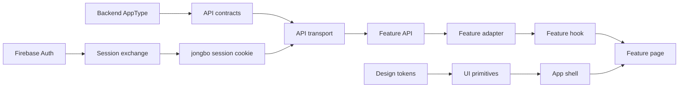
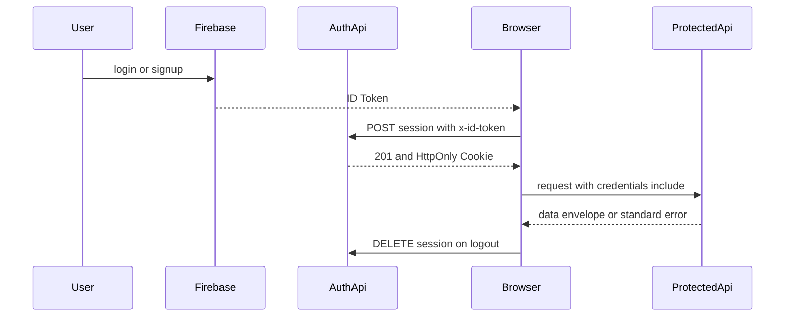

# 技術設計: frontend-foundation-ui

## 1. Overview

### Summary

`backend-foundation` が公開するHono `AppType`と、`backend-integrity-lifecycle` が保証するBE計算済み結果をFEの唯一のAPI契約入口として扱う。共通transport、型alias、adapter、認証・ErrorEnvelope、request状態を`src/lib`と`src/features`の境界に整理し、その上にTailwind CSS 4のsemantic token、UI primitives、AppShell/Header/navigation/AuthFormShellを構成する。後続画面はfeature固有の業務ロジックだけを持ち、API契約・認証・表示状態・基本UIを再実装しない。

### Goals

- Hono RPC型からBE DTO・request型を導出し、旧手書きresponse型との二重管理を止める。
- Cookie-only保護API、標準ErrorEnvelope、204、nullable/ISO日時を一つのFE境界で扱う。
- API DTOから表示用modelへ変換するadapterの責務を表示整形に限定し、BE計算値を保持する。
- 共通UIと白地・ブランドピンク基調のsemantic tokenを揃える。
- Header、navigation、mobile drawer、AuthFormShellを再利用可能なshellにする。

### Non-Goals

- BEのroute、DTO、Cookie属性、ErrorCode、点数計算、集計、OpenAPI、Firestoreの変更。
- リーグ・シーズン、Session・Match、統計の業務フローと画面固有の表示・CRUD。
- 旧型、mock、Redux、重複画面の一括削除。
- 新しいUIライブラリ、データ取得ライブラリ、チャートコンポーネント、テストランナーの導入。

## 2. Boundary Commitments

### This spec owns

- BE `AppType`を起点とするAPI client、envelope parser、typed `ApiError`、transport/decode errorの区別。
- ID・ISO日時・nullableを含むFE共通型と、API DTOからview modelへのadapter契約。
- Firebase ID Tokenのsession交換、Cookie-only保護API、401時の認証境界、requestのloading/error/empty状態。
- `src/app`、`src/features`、`src/components`、`src/lib`の配置・import責務。
- Tailwind token、Button/Input/Select/Card/Table/Loading/Error/Empty、AppShell/Header/navigation/AuthFormShell。
- 現行API module、auth provider、Header、auth画面への共通境界の適用と後続仕様へのhandoff。

### Out of Boundary

- `backend-foundation`のcanonical storage/API/auth契約や、`backend-integrity-lifecycle`のSession/Match/集計計算。
- 画面固有のleague/season CRUD、Session/Match入力、統計の一覧・チャート・集計表示。
- APIにない機能をmockで補うこと、旧コードの全削除、独立した設定画面の追加。
- FEでのrank、point、standing、progression、user_statsの再計算。

### Allowed Dependencies

| 方向 | 依存先 | Criticality | 契約 |
|---|---|---:|---|
| Inbound | `backend-foundation`の`AppType` | P0 | route/request/responseの型、`{ data }`、ErrorEnvelope、Cookie-only認証 |
| Inbound | `backend-integrity-lifecycle` | P0 | fixed members、許容wind、matchIndex、computed rank/point、集計値、fourth系null |
| External | Next.js 15.5.19 / React 19.1.0 | P0 | App Router、client component、`React.FC` |
| External | Tailwind CSS 4 / `clsx` / `lucide-react` | P1 | token、class composition、navigation icon |
| Outbound | 後続FE feature | P0 | shared client、型alias、adapter、Auth/Error/UIの共通利用 |

### Revalidation Triggers

- `AppType`のroute、request body、response DTO、ErrorCode、status、`data` envelopeの変更。
- `jongbo_session`のCookie名/属性、session交換の入力、保護APIの認証方式、CORSの変更。
- `gameType`、`rule`、`matchIndex`、`rank`、`point`、user_stats logical key、fourth系nullの変更。
- ID・ISO日時・nullableの意味、表示用adapter、featureフォルダ境界の変更。
- brand token、navigation route、responsive shell、アクセシビリティ要件の変更。

## 3. Architecture

### Technology Alignment

| Layer | Existing technology | Role |
|---|---|---|
| Route/runtime | Next.js `15.5.19`, App Router | route entry、middleware、layout、server/client境界 |
| UI/runtime | React `19.1.0` | `React.FC` component、context、hooks |
| API contract | Hono `^4.12.12` client、workspace backend `AppType` | typed request/response、Cookie付きAPI呼び出し |
| Auth | Firebase Web SDK `^12.11.0` + BE session endpoint | ID Token取得、session交換、local auth state |
| Styling | Tailwind CSS `^4`、CSS `@theme` | semantic color、typography、spacing、focus、responsive layout |
| Utilities | `clsx`、`lucide-react` | class合成、Header/navigation icon |

### Dependency Direction

`BE AppType → shared API contracts → transport/parser → feature API → feature adapter/model → route hook → feature UI/page`

`semantic tokens → UI primitives → layout shell → feature UI`

`Firebase Auth → session exchange → jongbo_session Cookie → protected API`

API contract層はUIをimportせず、transportはfeature業務知識を持たない。adapterはAPI DTOを表示用modelへ変換するが、scoring・aggregation・権限判定を持たない。route pageはAPI clientを直接呼ばず、feature hookまたはfeature modelを利用する。`src/types/domain`、`src/mocks`、`src/store`は互換移行のために残り得るが、新しい本番featureの正本依存先にしない。



### Authentication flow



## 4. Shared Contracts and Data Handling

### API contract source

API endpoint references are obtained from the typed Hono client. The FE defines aliases, not duplicate object literals.

```ts
type ApiData<T> = { data: T };

type ApiErrorCode =
  | "validation_error"
  | "authentication_error"
  | "forbidden"
  | "not_found"
  | "conflict"
  | "internal_error";

type ApiErrorEnvelope = {
  error: {
    code: ApiErrorCode;
    message: string;
    details: Record<string, unknown>;
  };
};

type ApiTransportError =
  | { kind: "network"; message: string; retryable: true }
  | { kind: "timeout"; message: string; retryable: true }
  | { kind: "decode"; message: string; retryable: false };
```

`ApiUser`、`ApiLeagueSummary`、`ApiLeagueDetail`、`ApiSeasonSummary`、`ApiSeasonDetail`、`ApiSession`、`ApiMatch`、`ApiUserStats`、`ApiJoiningSeason`と各create/update inputは、対応するHono endpointの`InferResponseType`/`InferRequestType`から導出する。成功parserは200/201で`data`を返し、204はbodyを解析せず完了値を返す。初期API契約には未定義の`meta`を要求しない。

### IDs and dates

API境界ではBEのopaque string IDとISO 8601 stringを受ける。内部のfeature modelでは`UserId`、`LeagueId`、`SeasonId`、`SessionId`、`MatchId`のbrand typeと、検証済み`IsoDateTime`を使えるようにする。adapterは空ID、不正ISO日時、未定義必須値を検出するが、`null`を`0`、空文字、現在日時へ置き換えない。既存`AppDate`や旧`leagueId`等の別命名は互換移行対象であり、本仕様の新規契約にはしない。

### Adapter boundary

API DTOからfeature view modelへ変換するadapterは次だけを担当する。

- IDと日時の境界検証、表示に必要なlabelの組み立て。
- APIのcamelCaseをUIが必要とする配置へ明示的に変換すること。
- `null`、三麻のfourth系`null`、BE算出済み`rank`/`point`/`totalPoints`の保持。

adapterはraw scoreからpointを計算せず、standingを並べ替えず、user_statsを合算せず、BE DTOにない値をmockで補わない。feature固有adapterは利用側の`src/features/<feature>/api`または`model`に置き、shared層にleague/season/sessionの業務知識を逆流させない。

## 5. Components and Interfaces

### Component Summary

| Component | Intent | Requirements | Key dependency | Contracts |
|---|---|---|---|---|
| API Contract Boundary | BE由来型、ID、日時、nullableを公開する | 1.1-1.4, 5.1-5.4 | `AppType` | Type |
| API Transport | base URL、credentials、envelope、204、timeoutを統一する | 2.1-2.4, 9.2 | Hono client | API, Service |
| Adapter Boundary | DTOから表示modelへ安全に変換する | 1.2-1.4, 5.2, 9.1 | API Contract | Type, Service |
| Auth Session Boundary | FirebaseとBE Cookieのsessionを連携する | 3.1-3.4, 8.1-8.4 | Firebase, API Transport | Service, State |
| Request State Boundary | loading/error/empty/retryとstale requestを統一する | 4.1-4.4, 9.1 | React hooks | State |
| Design System Primitives | tokenに基づく共通UIを提供する | 6.1-6.3, 7.1-7.4 | Tailwind CSS | UI |
| App Shell | Header、navigation、drawer、AuthFormShellを提供する | 8.1-8.4, 9.1 | Primitives, Auth | UI, State |
| Foundation Handoff | 既存FE適用と検証・再検証条件を固定する | 9.1-9.4 | all components | Test, Contract |

### API Transport

```ts
interface ApiClientPolicy {
  baseUrl: string;
  credentials: "include";
  signal?: AbortSignal;
}

interface ApiErrorLike {
  readonly kind: "api" | "network" | "timeout" | "decode";
  readonly status: number | null;
  readonly code: ApiErrorCode | null;
  readonly message: string;
  readonly details: Record<string, unknown>;
  readonly retryable: boolean;
}

const parseDataResponse = <T>(response: Response): Promise<T> => {
  throw new Error("contract only");
};

const parseNoContentResponse = (response: Response): Promise<void> => {
  throw new Error("contract only");
};
```

実装では`hc<AppType>`を一箇所で生成し、endpoint moduleはそのclientと共通parserだけを利用する。`fetch`の直接利用はtransport内部またはsession交換の共通wrapperに限定する。status判定、JSON decode、safe error mappingを各featureに複製しない。

### Auth Session Boundary

```ts
type AuthStatus = "loading" | "authenticated" | "unauthenticated";

type AuthState = {
  status: AuthStatus;
  user: FirebaseUser | null;
};

interface AuthSessionBoundary {
  readonly state: AuthState;
  signOut(): Promise<void>;
  handleAuthenticationError(error: ApiErrorLike): void;
}
```

FirebaseのID Tokenは`POST /api/auth/session`の`x-id-token`でのみ使用し、`json` bodyや保護APIのfallback headerには使わない。`jongbo_session`はブラウザJavaScriptから参照せず、clientの`credentials: include`で送信する。middlewareはCookie値の存在を使ったroute hintに限定し、認証の最終判断はBE APIの401とする。ログアウトはBEの204を確認してFirebase Authを終了する。

### Request State Boundary

```ts
type AsyncState<T> =
  | { status: "idle"; data: null; error: null }
  | { status: "loading"; data: T | null; error: null }
  | { status: "success"; data: T; error: null }
  | { status: "error"; data: T | null; error: ApiErrorLike };

interface RequestStateController<T> {
  readonly state: AsyncState<T>;
  execute(request: (signal: AbortSignal) => Promise<T>): Promise<T | null>;
  reset(): void;
}
```

画面hookはこの状態をfeature単位で利用し、同じhook内のmutation中はButtonをdisabled/loadingにする。requestにはAbortControllerまたはrequest sequenceを持たせ、unmount済み・古いrequestの結果を適用しない。401のroute遷移はAuth boundaryへ委譲し、Error componentは内部detailsを表示しない。

### Design System Primitives

共通primitiveは次の境界を持つ。

- `Button`: `primary`、`secondary`、`ghost`、`danger`、size、fullWidth、loading、disabled、native button props。
- `Input` / `Select`: label、description、error、required、disabled、native input/select props、aria関連付け。
- `Card`: title、meta、body slot。`SectionCard`や`HeaderCard`の既存用途を段階的に吸収する。
- `Table`: caption、header、body、row、cellのsemantic compositionとresponsive overflow。順位・統計の計算は持たない。
- `LoadingState` / `ErrorState` / `EmptyState`: `role`/`aria-live`、説明文、retryまたは次操作。emptyとerrorの表示を混ぜない。

すべてのcomponentはプロジェクト規約に従うarrow function + `React.FC`、型付きProps、token classで定義する。業務固有の`LeagueRule`や`MatchResult`をprimitiveのPropsへ導入しない。

### App Shell and Navigation

`AppShell`はHeaderとmain slotを持つ。Headerはデスクトップのinline navigationとモバイルのright drawerを提供し、`usePathname`に基づいてactive stateと`aria-current`を計算する。navigation itemはlabel、href、icon、path matcherを持つ設定値とし、現在のdashboard、league、stats routeを扱う。存在しないsettings routeや未接続actionをHeaderの必須導線に含めない。league一覧routeが後続仕様で確定するまで、league hrefは既存routeと衝突しない設定可能な値とする。

`AuthFormShell`は認証画面だけが利用し、title、children、error、submit loading、footer linksをslotとして受ける。認証済みAppShellと重複するHeaderは表示しない。

## 6. Design Tokens

`frontend/src/app/styles/globals.css`のTailwind `@theme`とCSS custom propertiesをtokenの正本とする。既存のbrand paletteを次のsemantic groupへ整理する。

| Token group | 用途 |
|---|---|
| `brand-*` | ブランド、primary action、selected state |
| `surface-*` | page、card、muted、overlay背景 |
| `text-*` | primary、muted、inverse、disabled |
| `border-*` / `focus-*` | border、focus ring、divider |
| `status-*` | error、warning、success、info |
| `rank-*` / `chart-*` | 順位・チャートの意味別色。実際の系列選択は後続feature |
| `font-*` / `radius-*` / `shadow-*` | 日本語本文、control、card、drawerの共通表現 |

新規画面はhex値、`red-500`等の意味不明な直接色、ページ固有のfocus表現を追加しない。既存の`COLOR_MAP`は段階的にsemantic tokenへ寄せ、foundationではチャートや順位の業務意味を決めない。現行の白地・ピンク基調をlight themeの初期値とし、dark themeは別仕様で再検証する。

## 7. File Structure Plan

### New files to add

| Component | Path | Responsibility |
|---|---|---|
| API Contract Boundary | `frontend/src/lib/api/contracts.ts` | `AppType`由来のresponse/request alias、envelope、ErrorCode |
| API Transport | `frontend/src/lib/api/client.ts` | Hono client、base URL、credentials、共通request入口 |
| API Transport | `frontend/src/lib/api/response.ts` | data/error/204 parserとdecode境界 |
| API Transport | `frontend/src/lib/api/errors.ts` | typed ApiError、transport/decode error、safe message mapping |
| API Contract Boundary | `frontend/src/features/shared/model/ids.ts` | branded IDと検証済みISO日時 |
| Request State Boundary | `frontend/src/features/shared/model/async-state.ts` | `AsyncState<T>`とrequest state contract |
| Request State Boundary | `frontend/src/features/shared/model/use-async-request.ts` | stale request、AbortController、retry/resetのhook |
| Auth Session Boundary | `frontend/src/features/auth/api/session.ts` | session exchange/logoutのendpoint wrapper |
| Auth Session Boundary | `frontend/src/features/auth/model/auth-context.tsx` | AuthStatus、Firebase user、401 handoffのcontext |
| Design System Primitives | `frontend/src/components/ui/input/index.tsx` | label/description/error対応Input |
| Design System Primitives | `frontend/src/components/ui/select/index.tsx` | typed optionsとerror対応Select |
| Design System Primitives | `frontend/src/components/ui/card/index.tsx` | Cardのsurface/title/body composition |
| Design System Primitives | `frontend/src/components/ui/loading-state/index.tsx` | loading表示とaria status |
| Design System Primitives | `frontend/src/components/ui/error-state/index.tsx` | safe error表示とretry action |
| Design System Primitives | `frontend/src/components/ui/empty-state/index.tsx` | empty説明と次操作 |
| App Shell | `frontend/src/components/layout/app-shell/index.tsx` | Header + main slot |
| App Shell | `frontend/src/components/layout/header/index.tsx` | brand、user、logout、desktop/mobile shell |
| App Shell | `frontend/src/components/layout/navigation/index.tsx` | item設定、active matcher、aria-current |
| Foundation Handoff | `frontend/src/features/shared/ui/index.ts` | 後続featureが参照するshared UI/APIの公開入口 |

### Existing files to modify

| Component | Path | Responsibility |
|---|---|---|
| API Transport | `frontend/src/lib/api/core.ts` | 新しいclient/response/errorsへ統合または互換再export |
| Feature API | `frontend/src/lib/api/auth.ts` | header-only session exchange、204 logoutへ修正 |
| Feature API | `frontend/src/lib/api/users.ts` | 直接fetch・手書きresponse・保護APIのID Token送信を共通clientへ移行 |
| Feature API | `frontend/src/lib/api/leagues.ts` | Hono由来型とfeature APIの互換入口へ整理 |
| Feature API | `frontend/src/lib/api/seasons.ts` | Hono由来型とfeature APIの互換入口へ整理 |
| Feature API | `frontend/src/lib/api/sessions.ts` | Hono由来型と共通parserへ整理 |
| Feature API | `frontend/src/lib/api/matches.ts` | Hono由来型、computed result保持、共通parserへ整理 |
| Auth Session Boundary | `frontend/src/providers/auth-provider.tsx` | 新AuthStatusとsession error handoffへ接続 |
| Auth Session Boundary | `frontend/src/lib/auth/flows.ts` | login/signup/logoutの順序とtoken用途を統一 |
| Auth Session Boundary | `frontend/src/middleware.ts` | route hintの範囲を明示し、BE認証を代替しない構成へ整理 |
| Design System Primitives | `frontend/src/app/styles/globals.css` | semantic token、focus、surface、fontの正本 |
| App Shell | `frontend/src/components/app/providers.tsx` | Auth、shared request、providerのcomposition |
| App Shell | `frontend/src/components/pages/auth/auth-form-shell/index.tsx` | shared AuthFormShellへ互換接続 |
| App Shell | `frontend/src/components/common/container/header/index.tsx` | 新Headerへ移行する互換入口または削除対象を明示 |
| Foundation Handoff | `frontend/src/app/layout.tsx` | metadata、lang、provider/AppShell適用方針を反映 |

`src/app/*/hooks`、`src/components/pages/*`、`src/types/domain/*`、`src/mocks/*`、`src/store/*`の画面固有移行・削除は後続featureの所有とし、本仕様はshared boundaryを壊さない互換接続だけを扱う。

## 8. Integration and Migration Notes

### Implementation order

1. `AppType`由来のcontracts、ID/日時、typed errorを固定する。
2. 共通Hono client、data/error/204 parser、credentialsを導入し、既存の直接fetchと重複parserを共通入口へ寄せる。
3. session exchange、Cookie-only保護API、AuthStatus、401 handoffを固定する。
4. tokenとUI primitivesを実装し、現行のButton/InputArea/Dropdown/Card/Table/状態表示を段階的に互換接続する。
5. Header/AppShell/navigation/AuthFormShellを適用し、既存auth/homeの共有導線を検証する。
6. 後続featureへAPI alias、adapterルール、状態・UI契約、再検証トリガーを引き渡す。

### Migration safety

- 旧型・mock・Reduxは参照調査なしに削除しない。移行済みrouteからの本番fallback利用だけを先に止める。
- API DTOの必須値を既定値へ埋めない。契約不一致は安全なErrorStateで可視化する。
- 既存の`users.ts`のID Token付きprotected requestは、session exchange以外からheaderを除去する。
- BEが`rank`、`point`、`totalPoints`、`currentRank`、`fourthRate`などを返す場合はFEで再計算せず、そのままadapterからviewへ渡す。
- `AppType`やErrorCodeが変わった場合はFE typecheckとBE contract testを同じ変更単位で再実行する。

## 9. Testing and Validation Strategy

| Validation | Verifies | Requirements |
|---|---|---|
| Type contract check | `AppType`由来alias、request input、nullable、ISO日時、ID境界 | 1.1-1.4, 5.1-5.4, 9.3 |
| Transport contract check | credentials、data/error envelope、status、204、decode/network distinction、no `meta` assumption | 2.1-2.4, 9.2 |
| Auth flow check | header-only session exchange、Cookie-only protected API、401 handoff、logout ordering | 3.1-3.4 |
| Adapter/state check | no recalculation、null preservation、loading/error/empty、stale request prevention | 1.2-1.4, 4.1-4.4 |
| UI accessibility check | label/error association、focus、disabled/loading、table semantics、aria status、drawer keyboard flow | 6.1-8.4 |
| Existing-app smoke | auth、home、league route、stats routeのcompile/buildとshared UI adoption | 9.1-9.4 |

FEに既存test runnerがないため、新規runnerをこの仕様の依存にせず、`pnpm typecheck`、`pnpm lint`、`pnpm build`、Hono clientの型整合、Emulator/BE contract testとのhandoffを必須検証とする。後続仕様がtest runnerを導入する場合は、上表のadapter、auth、state、accessibilityケースを追加する。

## 10. Open Questions / Risks

- 現行の視覚資産から白地・ピンク基調は合理的に導出できるが、プロダクトとしてdark modeまたはブランドカラー変更を予定する場合はtoken確定前に再検証が必要である。
- リーグ一覧専用routeがまだないため、Headerのleague hrefは設定値として扱う。後続の`frontend-league-season`がrouteを確定した時点でnavigationの再検証を行う。
- Hono clientの型がworkspace packageのexport変更に影響されるため、`backend-foundation`で`AppType`の公開位置を変更する場合はcontractsとtsconfigの再確認が必要である。
- 既存のusers APIにある手書きtimeoutは共通transportへ集約するが、個別endpointが異なるSLAを要求する場合はfeature仕様でsignal/timeoutを追加する。

## 11. Requirements Traceability

| Requirement | Summary | Components | Interfaces / Flows |
|---|---|---|---|
| 1.1, 1.2, 1.3, 1.4 | BE由来型、nullable/ISO、adapter、契約不一致 | API Contract Boundary, Adapter Boundary | AppType → alias → adapter |
| 2.1, 2.2, 2.3, 2.4 | client、credentials、envelope、204、transport error | API Transport | endpoint request → parser |
| 3.1, 3.2, 3.3, 3.4 | session exchange、Cookie-only、401、logout | Auth Session Boundary | Firebase → session → protected API |
| 4.1, 4.2, 4.3, 4.4 | loading/error/empty、retry、stale request | Request State Boundary | feature hook → state component |
| 5.1, 5.2, 5.3, 5.4 | feature folder、import、state、legacy boundary | API Contract Boundary, Adapter Boundary | app/features/components/lib map |
| 6.1, 6.2, 6.3 | semantic tokens、states、meaning colors | Design System Primitives | tokens → primitives → feature UI |
| 7.1, 7.2, 7.3, 7.4 | accessible primitivesと業務props分離 | Design System Primitives | Button/Input/Select/Card/Table/status |
| 8.1, 8.2, 8.3, 8.4 | AppShell、Header、navigation、drawer、AuthFormShell | App Shell, Auth Session Boundary | Authenticated shell / auth routes |
| 9.1, 9.2, 9.3, 9.4 | 既存適用、legacy API修正、validation、handoff | Foundation Handoff | current FE → downstream FE |
