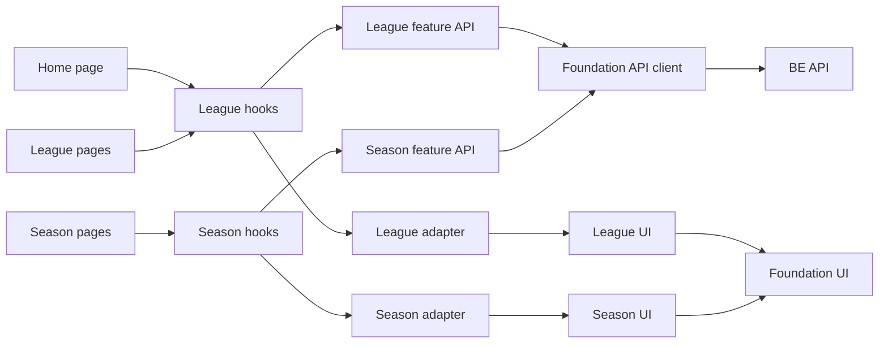
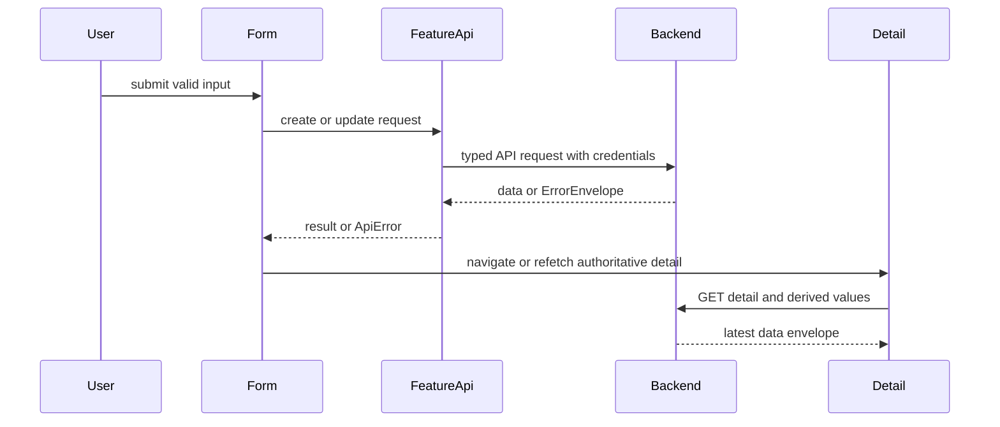

# 技術設計: frontend-league-season

## 1. Overview

### Summary

ホームをリーグ一覧の正規入口とし、リーグ・シーズンのAPI取得、フォーム送信、表示adapter、request状態をfeature境界へ集約する。`frontend-foundation-ui`の共通client、Hono由来型、AsyncState、UI primitives、AppShellを利用し、`backend-foundation`と`backend-integrity-lifecycle`が定めるDTO・status・派生値をそのまま画面へ渡す。既存の旧domain/mockを対象routeの正本から外し、シーズン編集の旧routeと未接続buttonを整理する。

### Goals

- `/`、リーグ作成・詳細・編集、シーズン作成・一覧・詳細・編集をBE APIへ接続する。
- LeagueSummary、LeagueDetail、SeasonSummary、SeasonDetailのAPI型をHono `AppType`から参照する。
- `rule`、member、active season、standings、records、nullable値、ISO日時を表示用に変換するだけで保持する。
- League create/editでは`rule.uma`の合計0を事前検証し、BEの`validation_error`を最終判定として表示する。
- 共通のloading/error/empty/retry、401 handoff、mutation中の二重送信防止、stale request防止を全対象画面へ適用する。
- 既存のシーズン編集mockと`console.log`、詳細画面の未接続更新button、誤った旧編集routeをなくす。

### Non-Goals

- Session・Matchの入力、編集、結果、点数計算、順位計算、統計チャートの詳細。
- BE route、DTO、ErrorEnvelope、active season整合性、rule lock、集計・削除ライフサイクルの変更。
- 共通API client、共通UI primitive、Header/AppShell、認証Cookieの再設計。
- APIに存在しないシーズンメンバー更新や、新しいメンバー管理仕様の追加。
- 旧domain、mock、Reduxの全リポジトリ横断削除。対象routeからの本番依存除去だけを行う。

## 2. Boundary Commitments

### This spec owns

- ホーム兼リーグ一覧と、リーグ・シーズンのroute entry、page composition、feature UI。
- `src/features/league` と `src/features/season` のAPI wrapper、型参照、表示adapter、hooks、form state、validation。
- LeagueSummary/Detail、SeasonSummary/Detail、members、rule、activeSeason、standings、recordsの表示とmutation後の再取得。
- 画面固有のloading/error/empty/retry、validation error、403/404/409表示、成功後の遷移。
- 旧シーズン編集routeの正規routeへの整理、対象routeからのmock・console出力・未接続操作の除去。

### Out of Boundary

- `frontend-foundation-ui`が所有する共通transport、Hono client生成、ErrorEnvelope parser、Auth boundary、AsyncState primitive、UI primitive、Header/AppShell本体。
- `backend-foundation`が所有する保存形式、公開DTO、認証、status、OpenAPI、members APIの意味。
- `backend-integrity-lifecycle`が所有するrule lock、active seasonの一意性、standings/records/point progressionの計算、削除後rebuild。
- Session・Match routeと業務ロジック、統計画面、チャートの新規UX。
- シーズン作成後にmember snapshotを変更する操作。編集画面ではmembersを読み取り専用で表示する。

### Allowed Dependencies

| 方向 | 依存先 | Criticality | 契約 |
|---|---|---:|---|
| Inbound | `frontend-foundation-ui` | P0 | `AppType`由来型、共通client、AsyncState、safe error、UI、AppShell |
| Inbound | `backend-foundation` | P0 | `GET/POST/PATCH /api/leagues`、members、camelCase、ISO日時、`{ data }`、ErrorEnvelope、`rule.uma`合計0 invariant |
| Inbound | `backend-integrity-lifecycle` | P0 | rule lock、active season conflict、BE算出standings/records、null semantics |
| Outbound | `frontend-session-match` | P1 | シーズン詳細から既存Session開始routeへのnavigation契約 |
| External | Next.js `15.5.19` / React `19.1.0` | P0 | App Router、`useParams`、`useRouter`、`React.FC` |
| External | Tailwind CSS `4` / `lucide-react` / `clsx` | P1 | 既存tokenと共通UIの利用 |

### Revalidation Triggers

- League/Seasonのroute、request body、response DTO、`status`、ErrorCode、HTTP statusの変更。
- `rule.gameType`、`rule.uma`、`rule.uma`合計0 invariant、`rule.oka`、activeSeason、member snapshot、standing/record/nullの変更。
- `AppType`の公開位置、共通client、ApiError、AsyncState、UI primitive、AppShellの変更。
- ルート構成、ホームの正規入口、Session開始route、認証・認可境界の変更。
- `rule.uma`合計0 invariantのBE schema/domain validation、`validation_error` code/message/details、FEの事前検証、契約テストの変更。

## 3. Architecture

### Technology Alignment

| Layer | Existing technology | Role |
|---|---|---|
| Route/runtime | Next.js `15.5.19`, App Router | route entry、params、navigation、client boundary |
| UI/runtime | React `19.1.0` | page、feature component、form、hooks |
| API contract | Hono client、workspace backend `AppType` | endpoint request/response型、API操作 |
| Shared runtime | `frontend-foundation-ui` API client、AsyncState、UI primitives | credentials、envelope、auth/error、共通表示状態 |
| Styling | Tailwind CSS `4`、foundation semantic tokens | 白地・brand pink基調、focus、responsive layout |

### Dependency Direction

`route page → feature hook → feature API → foundation API client/AppType`

`route page → feature UI → foundation UI primitives/AppShell`

`API DTO → feature adapter → feature view model → feature UI`

route pageは直接fetch、mock参照、BE計算を持たない。feature APIはendpoint呼び出しと型付き入力/出力を担当し、adapterはID/日時の検証と表示整形だけを担当する。フォームは入力文字列をAPIのnumber/null型へ変換するが、point、rank、standing、recordsを計算しない。共有transportとprimitiveへの業務概念の逆流を禁止する。



### Mutation and revalidation flow



## 4. API Contracts and Data Handling

### Endpoint matrix

| Feature operation | Endpoint | Input/Output contract | UI use |
|---|---|---|---|
| Home list | `GET /api/leagues` | `data: LeagueSummary[]` | `/` cards、empty |
| League detail | `GET /api/leagues/:leagueId` | `data: LeagueDetail` | detail、edit initial values |
| League members | `GET /api/leagues/:leagueId/members` | `data: LeagueMember[]` | season create member selection |
| League create | `POST /api/leagues` | `CreateLeagueInput` → 201 `LeagueDetail` | create success |
| League update | `PATCH /api/leagues/:leagueId` | typed update input → 200 `LeagueDetail` | name/member/rule update |
| Season list | `GET /api/leagues/:leagueId/seasons` | `data: SeasonSummary[]` | league detail list |
| Season detail | `GET /api/leagues/:leagueId/seasons/:seasonId` | `data: SeasonDetail` | detail、edit initial values |
| Season create | `POST /api/leagues/:leagueId/seasons` | `CreateSeasonInput` → 201 `SeasonDetail` | create success |
| Season update | `PATCH /api/leagues/:leagueId/seasons/:seasonId` | `{ name?: string; status?: SeasonStatus }` → 200 `SeasonDetail` | edit success |

Feature API modules derive response and request aliases with `InferResponseType`/`InferRequestType` from the foundation client. `LeagueSummary` includes `id`、`name`、`memberCount`、`totalMatchCount`、nullable `activeSeason`、nullable `myStanding`、`createdAt`、`updatedAt`。`LeagueDetail` additionally includes `rule`、members、nullable `leagueRecords`。`SeasonSummary` includes `id`、`leagueId`、`name`、`status`、memberCount、totalMatchCount、timestamps。`SeasonDetail` additionally includes members、BE `standings`、`pointProgressions`、nullable `seasonRecords`、nullable `latestPlayedAt`。

`PATCH /api/leagues/:leagueId/seasons/:seasonId` はname/statusだけを許可する。membersは作成時のsnapshotであり、memberUserIdsをseason update payloadへ追加しない。リーグruleはembedded `gameType`、`uma.first/second/third/fourth`、`oka.startingPoints/returnPoints`を利用し、sanmaのfourthはnull、yonmaのfourthはnumberとする。`rule.uma`の数値フィールド合計は0でなければならず、sanmaのnullであるfourthは合計に加えない。このinvariantはBEがschema/domain境界で検証し、FEは同じ条件を事前検証するが、BEの`validation_error`を最終的な正とする。古い`ruleId`、`scoreCalc`、`mode`などの旧domainフィールドはfeature契約へ持ち込まない。

### Adapter policy

Adapterは次を行う。

- 必須ID、ISO 8601日時、nullableフィールドの境界検証。
- `activeSeason`、`myStanding`、`leagueRecords`、`seasonRecords`、sanmaのfourth系nullを保持したview modelへの変換。
- score、rank、point、standing、recordの数値を表示用文字列へ整形すること。

Adapterは次を行わない。

- raw scoreからpoint/rankを計算すること。
- standingsの再集計、並べ替え、欠損値の0埋めを行うこと。
- point progressionやrecordsをmockで補完すること。
- API DTOに存在しないrule、member、statusを推測して追加すること。

## 5. Components and Interfaces

### Component Summary

| Component | Intent | Requirements | Key dependency | Contracts |
|---|---|---|---|---|
| League Feature API | League endpointと型付きmutationを提供する | 1.1, 2.1-2.4, 3.1-3.6, 4.1-4.4, 8.1-8.2 | Foundation API client | API, Type |
| Season Feature API | Season endpointと型付きmutationを提供する | 5.1-5.4, 6.1-6.4, 7.1-7.4, 8.1-8.2 | Foundation API client | API, Type |
| League/Season Adapter | DTOを検証済みview modelへ変換する | 1.1, 2.1-2.3, 6.1-6.2, 8.2 | AppType aliases | Type, Service |
| Request Hooks | loading/error/empty/retry/stale requestを管理する | 1.2, 3.2-3.4, 4.4, 5.2-5.4, 7.4, 8.3-8.4 | AsyncState | State |
| League UI and Forms | Home、League detail、create/editを表示する | 1.1-1.4, 2.1-2.4, 3.1-3.6, 4.1-4.4, 9.4 | UI primitives、AppShell | UI |
| Season UI and Forms | Season list、detail、create/editを表示する | 5.1-5.4, 6.1-6.4, 7.1-7.4, 9.4 | UI primitives、AppShell | UI |
| Route Integration | 正規route、navigation、下流遷移を接続する | 1.4, 6.3-6.4, 9.1, 9.3-9.4 | Next App Router、Session route | UI, State |
| Migration Validation | mock/console/未接続操作と契約を検証する | 8.1-8.4, 9.1-9.4 | typecheck、lint、build | Test |

### Feature API interfaces

実装は手書きDTOを公開せず、以下の操作形をHono clientから導出する。

```ts
interface LeagueFeatureApi {
  list(): Promise<LeagueSummary[]>;
  get(leagueId: LeagueId): Promise<LeagueDetail>;
  listMembers(leagueId: LeagueId): Promise<LeagueMember[]>;
  create(input: CreateLeagueInput): Promise<LeagueDetail>;
  update(leagueId: LeagueId, input: UpdateLeagueInput): Promise<LeagueDetail>;
}

interface SeasonFeatureApi {
  list(leagueId: LeagueId): Promise<SeasonSummary[]>;
  get(leagueId: LeagueId, seasonId: SeasonId): Promise<SeasonDetail>;
  create(leagueId: LeagueId, input: CreateSeasonInput): Promise<SeasonDetail>;
  update(
    leagueId: LeagueId,
    seasonId: SeasonId,
    input: UpdateSeasonInput,
  ): Promise<SeasonDetail>;
}
```

`LeagueId`と`SeasonId`はfoundationのbranded IDを利用する。`CreateLeagueInput`、`UpdateLeagueInput`、`CreateSeasonInput`、`UpdateSeasonInput`はendpointの`InferRequestType`から導出する。`UpdateSeasonInput`にmemberUserIdsを持たせない。API wrapperは共通parser、credentials、ApiError、204方針を再実装しない。

### Request hooks

- `useLeagueList`はホームの一覧、retry、empty判定、401 handoffを扱う。
- `useLeagueDetail`はLeagueDetailとSeasonSummaryの取得、再取得、record/season listの表示用stateを扱う。
- `useLeagueForm`はcreate/edit共通の入力state、member search、rule入力、client validation、submit stateを扱う。
- `useSeasonList`はリーグ詳細内のSeasonSummary listとempty判定を扱う。
- `useSeasonDetail`はSeasonDetail、standings/recordsのnull、既存Session開始routeへのnavigation、再取得を扱う。
- `useSeasonForm`はcreateのmember selectionと、editのname/statusだけを扱う。editではmembersを変更可能なstateにしない。

すべてのhookはfoundationの`AsyncState<T>`とAbortControllerまたはrequest sequenceを利用し、route parameter変更後に古いrequest結果を適用しない。mutation中はsubmit actionをdisabled/loadingにし、成功時はauthoritative detailを再取得してから画面遷移または表示を確定する。

### Form validation and error mapping

| Condition | Client behavior | API behavior |
|---|---|---|
| 空のname、season参加者0人、型変換不能なnumber | APIを呼ばずfield/form error | なし |
| sanmaでfourth入力、yonmaでfourth欠落 | 入力状態を修正可能にする | 送信前に契約形へ変換 |
| `rule.uma`の数値合計が0以外 | APIを呼ばず、uma合計が0になるようfield/form errorを表示 | BEでも同じinvariantを検証 |
| validation error | API detailsを安全なfield/form messageへ表示 | `validation_error` |
| 未認証 | Auth boundaryへ委譲してloginへ遷移 | `authentication_error`/401 |
| 権限なし・対象なし | 画面内error stateと戻る/retry | `forbidden`/`not_found` |
| rule lock・active重複 | 入力を保持し、競合理由と再確認操作を表示 | `conflict` |
| network・timeout・decode | retry可能な共通error state | transport/decode error |

FEのfield validationは送信前の利用者体験を改善するためのもので、BE validationの代替ではない。FEが合計0と判定しても、BEが返す`validation_error`、message、detailsが最終的な正であり、FEはその結果を安全に表示して入力を保持する。

## 6. Screen and Route Composition

### Canonical routes

| Route | Responsibility | Main data |
|---|---|---|
| `/` | ホーム兼リーグ一覧 | `LeagueSummary[]` |
| `/league/new` | リーグ作成 | user search、league create |
| `/league/[leagueId]` | リーグ詳細とシーズン一覧 | `LeagueDetail`、`SeasonSummary[]` |
| `/league/[leagueId]/edit` | リーグ編集 | `LeagueDetail`、league update |
| `/league/[leagueId]/season/new` | シーズン作成 | league members、season create |
| `/league/[leagueId]/season/[seasonId]` | シーズン詳細 | `SeasonDetail` |
| `/league/[leagueId]/season/[seasonId]/edit` | シーズン編集 | `SeasonDetail`、season update |

`frontend/src/app/league/season/[seasonId]/edit` はleagueIdを欠く旧routeであり、対象routeの正本にしない。正規routeへ遷移させるか、未使用の旧routeを除去して同じ画面が二重に存在しないようにする。

### Screen behavior

- Homeは一覧loading、API error/retry、empty、カード導線を持つ。
- League detailはdetailとseason listを表示し、records/activeSeason nullをempty表示する。season listが空でも作成導線を表示する。
- League formはcreate/editを共通化し、editの初期値をAPIから取得する。`rule.uma`の合計0を事前検証し、Match存在後のrule lockはread-only表示またはBE conflict表示で扱う。BE validation errorはFEの事前検証より優先して表示する。
- Season createは`GET /members`のcurrent league membersを選択肢とし、statusはactiveを既定値として送信可能にする。既存activeとの競合は自動archived化しない。
- Season detailはBEのstanding、record、最新日時を表示し、対局記録buttonは既存Session開始routeへ遷移する。point progression chartの新規仕様は追加しない。
- Season editはname/statusだけを編集可能にし、membersはsnapshot表示とする。成功後はSeasonDetailを再取得し、変更後のactive表示を反映する。

## 7. File Structure Plan

### New files to add

| Component | Path | Responsibility |
|---|---|---|
| League Feature API | `frontend/src/features/league/api/index.ts` | League endpoint wrapperとHono由来型の公開入口 |
| League Adapter | `frontend/src/features/league/model/adapters.ts` | League DTOの検証・表示整形 |
| League Form Model | `frontend/src/features/league/model/forms.ts` | create/edit入力stateとvalidation |
| League Hooks | `frontend/src/features/league/hooks/index.ts` | list/detail/form/member search hookの公開入口 |
| League UI | `frontend/src/features/league/ui/index.tsx` | card、detail、season list、form composition |
| Season Feature API | `frontend/src/features/season/api/index.ts` | Season endpoint wrapperと型公開入口 |
| Season Adapter | `frontend/src/features/season/model/adapters.ts` | Season DTO、standing、recordsの検証・表示整形 |
| Season Form Model | `frontend/src/features/season/model/forms.ts` | create/edit入力stateとvalidation |
| Season Hooks | `frontend/src/features/season/hooks/index.ts` | list/detail/form hookの公開入口 |
| Season UI | `frontend/src/features/season/ui/index.tsx` | season list、detail、create/edit form composition |

### Existing files to modify

| Component | Path | Responsibility |
|---|---|---|
| Home route | `frontend/src/app/page.tsx` | Home feature UIと共通AppShellの接続 |
| Home hook | `frontend/src/app/hooks/index.ts` | 既存home取得処理をfeature hookへ移行 |
| League routes | `frontend/src/app/league/new/*` | League create formをfeatureへ接続 |
| League detail route | `frontend/src/app/league/[leagueId]/*` | detailとseason listをfeatureへ接続 |
| League edit route | `frontend/src/app/league/[leagueId]/edit/*` | edit form、rule lock、再取得をfeatureへ接続 |
| Season create route | `frontend/src/app/league/[leagueId]/season/new/*` | member選択、status、createをfeatureへ接続 |
| Season detail route | `frontend/src/app/league/[leagueId]/season/[seasonId]/*` | standings/records、edit/session導線をfeatureへ接続 |
| Season edit route | `frontend/src/app/league/[leagueId]/season/[seasonId]/edit/*` | 正規season edit routeの追加 |
| Legacy edit route | `frontend/src/app/league/season/[seasonId]/edit/*` | mock依存の旧routeを除去または正規routeへの互換redirectへ整理 |
| Feature API compatibility | `frontend/src/lib/api/leagues.ts`、`frontend/src/lib/api/seasons.ts` | foundation移行中のcompatibility入口。featureからの直接mock依存を禁止 |
| Existing league UI | `frontend/src/components/pages/home/*`、`frontend/src/components/pages/league/*` | feature UIへ移行または薄いcompatibility wrapper化 |

### Ownership notes

- `frontend/src/lib/api/*`の共通transport/parser変更は`frontend-foundation-ui`の所有であり、このspecはleague/season endpointのfeature入口だけを所有する。
- `frontend/src/components/ui/*`、`frontend/src/components/common/container/header/*`、`frontend/src/components/layout/*`のprimitive・Header本体は変更せず、提供されたAPIを利用する。
- `frontend/src/mocks/league*`、`frontend/src/mocks/league-season*`、`frontend/src/types/domain/league*`の全削除は行わず、対象本番routeのimportを外す。

## 8. Integration and Migration Notes

### Implementation order

1. foundationのAppType、client、AsyncState、UIが利用可能であることを確認する。
2. League/Season feature API、型alias、adapter、form modelを追加する。
3. Home、League detail、Season listの読み取り画面を移行する。
4. League create/edit、Season create/editのmutationとconflict/error状態を移行する。
5. Season detailの正規route、edit導線、Session開始導線を接続する。
6. 旧route、mock import、console output、未接続buttonを対象範囲で除去し、shared navigationのleague hrefを`/`へ再検証する。
7. typecheck、lint、buildとAPI契約fixtureで検証する。

### Migration safety

- API DTOの必須値を`0`、空文字、現在日時へ置換しない。不正DTOはfoundationのcontract errorへ渡す。
- `rule.uma`合計0のFE事前検証はBEの正本を置き換えない。FE/BEの判定差異時はBEの`validation_error`を表示する。
- APIにないseason member updateをUIから送らず、既存mockをfallbackにしない。
- BEが返すactive season、standing、record、point progressionの値をFEで再計算しない。
- rule lockやactive season conflict時に入力を捨てず、ユーザーが修正または戻れる状態を残す。
- 旧domain型がSession/Match/統計の後続画面で必要な場合があるため、対象routeの利用停止と全削除を分離する。

## 9. Testing and Validation Strategy

| Validation | Verifies | Requirements |
|---|---|---|
| API type contract | endpoint、request、response、rule、nullable、statusの型整合、BE validation error | 3.3, 3.5, 3.6, 4.2, 4.3, 5.1, 7.2, 8.1, 8.2, 9.3 |
| Adapter/model check | ISO/ID validation、null保持、uma合計0事前検証、BE算出値非再計算、form payload | 2.1, 2.2, 3.3, 3.4, 3.6, 5.2, 5.3, 6.1, 6.2, 7.1, 7.2, 8.2 |
| Home/league smoke | loading/error/empty、card/detail/list/create/edit navigation | 1.1-1.4, 2.1-2.4, 4.1-4.4 |
| Season flow smoke | season list/create/detail/edit、status、active conflict、read-only members | 5.1-5.4, 6.1-6.4, 7.1-7.4 |
| Error/state check | retry、401 handoff、403/404/409、uma validation error、double submit、stale request | 1.2, 3.2, 3.4, 3.5, 3.6, 4.3, 4.4, 5.4, 6.4, 7.4, 8.3, 8.4 |
| Migration scan | 対象routeのmock/console/direct fetch/未接続button/旧route依存 | 8.1, 9.1-9.4 |
| Project validation | `pnpm typecheck`、`pnpm lint`、`pnpm build`とfoundation contract整合 | 8.1-8.4, 9.3 |

既存test runnerを新規導入せず、foundationの契約検証方針と型・lint・buildを必須とする。画面テスト基盤が後続仕様で導入される場合は、上表の主要navigation、mutation、conflict、emptyを追加する。

## 10. Open Questions / Risks

- `backend-foundation`の実装・契約テストが`rule.uma`合計0 invariantと`validation_error`のmessage/detailsを公開することが、FE実装の前提となる。FEは事前検証を持つが、BE判定を最終的な正として扱う。
- upstream foundationのAppShellがleague navigationを`/`へ切り替えるタイミングがずれる場合、対象featureのroute smokeとnavigation設定を同時に再検証する。
- upstream BE docsの一部に旧rule master表現が残る場合があるが、本specは承認済み`backend-foundation`のembedded rule、camelCase DTO、Hono `AppType`を優先する。
- `PATCH`後にBE rebuildが非同期化された場合、mutation直後の再取得が古い派生値を返す可能性があるため、BEの完了契約と再取得タイミングを再検証する。

## 11. Requirements Traceability

| Requirement | Summary | Components | Interfaces / Flows |
|---|---|---|---|
| 1.1, 1.2, 1.3, 1.4 | HomeのAPI一覧、状態、empty、導線 | League Feature API, Request Hooks, League UI, Route Integration | `GET /api/leagues` → home cards |
| 2.1, 2.2, 2.3, 2.4 | League detail、records、active season、season list empty | League Feature API, League Adapter, League UI | league detail + season list flow |
| 3.1, 3.2, 3.3, 3.4, 3.5, 3.6 | League create/edit form、member search、rule.uma合計0事前検証、BE validation error、submit | League Feature API, Request Hooks, League UI and Forms | form validation → `POST/PATCH /api/leagues` → `validation_error` or detail |
| 4.1, 4.2, 4.3, 4.4 | League edit、rule conflict、再取得、二重送信 | League Feature API, Request Hooks, League UI and Forms | detail → `PATCH /api/leagues/:leagueId` → refetch |
| 5.1, 5.2, 5.3, 5.4 | Season list/create、members、active conflict | Season Feature API, Request Hooks, Season UI and Forms | list/members → `POST /api/leagues/:leagueId/seasons` |
| 6.1, 6.2, 6.3, 6.4 | Season detail、BE standings、empty、navigation/error | Season Feature API, Season Adapter, Season UI, Route Integration | `GET /api/leagues/:leagueId/seasons/:seasonId` |
| 7.1, 7.2, 7.3, 7.4 | Season edit name/status、snapshot、再取得、errors | Season Feature API, Request Hooks, Season UI and Forms | detail → season `PATCH` → refetch |
| 8.1, 8.2, 8.3, 8.4 | foundation client、adapter、共通状態、stale防止 | League/Season Adapter, Request Hooks, Migration Validation | feature hook → foundation boundary |
| 9.1, 9.2, 9.3, 9.4 | 境界、mock禁止、再検証、未接続操作解消 | Route Integration, Migration Validation | downstream handoff and smoke |
