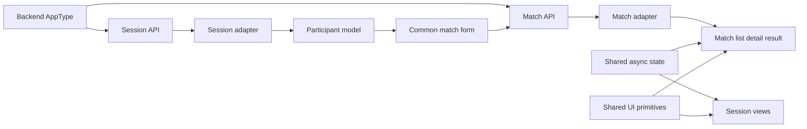
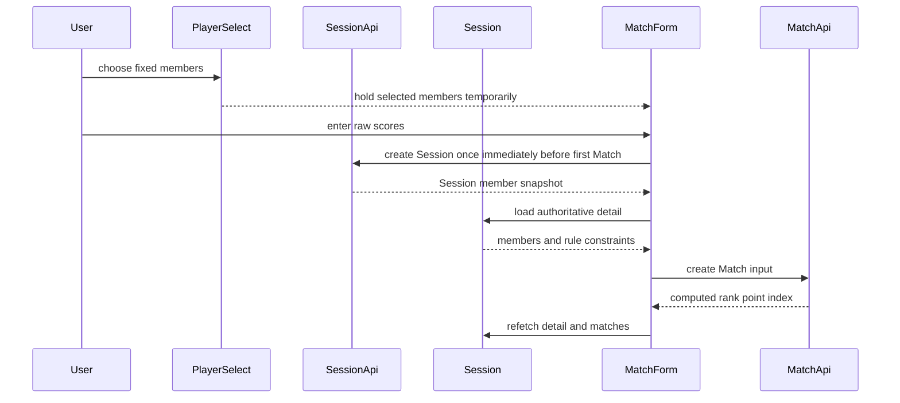

# 技術設計: frontend-session-match

## 1. Overview

### Summary

Seasonの参加者候補から固定Sessionを作成し、Session membersを正本として初回・追加・編集Matchを共通フォームで扱う。`frontend-foundation-ui`のtyped API client、AsyncState、Error boundary、UI primitivesを利用し、`backend-integrity-lifecycle`が返すcomputed `rank`・`point`・`matchIndex`を表示する。FEはscore/rank/point/aggregateを再計算せず、mutation成功後にGETで正本を再取得する。

### Goals

- `sanma`はeast/south/westの3人、`yonma`はeast/south/west/northの4人をPlayer selectとMatchフォームへ反映する。
- Session member snapshotをSession作成時に固定し、Matchのparticipant集合を常に完全一致させる。
- Sessionの作成・一覧・詳細、Matchの作成・編集・一覧・詳細・削除と結果表示をAPIへ接続する。
- 初回・追加・編集でMatchフォームの入力・validation・mutation状態を共通化する。
- API error/loading/empty、retry、二重submit、stale request、未接続操作を対象画面で統一する。

### Non-Goals

- BEのSession/Match validation、score/rank/point calculation、matchIndex allocation、aggregate/rebuild、ErrorEnvelope、route/statusの変更。
- FEのrank、point、standing、累計値、統計の再計算やmatchIndex欠番の補正。
- 統計画面、旧domain/mock/Reduxの全削除、リアルタイム同期、複数端末同時編集。
- `frontend-foundation-ui`の共通API client、Auth boundary、UI primitive、AppShell本体の再設計。

## 2. Boundary Commitments

### This spec owns

- Player selectのgameType別枠数、候補制御、Session作成フローへの接続。
- Session feature API、Session一覧・詳細・終了表示、Session membersのview model。
- Match feature API、共通Matchフォーム、Match一覧・詳細・結果表示、create/update/delete後の再取得。
- Session membersとMatch participantの一致をUIで表示・送信する境界、raw scoreの入力補助、BE結果の表示。
- 対象routeのloading/error/empty/retry、二重submit防止、stale request防止、未接続buttonの解消。

### Out of Boundary

- BEのcanonical Session/Match、固定member、wind/raw score validation、score/rank/point計算、matchIndex採番、集計・repair・削除ライフサイクル。
- `frontend-foundation-ui`のtransport、AppType公開位置、認証Cookie、ErrorEnvelope parser、AsyncState/UI primitiveの内部実装。
- `frontend-league-season`のLeague/Season CRUDとstanding/record表示、`frontend-statistics-quality`の統計・旧コード削除。
- Session作成後のmember変更、別参加者を既存Sessionへ追加する操作、新しいgame rule。

### Allowed Dependencies

| 方向 | 依存先 | Criticality | 契約 |
|---|---|---:|---|
| Inbound | `frontend-foundation-ui` | P0 | AppType aliases、共通client、ApiError、AsyncState、Auth、UI primitives |
| Inbound | `frontend-league-season` | P0 | Season detailからのSession開始導線、Season member候補 |
| Inbound | `backend-foundation` | P0 | Session/Match route、camelCase DTO、ISO日時、status、ErrorEnvelope、AppType |
| Inbound | `backend-integrity-lifecycle` | P0 | fixed members、allowed wind、computed rank/point、matchIndex、欠番、fourth null |
| Outbound | `frontend-statistics-quality` | P1 | Session/Match画面がBE結果を再計算しない境界、旧資産の移行対象 |
| External | Next.js `15.5.19` / React `19.1.0` | P0 | App Router、useParams/useRouter、`React.FC` |

### Revalidation Triggers

- Session/Matchのrequest/response DTO、route、HTTP status、ErrorCode、AppType公開位置の変更。
- Session members、gameType、allowed wind、raw score total、rank/point計算、matchIndex欠番、fourth null semanticsの変更。
- 共通client、Auth boundary、AsyncState、Loading/Error/Empty、Input/Select/Table primitiveの変更。
- Season詳細からのSession開始導線、Session詳細route、Match一覧・詳細route、Session作成タイミングの変更。
- Create/UpdateMatchでrankを入力するかどうかのBE契約変更。

## 3. Architecture

### Technology Alignment

| Layer | Existing technology | Role |
|---|---|---|
| Route/runtime | Next.js `15.5.19`, App Router | path params、route entry、navigation |
| UI/runtime | React `19.1.0` | `React.FC`、hooks、controlled form |
| API contract | Hono client、workspace `AppType` | typed request/response、Session/Match operations |
| Shared runtime | `frontend-foundation-ui` client、AsyncState、UI primitives | credentials、envelope、auth/error、共通状態 |
| Styling | Tailwind CSS 4 semantic tokens | form、table、loading/error/empty、responsive UI |

### Dependency Direction

`AppType aliases → feature API → DTO adapter → request hooks → feature UI → route page`

`Session member snapshot → participant model → Match form → Match API input`

`BE computed Match response → adapter → list/detail/result UI`

Feature APIはshared transportだけを利用し、BE業務計算を持たない。adapterはID/日時/null検証と表示用整形だけを行い、raw scoreからrank/pointを求めない。pageはAPIを直接呼ばず、feature hookとfeature UIを利用する。Reduxのrecording flowを新しい正本状態として拡張せず、画面遷移中の一時入力はfeature hook内で管理する。



### Session start flow



Player selectでは参加者を一時保持し、初回Match送信直前にSessionを一度だけ作成する。Match作成に失敗した場合は同じ送信で作成したSessionだけを削除してロールバックし、既存Sessionや既存Matchは削除しない。Session作成後のmembersは変更不可とする。

## 4. Shared Contracts and Data Handling

### API endpoint matrix

| Operation | Endpoint | Input/output | UI responsibility |
|---|---|---|---|
| Session list | `GET /api/leagues/:leagueId/seasons/:seasonId/sessions` | `data: Session[]` | Season内の一覧、empty、導線 |
| Session create | `POST /api/leagues/:leagueId/seasons/:seasonId/sessions` | create input → 201 `Session` | fixed member snapshotの開始 |
| Session detail | `GET /api/leagues/:leagueId/seasons/:seasonId/sessions/:sessionId` | `data: Session` | members、status、count |
| Session update | `PATCH /api/leagues/:leagueId/seasons/:seasonId/sessions/:sessionId` | endedAt/tableLabel → 200 `Session` | 終了操作、再取得 |
| Session delete | existing API only for rollback/explicit supported action | 204 | UIの必須機能には含めない |
| Match list | `GET /api/leagues/:leagueId/seasons/:seasonId/sessions/:sessionId/matches` | `data: Match[]` | matchIndex、raw score、rank、point |
| Match create | `POST /api/leagues/:leagueId/seasons/:seasonId/sessions/:sessionId/matches` | create input → 201 `Match` | 初回・追加登録 |
| Match detail | `GET /api/leagues/:leagueId/seasons/:seasonId/sessions/:sessionId/matches/:matchId` | `data: Match` | 編集初期値、結果詳細 |
| Match update | `PATCH /api/leagues/:leagueId/seasons/:seasonId/sessions/:sessionId/matches/:matchId` | update input → 200 `Match` | raw score/playedAt更新 |
| Match delete | `DELETE /api/leagues/:leagueId/seasons/:seasonId/sessions/:sessionId/matches/:matchId` | 204 | 確認、削除後再取得 |

具体的なrequest/response typeは手書きDTOを新設せず、foundationの`AppType`から`InferRequestType`/`InferResponseType`で導出する。`frontend/src/lib/api/sessions.ts`と`matches.ts`はfeature APIへの互換入口として整理し、共通parserや認証を再実装しない。

### Participant and seat contract

```ts
type GameType = "sanma" | "yonma";
type Wind = "east" | "south" | "west" | "north";
type ParticipantByWind = Readonly<Record<Wind, string | null>>;

type FixedSessionMembers = ReadonlyArray<{
  userId: string;
  userName: string;
}>;

type ParticipantConstraint = {
  gameType: GameType;
  requiredWinds: readonly Wind[];
  memberCount: 3 | 4;
};
```

`sanma`の`requiredWinds`は`east/south/west`、`yonma`は`east/south/west/north`。UIはSeason membersを候補として受け取り、Session作成後はSession membersだけを選択肢の正本とする。Match editではparticipant controlをread-onlyへ切り替え、異なる参加者は新Sessionでのみ登録可能と表示する。

### Match form model

```ts
type MatchFormValues = {
  playedAt: string;
  userIdByWind: ParticipantByWind;
  rawScoreByWind: Readonly<Record<Wind, string>>;
};

type MatchFormMode = "initial" | "additional" | "edit";

type MatchFormProps = {
  mode: MatchFormMode;
  members: FixedSessionMembers;
  constraint: ParticipantConstraint;
  initialValues: MatchFormValues | null;
  submitting: boolean;
  errorMessage: string | null;
  onSubmit: (values: MatchFormValues) => Promise<void>;
  onCancel: () => void;
};
```

フォームはraw score文字列を保持し、送信時にBE入力の整数へ変換する。raw scoreの合計・整数・必須入力は表示上の早期検証として扱うが、BE validationが最終権威である。rankとpointは`MatchFormValues`に含めず、Match create/update requestにも含めない。API responseの`results[].rank`/`point`だけをMatch view modelへ渡す。

### Adapter policy

Adapterは次を担当する。

- opaque ID、ISO 8601日時、必須DTOフィールドの検証。
- Session member snapshot、Match result、sanmaのfourth系nullの保持。
- BE responseの`matchIndex`、`rank`、`point`、rawScore、userNameの表示整形。
- API ErrorEnvelopeをfoundation `ApiError`/safe messageへ渡すためのfeature context付与。

Adapterは次を担当しない。

- raw scoreからrank/pointを計算すること。
- matchIndexを並べ替え、欠番を埋めること。
- Session resultのpoint合算、standing、統計、累計値を生成すること。
- Session memberをSeason current membersへ更新すること、API DTOにない値をmockで補うこと。

### Mutation and revalidation

1. form validationで不正入力を止める。
2. feature APIが共通client経由でPOST/PATCH/DELETEを実行する。
3. 成功してもlocal listへoptimistic updateせず、対象Session、Match list、必要なMatch detailをGETする。
4. GET responseをadapterへ通し、BEのcomputed値・欠番・nullをそのまま描画する。
5. 失敗時は入力を保持し、401だけAuth boundaryへ委譲する。

## 5. Components and Interfaces

### Component Summary

| Component | Intent | Requirements | Key dependencies | Contracts |
|---|---|---|---|---|
| Session Feature API | Session list/create/detail/updateを型付きで提供する | 2.1-2.5, 6.1-6.2 | Foundation client、AppType | API, Type |
| Match Feature API | Match list/create/detail/update/deleteを型付きで提供する | 4.1-4.5, 6.1-6.2 | Foundation client、AppType | API, Type |
| Participant Model | gameType、wind、fixed memberを検証する | 1.1-1.6, 3.2 | Season/League DTO、Session DTO | Type, State |
| Session Hooks and UI | Player select、Session list/detail、終了操作を表示する | 1.1-2.5, 5.1-5.3, 6.3-6.4 | AsyncState、UI primitives | UI, State |
| Common Match Form | initial/additional/editを同一入力契約にする | 3.1-3.6, 4.1, 4.4 | Participant Model、Match API | UI, State |
| Match Views | list/detail/result/delete confirmationを表示する | 4.2-4.5, 5.1-5.3 | Match adapter、Table | UI |
| Route Integration | existing routeとSeason detail導線を接続する | 2.1, 5.1-5.4, 7.1-7.3 | Next Router、League-Season | UI, State |
| Validation Handoff | typecheck/lint/buildと境界を検証する | 6.1-6.4, 7.1-7.3 | project scripts、BE contract | Test |

### Session Feature API

```ts
interface SessionFeatureApi {
  list(leagueId: string, seasonId: string): Promise<ReadonlyArray<SessionDto>>;
  create(
    leagueId: string,
    seasonId: string,
    input: CreateSessionInput,
  ): Promise<SessionDto>;
  get(
    leagueId: string,
    seasonId: string,
    sessionId: string,
  ): Promise<SessionDto>;
  update(
    leagueId: string,
    seasonId: string,
    sessionId: string,
    input: UpdateSessionInput,
  ): Promise<SessionDto>;
}
```

`SessionDto`、`CreateSessionInput`、`UpdateSessionInput`はAppTypeから導出する。`members`の配列順をseat順として暗黙利用せず、participant modelがgameTypeとwindを明示的に管理する。createはone-shot guardを持ち、成功後に返却Sessionのmembersを保存する。

### Match Feature API

```ts
interface MatchFeatureApi {
  list(
    leagueId: string,
    seasonId: string,
    sessionId: string,
  ): Promise<ReadonlyArray<MatchDto>>;
  get(
    leagueId: string,
    seasonId: string,
    sessionId: string,
    matchId: string,
  ): Promise<MatchDto>;
  create(
    leagueId: string,
    seasonId: string,
    sessionId: string,
    input: CreateMatchInput,
  ): Promise<MatchDto>;
  update(
    leagueId: string,
    seasonId: string,
    sessionId: string,
    matchId: string,
    input: UpdateMatchInput,
  ): Promise<MatchDto>;
  remove(
    leagueId: string,
    seasonId: string,
    sessionId: string,
    matchId: string,
  ): Promise<void>;
}
```

`MatchDto`の`matchIndex`、各resultの`rank`/`point`はread-only response値。Feature APIはこれらを算出・補正せず、rank/pointを除いたAppTypeのMatch入力だけを送る。

### Request state and error mapping

既存のfoundation `AsyncState<T>`を使い、featureごとに`idle/loading/success/error`を持つ。route parameter変更時はAbortSignalまたはrequest sequenceで旧responseを破棄する。mutation中はフォームと対象操作をdisabled/loadingにし、success後にGETを起動する。

| API condition | UI behavior |
|---|---|
| 401 / authentication_error | Auth boundaryへ委譲しloginへ誘導。入力を無関係なemptyへ変換しない |
| 403 / forbidden | 権限不足のErrorState、戻るまたは再試行 |
| 404 / not_found | 対象Session/MatchなしのErrorState、戻る導線 |
| 409 / conflict | Session固定、participant不一致、編集競合を説明し入力保持 |
| validation_error | field/form messageへ安全に表示し入力保持 |
| internal_error | 内部detailsを露出せず汎用的に再試行 |
| network/timeout/decode | transport区別とretry action |
| empty array/null | errorと混同しないempty/uncomputed表示 |

## 6. Screen and Route Composition

### Canonical routes and sections

| Route or section | Responsibility |
|---|---|
| `/league/[leagueId]/season/[seasonId]` Session section | Season detailからSession listと新規Session開始へ接続 |
| `/league/[leagueId]/season/[seasonId]/sessions/start/players` | gameType別Player selectとSession開始 |
| `/league/[leagueId]/season/[seasonId]/sessions/start/match` | 初回Matchの共通フォーム接続 |
| `/league/[leagueId]/season/[seasonId]/sessions/[sessionId]/results` | Session detail、Match list、BE result表示、追加・編集・終了 |
| `/league/[leagueId]/season/[seasonId]/sessions/[sessionId]/matches/new` | 追加Matchの共通フォーム |
| `/league/[leagueId]/season/[seasonId]/sessions/[sessionId]/matches/[matchId]/edit` | Match editの共通フォーム |

Matchのread-only詳細は専用routeを新設せず、既存results routeのMatch行または結果カードを展開して表示する。編集だけは既存の`matches/[matchId]/edit`へ遷移する。Session listは新規の独立routeを増やさず、Season detail内の一覧領域を初期UIとする。

### UI behavior

- Player selectはLeague ruleとSeason membersを同時に読み、三麻はnorth controlを表示せず、四麻は4枠を必須にする。
- Session detailのmembersは作成時snapshot。Season membersの現在値を上書きしない。
- Match formのedit modeはparticipantをread-onlyにし、raw score/playedAtだけを編集する。別参加者の場合は新Session開始へ戻す説明を出す。
- Match listはBEの配列順と各`matchIndex`を表示し、欠番補正を行わない。sortを追加する場合もdisplay indexを変更しない。
- Match listの各行は展開状態を持ち、展開時に同じMatch DTOのwind、raw score、rank、point、playedAtをread-onlyで表示する。編集は既存のedit routeへ遷移する。
- Session resultは各MatchのBE結果を表示し、pointの総和や順位の再計算で表示値を上書きしない。
- 作成・更新・削除後は対象resourceと一覧を再取得する。楽観更新、mock fallback、console-only completionは持たない。

## 7. File Structure Plan

### New files to add

| Component | Path | Responsibility |
|---|---|---|
| Session Feature API | `frontend/src/features/session/api/index.ts` | Session list/create/detail/updateのtyped wrapper |
| Match Feature API | `frontend/src/features/match/api/index.ts` | Match list/create/detail/update/deleteのtyped wrapper |
| Participant Model | `frontend/src/features/session-match/model/participants.ts` | gameType、wind、fixed member、seat constraint |
| Match Form Model | `frontend/src/features/session-match/model/match-form.ts` | initial/additional/edit values、raw score validation、BE input mapping |
| Session Hooks | `frontend/src/features/session/hooks/index.ts` | Player select、Session list/detail、stale/error state |
| Match Hooks | `frontend/src/features/match/hooks/index.ts` | Match list/detail/form mutation、refetch state |
| Session UI | `frontend/src/features/session/ui/index.tsx` | Player select、Session list/detail、empty/error composition |
| Match UI | `frontend/src/features/match/ui/index.tsx` | common form、list/detail/result、delete confirmation |
| Feature export | `frontend/src/features/session-match/index.ts` | downstream routeが使う公開feature入口 |

### Existing files to modify

| Component | Path | Responsibility |
|---|---|---|
| Session API compatibility | `frontend/src/lib/api/sessions.ts` | feature APIへの薄い互換入口、list/detail契約の不足を補う |
| Match API compatibility | `frontend/src/lib/api/matches.ts` | feature APIへの薄い互換入口、match detailとtyped inputを接続 |
| Player select route | `frontend/src/app/league/[leagueId]/season/[seasonId]/sessions/start/players/*` | Participant ModelとSession creationを接続 |
| First Match route | `frontend/src/app/league/[leagueId]/season/[seasonId]/sessions/start/match/*` | common formのinitial modeを接続 |
| Session result route | `frontend/src/app/league/[leagueId]/season/[seasonId]/sessions/[sessionId]/results/*` | Session detail、Match list、BE result、end/delete/refetchを接続 |
| Additional Match route | `frontend/src/app/league/[leagueId]/season/[seasonId]/sessions/[sessionId]/matches/new/*` | common formのadditional modeを接続 |
| Match edit route | `frontend/src/app/league/[leagueId]/season/[seasonId]/sessions/[sessionId]/matches/[matchId]/edit/*` | common formのedit mode、participant read-onlyを接続 |
| Season detail handoff | `frontend/src/app/league/[leagueId]/season/[seasonId]/*` | Session list/start導線を接続。Season集計は変更しない |
| Existing result table | `frontend/src/components/pages/daily-record/daily-record-table/*` | BE rank/point/indexを表示できる薄いview componentへ整理 |
| Legacy flow boundary | `frontend/src/store/slices/recording-flow-slice/*` | 新しい正本状態にせず、不要なparticipant/session fallbackを移行対象として明示 |

### Ownership notes

- `frontend/src/lib/api/core.ts`、`src/components/ui/*`、`src/components/layout/*`の共通本体は変更せず、foundation提供契約を利用する。
- `frontend/src/mocks/match.ts`、旧`src/types/domain/match.ts`、Redux全体はこのspecで削除しない。対象routeの本番正本依存から外す作業だけを扱う。
- `frontend/src/features/session`と`src/features/match`のAPI/model/UIはそれぞれ独立させ、共通のparticipant/form契約だけを`session-match/model`に置く。

## 8. Integration and Migration Notes

### Implementation order

1. FoundationのAppType、client、AsyncState、UI primitiveの利用可否とBE Session/Match契約を確認する。
2. Session/Match API wrapper、DTO alias、participant model、adapterを固定する。
3. Player selectとSession作成/list/detailを移行し、members snapshotを正本化する。
4. 初回・追加・編集を共通Matchフォームへ寄せ、FE rank/point計算を外す。
5. Match list/detail/result、delete、成功後refetch、error/loading/emptyを接続する。
6. Season detail導線、未接続button、mock fallback、旧recording flow依存を対象範囲で整理する。
7. AppType契約、typecheck、lint、build、主要routeの静的スキャンを検証する。

### Migration safety

- Session作成後のmembersを再取得したSeason membersで上書きしない。
- BEのrank/point/matchIndexをFEで作らず、欠番を連番化せず、raw scoreから表示用rankを推定しない。
- Match editでparticipant selectを編集可能なまま残さず、異なる参加者は新Sessionへ誘導する。
- API成功前にlocal list/totalsを確定させず、成功後にSession detail・Match list・Match detailを再取得する。
- APIにない参加者変更・統計計算・旧コード全削除をmockで補わない。
- 既存Session createのrollback用途だけで使われるdelete APIは、UIの通常操作と混同しない。

## 9. Testing and Validation Strategy

| Validation | Verifies | Requirements |
|---|---|---|
| Participant constraint check | sanma/yonma count、allowed wind、duplicate、fixed members、new Session handoff | 1.1-1.6, 2.1, 3.2, 4.1, 4.4 |
| Session API contract check | list/create/detail/update、snapshot、DTO/null/ISO、status/ErrorEnvelope | 2.1-2.5, 6.1-6.2 |
| Match form check | common modes、raw score validation、participant read-only、no FE rank/point | 3.1-3.6, 4.1, 4.4 |
| Match result check | list/detail/delete/refetch、computed rank/point、matchIndex gaps | 4.2-4.5, 5.1-5.3 |
| State and error check | loading/empty/retry、401 handoff、403/404/409/validation/transport、stale request | 1.6, 2.5, 3.5-3.6, 6.3-6.4 |
| Route smoke | Season detail → Session → first/additional/edit/result/back flow and no-op buttons | 5.1-5.3, 7.3 |
| Project validation | `pnpm typecheck`、`pnpm lint`、`pnpm build`、mock/direct-fetch/FE-calculation scan | 5.4, 6.1, 7.1-7.3 |

既存test runnerの導入は本仕様の前提にせず、foundationの型契約とプロジェクト標準コマンドを必須検証とする。後続でcomponent/E2E基盤が導入された場合は、上表のparticipant、form、mutation、stale、errorケースを追加する。

## 10. Open Questions / Risks

- backendのrebuildが非同期化された場合、mutation直後のGETが古い派生値を返さない完了契約を再確認する。

## 11. Requirements Traceability

| Requirement | Summary | Components | Interfaces / Flows |
|---|---|---|---|
| 1.1, 1.2, 1.3, 1.4, 1.5, 1.6 | gameType別Player select、重複、fixed member、候補状態 | Participant Model, Session Hooks and UI | Season/League → Player select |
| 2.1, 2.2, 2.3, 2.4, 2.5 | Session create/list/detail/end/error | Session Feature API, Session Hooks and UI | Session endpoints → Session views |
| 3.1, 3.2, 3.3, 3.4, 3.5, 3.6 | 共通Match form、raw score、participant一致、BE結果、二重submit | Common Match Form, Participant Model | form → Match API |
| 4.1, 4.2, 4.3, 4.4, 4.5 | Match create/update/delete、list/detail、欠番、編集固定、refetch | Match Feature API, Match Views | Match endpoints → result views |
| 5.1, 5.2, 5.3, 5.4 | success navigation、BE result表示、未接続操作、scope | Route Integration, Match Views | mutation → route/refetch |
| 6.1, 6.2, 6.3, 6.4 | foundation contracts、adapter、loading/error/stale | Session/Match API, Validation Handoff | feature → shared boundaries |
| 7.1, 7.2, 7.3 | revalidation、project validation、ownership boundary | Route Integration, Validation Handoff | upstream/downstream handoff |
