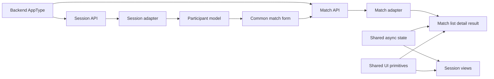
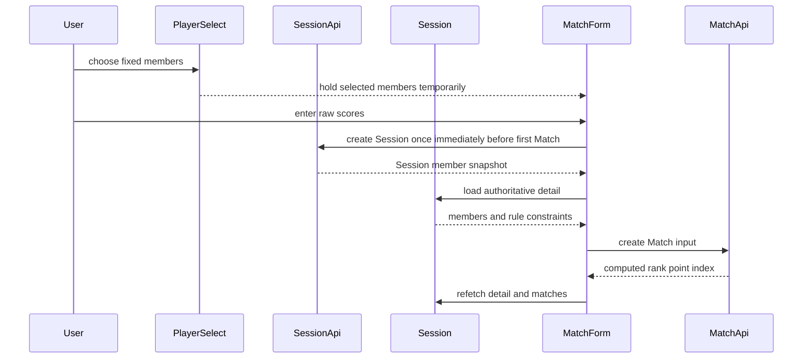

# 技術設計: frontend-session-match

## 1. Overview

### Summary

Seasonの参加者候補から固定Sessionを作成し、Session membersを正本として初回・追加・編集Matchを共通フォームで扱う。`frontend-foundation-ui`のtyped API client、AsyncState、Error boundary、UI primitivesを利用し、`backend-integrity-lifecycle`が返すcomputed `rank`・`point`・`matchIndex`を表示する。ISSUE-99ではMatchごとのチョンボ発生者と卓外供託を別入力で記録し、外卓入力を結果詳細で確認できるようにする。FEはscore/rank/point/aggregateを再計算せず、mutation成功後にGETで正本を再取得する。

Issue #123ではSession終了保存の成功後にSeason detailへ遷移し、League ruleのrotateSeatOrderが有効な追加Matchでは、同SessionでmatchIndexが最大の保存済みMatchの実seat assignmentを一席分回した値を初期表示する。初期表示後の手修正は許可し、次回は直近に保存されたassignmentを基準に回す。

### Goals

- `sanma`はeast/south/westの3人、`yonma`はeast/south/west/northの4人をPlayer selectとMatchフォームへ反映する。
- Session member snapshotをSession作成時に固定し、Matchのparticipant集合を常に完全一致させる。
- Sessionの作成・一覧・詳細、Matchの作成・編集・一覧・詳細・削除と結果表示をAPIへ接続する。
- 初回・追加・編集でMatchフォームの入力・validation・mutation状態を共通化する。
- League ruleで卓外供託が許可される場合だけ供託入力を表示し、チョンボ発生行と供託本数を別々に送信する。
- Session終了保存後は所属Season detailへ遷移する。
- League ruleの座順ローテーション設定を追加Matchの初期seat assignmentに反映し、保存済みwindを次回の基準にする。
- Main/PR #104のMatch UIを維持し、チョンボ・供託の入力欄と結果詳細だけを追加する。
- API error/loading/empty、retry、二重submit、stale request、未接続操作を対象画面で統一する。

### Non-Goals

- BEのSession/Match validation、score/rank/point calculation、matchIndex allocation、aggregate/rebuild、ErrorEnvelope、route/statusの変更。
- FEのrank、point、standing、累計値、統計の再計算やmatchIndex欠番の補正。
- 統計画面、旧domain/mock/Reduxの全削除、リアルタイム同期、複数端末同時編集。
- `frontend-foundation-ui`の共通API client、Auth boundary、UI primitive、AppShell本体の再設計。
- League ruleの編集、rotation flagのBE保存、既存Matchのseat assignment変更。

## 2. Boundary Commitments

### This spec owns

- Player selectのgameType別枠数、候補制御、Session作成フローへの接続。
- Session feature API、Session一覧・詳細・終了表示と終了後Season遷移、Session membersのview model。
- Match feature API、共通Matchフォーム、Match一覧・詳細・結果表示、create/update/delete後の再取得。
- Session membersとMatch participantの一致をUIで表示・送信する境界、raw scoreの入力補助、BE結果の表示。
- Matchごとのchombo event・off-table kyotaku inputと、BEが保存した両項目の結果詳細表示。
- Session終了成功後のSeason detail navigation、および追加Match初期値の座順rotationと保存前seat correction。
- 対象routeのloading/error/empty/retry、二重submit防止、stale request防止、未接続buttonの解消。

### Out of Boundary

- BEのcanonical Session/Match、固定member、wind/raw score validation、score/rank/point計算、外卓点数処理、matchIndex採番、集計・repair・削除ライフサイクル。
- `frontend-foundation-ui`のtransport、AppType公開位置、認証Cookie、ErrorEnvelope parser、AsyncState/UI primitiveの内部実装。
- `frontend-league-season`のLeague rule編集とstanding/record表示、`frontend-statistics-quality`の統計・旧コード削除。
- Session作成後のmember変更、別参加者を既存Sessionへ追加する操作、League rule設定や点数計算。

### Allowed Dependencies

| 方向 | 依存先 | Criticality | 契約 |
|---|---|---:|---|
| Inbound | `frontend-foundation-ui` | P0 | AppType aliases、共通client、ApiError、AsyncState、Auth、UI primitives |
| Inbound | `frontend-league-season` | P0 | Season detailからのSession開始導線、Season member候補 |
| Inbound | `backend-foundation` | P0 | Session/Match route、camelCase DTO、ISO日時、status、Match external fields、LeagueRule.rotateSeatOrder、ErrorEnvelope、AppType |
| Inbound | `backend-integrity-lifecycle` | P0 | fixed members、allowed wind、League rule external settings、computed rank/point、matchIndex、欠番、fourth null |
| Outbound | `frontend-statistics-quality` | P1 | Session/Match画面がBE結果を再計算しない境界、旧資産の移行対象 |
| External | Next.js `15.5.19` / React `19.1.0` | P0 | App Router、useParams/useRouter、`React.FC` |

### Revalidation Triggers

- Session/Matchのrequest/response DTO、route、HTTP status、ErrorCode、AppType公開位置の変更。
- Session members、gameType、allowed wind、raw score totalとkyotaku count、chombo event/penalty契約、rank/point計算、matchIndex欠番、fourth null semanticsの変更。
- rotateSeatOrderのlegacy default、最大matchIndexの判定、Wind assignment DTO semanticsの変更。
- 共通client、Auth boundary、AsyncState、Loading/Error/Empty、Input/Select/Table primitiveの変更。
- Season詳細からのSession開始導線、Session詳細route、Match一覧・詳細route、Session作成タイミングの変更。
- Create/UpdateMatchでrankを入力するかどうかのBE契約変更。
- rotateSeatOrderのBE契約、同Session matchIndex ordering、三麻/四麻のwind集合、保存済みseat correction方針の変更。

## 3. Architecture

### Technology Alignment

| Layer | Existing technology | Role |
|---|---|---|
| Route/runtime | Next.js `15.5.19`, App Router | path params、route entry、navigation |
| UI/runtime | React `19.1.0` | `React.FC`、hooks、controlled form |
| API contract | Hono client、workspace `AppType` | typed request/response、Session/Match operations |
| Shared runtime | `frontend-foundation-ui` client、AsyncState、UI primitives | credentials、envelope、auth/error、共通状態 |
| Styling | Tailwind CSS 4 semantic tokens | form、table、loading/error/empty、responsive UI |

### Dependency Direction

`AppType aliases → feature API → DTO adapter → request hooks → feature UI → route page`

`Session member snapshot → participant model → Match form → Match API input`

`BE computed Match response → adapter → list/detail/result UI`

Feature APIはshared transportだけを利用し、BE業務計算を持たない。adapterはID/日時/null検証と表示用整形だけを行い、raw scoreからrank/pointを求めない。pageはAPIを直接呼ばず、feature hookとfeature UIを利用する。Reduxのrecording flowを新しい正本状態として拡張せず、画面遷移中の一時入力はfeature hook内で管理する。


```mermaid
graph LR
    AppType[Backend AppType] --> SessionApi[Session API]
    AppType --> MatchApi[Match API]
    SessionApi --> SessionAdapter[Session adapter]
    MatchApi --> MatchAdapter[Match adapter]
    SessionAdapter --> ParticipantModel[Participant model]
    ParticipantModel --> MatchForm[Common match form]
    MatchAdapter --> MatchViews[Match list detail result]
    MatchForm --> MatchApi
    SharedState[Shared async state] --> SessionViews[Session views]
    SharedState --> MatchViews
    SharedUi[Shared UI primitives] --> SessionViews
    SharedUi --> MatchViews
```

### Session start flow


```mermaid
sequenceDiagram
    participant User
    participant PlayerSelect
    participant SessionApi
    participant Session
    participant MatchForm
    participant MatchApi
    User->>PlayerSelect: choose fixed members
    PlayerSelect-->>MatchForm: hold selected members temporarily
    User->>MatchForm: enter raw scores
    MatchForm->>SessionApi: create Session once immediately before first Match
    SessionApi-->>MatchForm: Session member snapshot
    MatchForm->>Session: load authoritative detail
    Session-->>MatchForm: members and rule constraints
    MatchForm->>MatchApi: create Match input
    MatchApi-->>MatchForm: computed rank point index
    MatchForm->>Session: refetch detail and matches
```

Player selectでは参加者を一時保持し、初回Match送信直前にSessionを一度だけ作成する。Match作成に失敗した場合は同じ送信で作成したSessionだけを削除してロールバックし、既存Sessionや既存Matchは削除しない。Session作成後のmembersは変更不可とする。

## 4. Shared Contracts and Data Handling

### API endpoint matrix

| Operation | Endpoint | Input/output | UI responsibility |
|---|---|---|---|
| Session list | `GET /api/leagues/:leagueId/seasons/:seasonId/sessions` | `data: Session[]` | Season内の一覧、empty、導線 |
| Session create | `POST /api/leagues/:leagueId/seasons/:seasonId/sessions` | create input → 201 `Session` | fixed member snapshotの開始 |
| Session detail | `GET /api/leagues/:leagueId/seasons/:seasonId/sessions/:sessionId` | `data: Session` | members、status、count |
| Session update | `PATCH /api/leagues/:leagueId/seasons/:seasonId/sessions/:sessionId` | endedAt/tableLabel → 200 `Session` | 終了操作、再取得 |
| Session delete | existing API only for rollback/explicit supported action | 204 | UIの必須機能には含めない |
| Match list | `GET /api/leagues/:leagueId/seasons/:seasonId/sessions/:sessionId/matches` | `data: Match[]` | matchIndex、raw score、rank、point |
| Match create | `POST /api/leagues/:leagueId/seasons/:seasonId/sessions/:sessionId/matches` | create input（rank/pointなし、外卓欄別）→ 201 `Match` | 初回・追加登録 |
| Match detail | `GET /api/leagues/:leagueId/seasons/:seasonId/sessions/:sessionId/matches/:matchId` | `data: Match` | 編集初期値、結果詳細 |
| Match update | `PATCH /api/leagues/:leagueId/seasons/:seasonId/sessions/:sessionId/matches/:matchId` | update input（rank/point/外卓fieldなし）→ 200 `Match` | raw score/playedAt更新。外卓field omissionで既存値を保持 |
| Match delete | `DELETE /api/leagues/:leagueId/seasons/:seasonId/sessions/:sessionId/matches/:matchId` | 204 | 確認、削除後再取得 |

具体的なrequest/response typeは手書きDTOを新設せず、foundationの`AppType`から`InferRequestType`/`InferResponseType`で導出する。`frontend/src/lib/api/sessions.ts`と`matches.ts`はfeature APIへの互換入口として整理し、共通parserや認証を再実装しない。

### Participant and seat contract

```ts
type GameType = "sanma" | "yonma";
type Wind = "east" | "south" | "west" | "north";
type ParticipantByWind = Readonly<Record<Wind, string | null>>;

type FixedSessionMembers = ReadonlyArray<{
  userId: string;
  userName: string;
}>;

type ParticipantConstraint = {
  gameType: GameType;
  requiredWinds: readonly Wind[];
  memberCount: 3 | 4;
};
```

`sanma`の`requiredWinds`は`east/south/west`、`yonma`は`east/south/west/north`。UIはSeason membersを候補として受け取り、Session作成後はSession membersだけを選択肢の正本とする。Match editではparticipant controlをread-onlyへ切り替え、異なる参加者は新Sessionでのみ登録可能と表示する。

#### Issue #123 seat rotation contract

League ruleのrotateSeatOrderはbackend-foundationのAppTypeから読み取るbooleanであり、frontend-league-seasonが編集・保存する。Session/Match画面はLeague detailからその値を読む。無効、または保存済みMatchがない場合は従来どおりmembersToParticipantsの初期割当を使う。有効かつMatchがある場合は、matches response内でmatchIndexが最大のMatchを直前とし、playedAtや配列位置では選ばない。削除によるindex gapはそのまま許容する。

seat assignmentは直前Matchのresults[].windとuserIdを参加者集合に再構成する。yonmaでは直前の東家を次の南家、南家を次の西家、西家を次の北家、北家を次の東家に割り当てる。sanmaでは東家→南家、南家→西家、西家→東家とする。DTOの必須windが欠落/重複する場合、初期席順をmembers順へ黙ってfallbackせず契約エラーとして画面に表示する。

```ts
type SeatAssignmentResult =
  | { ok: true; userIdByWind: ParticipantByWind }
  | { ok: false; reason: "invalid_previous_assignment" };

function rotateSeatAssignment(input: {
  previous: ParticipantByWind;
  constraint: ParticipantConstraint;
}): SeatAssignmentResult;
```

MatchFormValuesは既存のuserIdByWindを編集可能なdraftとして保つ。POSTには選択後のwindを既存results payloadとして送信し、rotation用の別API fieldは追加しない。次回formはAPIから再取得した最新Matchから初期値を計算するため、保存前の未確定変更は次回へ漏れない。

### Match form model

```ts
type MatchFormValues = {
  playedAt: string;
  userIdByWind: ParticipantByWind;
  rawScoreByWind: Readonly<Record<Wind, string>>;
  hasChomboEvents: boolean;
  chomboEvents: ReadonlyArray<{ offenderUserId: string | null }>;
  hasOffTableKyotaku: boolean;
  offTableKyotakuCount: string;
};

type MatchFormMode = "initial" | "additional" | "edit";

type MatchFormProps = {
  mode: MatchFormMode;
  members: FixedSessionMembers;
  constraint: ParticipantConstraint;
  externalRule: {
    chomboPenaltyPoints: number;
    allowOffTableKyotaku: boolean;
  };
  initialValues: MatchFormValues | null;
  submitting: boolean;
  errorMessage: string | null;
  onSubmit: (values: MatchFormValues) => Promise<void>;
  onCancel: () => void;
};
```

Match create用フォームはraw score、供託本数、チョンボ発生者IDを文字列/行配列として保持し、送信時にAppTypeのMatch入力へ変換する。`hasChomboEvents`を有効にすると発生1回ごとの行を表示し、行数が発生回数になる。同じ`offenderUserId`の複数行を許す。未選択行、Session memberに含まれないID、供託ありなのに1以上の整数でない本数は送信前に拒否する。供託なしは0本へ変換する。卓外供託がruleで許可されない場合は該当controlを表示せず、入力値0を送る。raw score合計の期待値は`startingPoints × memberCount - 1000 × offTableKyotakuCount`とし、チョンボ回数はraw score合計に影響させない。これらは利用者向けの早期検証であり、BE validationが最終権威である。rankとpointは`MatchFormValues`に含めず、Match create/update requestにも含めない。API responseの`results[].rank`/`point`だけをMatch view modelへ渡す。既存Matchのedit modeはチョンボ発生・供託をread-onlyで表示し、PATCHから両fieldを省略して既存値を保持する。これは承認済みRequirement 4.4の「編集対象はplayedAt/raw score」に沿う。

### Adapter policy

Adapterは次を担当する。

- opaque ID、ISO 8601日時、必須DTOフィールドの検証。
- Session member snapshot、Match result、sanmaのfourth系nullの保持。
- BE responseの`matchIndex`、`rank`、`point`、rawScore、userName、`chomboEvents`、`offTableKyotakuCount`の表示整形とedit form初期化。
- API ErrorEnvelopeをfoundation `ApiError`/safe messageへ渡すためのfeature context付与。

Adapterは次を担当しない。

- raw scoreからrank/pointを計算すること、chombo penaltyやkyotakuの点数影響をFEで計算すること。
- matchIndexを並べ替え、欠番を埋めること。
- Session resultのpoint合算、standing、統計、累計値を生成すること。
- Session memberをSeason current membersへ更新すること、API DTOにない値をmockで補うこと。

### Mutation and revalidation

1. form validationで不正入力を止める。
2. feature APIが共通client経由でPOST/PATCH/DELETEを実行する。
3. 成功してもlocal listへoptimistic updateせず、対象Session、Match list、必要なMatch detailをGETする。
4. GET responseをadapterへ通し、BEのcomputed値・欠番・nullをそのまま描画する。
5. 失敗時は入力を保持し、401だけAuth boundaryへ委譲する。

## 5. Components and Interfaces

### Component Summary

| Component | Intent | Requirements | Key dependencies | Contracts |
|---|---|---|---|---|
| Session Feature API | Session list/create/detail/updateを型付きで提供する | 2.1-2.5, 6.1-6.2 | Foundation client、AppType | API, Type |
| Match Feature API | Match list/create/detail/update/deleteを型付きで提供する | 4.1-4.5, 6.1-6.2 | Foundation client、AppType | API, Type |
| Participant Model | gameType、wind、fixed memberを検証する | 1.1-1.6, 3.2 | Season/League DTO、Session DTO | Type, State |
| Session Hooks and UI | Player select、Session list/detail、終了保存とSeason detail遷移を扱う | 1.1-2.5, 5.1-5.3, 6.3-6.4 | AsyncState、UI primitives、Next Router | UI, State |
| Common Match Form | initial/additional/editを同一入力契約にし、座順修正、チョンボ発生、許可された卓外供託を扱う | 3.1-3.12, 4.1, 4.4 | Participant Model、League rule、Match API | UI, State |
| Seat Rotation Model | 直前保存Matchのwind assignmentをgameType別に一席回し、新規formの初期値を作る | 3.10-3.12 | Participant Model、Match DTO | Type, State |
| Match Views | list/detail/result/delete confirmationと記録済み外卓入力を表示する | 4.2-4.5, 5.1-5.3 | Match adapter、Table | UI |
| Route Integration | existing routeとSeason detail導線を接続する | 2.1, 5.1-5.4, 7.1-7.3 | Next Router、League-Season | UI, State |
| Validation Handoff | 既存scriptとsource reviewで型・境界を確認する | 6.1-6.4, 7.1-7.3 | project scripts、BE contract | Static Validation |

### Session Feature API

```ts
interface SessionFeatureApi {
  list(leagueId: string, seasonId: string): Promise<ReadonlyArray<SessionDto>>;
  create(
    leagueId: string,
    seasonId: string,
    input: CreateSessionInput,
  ): Promise<SessionDto>;
  get(
    leagueId: string,
    seasonId: string,
    sessionId: string,
  ): Promise<SessionDto>;
  update(
    leagueId: string,
    seasonId: string,
    sessionId: string,
    input: UpdateSessionInput,
  ): Promise<SessionDto>;
}
```

`SessionDto`、`CreateSessionInput`、`UpdateSessionInput`はAppTypeから導出する。`members`の配列順をseat順として暗黙利用せず、participant modelがgameTypeとwindを明示的に管理する。createはone-shot guardを持ち、成功後に返却Sessionのmembersを保存する。

### Match Feature API

```ts
interface MatchFeatureApi {
  list(
    leagueId: string,
    seasonId: string,
    sessionId: string,
  ): Promise<ReadonlyArray<MatchDto>>;
  get(
    leagueId: string,
    seasonId: string,
    sessionId: string,
    matchId: string,
  ): Promise<MatchDto>;
  create(
    leagueId: string,
    seasonId: string,
    sessionId: string,
    input: CreateMatchInput,
  ): Promise<MatchDto>;
  update(
    leagueId: string,
    seasonId: string,
    sessionId: string,
    matchId: string,
    input: UpdateMatchInput,
  ): Promise<MatchDto>;
  remove(
    leagueId: string,
    seasonId: string,
    sessionId: string,
    matchId: string,
  ): Promise<void>;
}
```

`MatchDto`の`matchIndex`、各resultの`rank`/`point`はread-only response値。Feature APIはこれらを算出・補正せず、rank/pointを除いたAppTypeのMatch入力だけを送る。

### Request state and error mapping

既存のfoundation `AsyncState<T>`を使い、featureごとに`idle/loading/success/error`を持つ。route parameter変更時はAbortSignalまたはrequest sequenceで旧responseを破棄する。mutation中はフォームと対象操作をdisabled/loadingにし、success後にGETを起動する。

| API condition | UI behavior |
|---|---|
| 401 / authentication_error | Auth boundaryへ委譲しloginへ誘導。入力を無関係なemptyへ変換しない |
| 403 / forbidden | 権限不足のErrorState、戻るまたは再試行 |
| 404 / not_found | 対象Session/MatchなしのErrorState、戻る導線 |
| 409 / conflict | Session固定、participant不一致、編集競合を説明し入力保持 |
| validation_error | field/form messageへ安全に表示し入力保持 |
| internal_error | 内部detailsを露出せず汎用的に再試行 |
| network/timeout/decode | transport区別とretry action |
| empty array/null | errorと混同しないempty/uncomputed表示 |

## 6. Screen and Route Composition

### Canonical routes and sections

| Route or section | Responsibility |
|---|---|
| `/league/[leagueId]/season/[seasonId]` Session section | Season detailからSession listと新規Session開始へ接続 |
| `/league/[leagueId]/season/[seasonId]/sessions/start/players` | gameType別Player selectとSession開始 |
| `/league/[leagueId]/season/[seasonId]/sessions/start/match` | 初回Matchの共通フォーム接続 |
| `/league/[leagueId]/season/[seasonId]/sessions/[sessionId]/results` | Session detail、Match list、BE result表示、追加・編集・終了 |
| `/league/[leagueId]/season/[seasonId]/sessions/[sessionId]/matches/new` | 追加Matchの共通フォーム |
| `/league/[leagueId]/season/[seasonId]/sessions/[sessionId]/matches/[matchId]/edit` | Match editの共通フォーム |

Matchのread-only詳細は専用routeを新設せず、既存results routeのMatch行または結果カードを展開して表示する。編集だけは既存の`matches/[matchId]/edit`へ遷移する。Session listは新規の独立routeを増やさず、Season detail内の一覧領域を初期UIとする。

### UI behavior

- Player selectはLeague ruleとSeason membersを同時に読み、三麻はnorth controlを表示せず、四麻は4枠を必須にする。
- Session detailのmembersは作成時snapshot。Season membersの現在値を上書きしない。
- Session end操作はendedAt/tableLabelの許可済み更新を保存し、成功後に`/league/{leagueId}/season/{seasonId}`へ遷移する。更新失敗時はrouteを変えず、Session resultsにerrorを表示して再試行可能にする。
- Match formのedit modeはparticipantをread-onlyにし、raw score/playedAtだけを編集する。別参加者の場合は新Session開始へ戻す説明を出す。
- 初回/追加Match formでは既存のplayedAt/席別点数行の後に外卓欄を追加する。チョンボ発生toggleがONなら、Session memberを選ぶ発生者行（1行=1回）と「発生を追加/削除」を表示し、同一userの複数行を許す。各回の罰符はLeague ruleの値を説明表示するだけでFE計算しない。
- 卓外供託の有無と本数欄は`allowOffTableKyotaku=true`の場合だけ描画する。ありを選んだ時だけ棒数欄を出し、0または不正値では送信を止める。falseの場合は選択・入力controlを描画しない。
- Match edit modeでは既存のチョンボ発生者と卓外供託本数をread-onlyで表示し、追加・削除・変更controlを表示しない。PATCHは外卓fieldを省略して既存値を保持する。
- 追加MatchでrotateSeatOrderがtrueの場合はLeague detail、Session detail、Match listを取得する。Match listが空なら現行member順、1件以上なら最大matchIndexのMatchから三麻/四麻の一席rotationを初期値にする。利用者は保存前に通常のseat selectorで修正できる。
- seat assignmentを手修正してMatchを保存した時は、次の追加Matchでその保存結果を新しい基準としてさらに一席rotationする。既存Matchのseat selectorはread-onlyのままとし、保存済みMatchを自動補正しない。
- Match listはBEの配列順と各`matchIndex`を表示し、欠番補正を行わない。sortを追加する場合もdisplay indexを変更しない。
- Match listの各行は展開状態を持ち、展開時に同じMatch DTOのwind、raw score、rank、point、playedAt、記録済みチョンボ発生回数と各発生者、卓外供託本数をread-onlyで表示する。編集は既存のedit routeへ遷移する。
- Session resultは各MatchのBE結果を表示し、pointの総和や順位の再計算で表示値を上書きしない。
- 作成・更新・削除後は対象resourceと一覧を再取得する。楽観更新、mock fallback、console-only completionは持たない。

## 7. File Structure Plan

### New files to add

| Component | Path | Responsibility |
|---|---|---|
| Session Hooks | `frontend/src/features/session/hooks/index.ts` | Player select、Session list/detail、stale/error state |
| Match Hooks | `frontend/src/features/match/hooks/index.ts` | Match list/detail/form mutation、refetch state |
| Session Hooks and UI | `frontend/src/features/session/ui/index.tsx` | Player select、Session list/detail、empty/error composition |
| Common Match Form / Match Views | `frontend/src/features/match/ui/index.tsx` | common form、list/detail/result、delete confirmation |
| Feature export | `frontend/src/features/session-match/index.ts` | downstream routeが使う公開feature入口 |

### Existing files to modify

| Component | Path | Responsibility |
|---|---|---|
| Session Feature API | `frontend/src/features/session/api/index.ts` | Session list/create/detail/updateのtyped wrapperを更新 |
| Match Feature API | `frontend/src/features/match/api/index.ts` | Match list/create/detail/update/deleteのtyped wrapperを更新 |
| Participant Model / Seat Rotation Model | `frontend/src/features/session-match/model/participants.ts` | gameType、wind、fixed memberを検証し、保存済みassignmentをsanma/yonma別に一席rotateする |
| Common Match Form | `frontend/src/features/session-match/model/match-form.ts`, `frontend/src/features/match/ui/MatchForm.tsx` | seat assignmentとexternal input draft、kyotaku調整後raw total validation、chombo event rows、typed payload変換を共通formに追加 |
| Match Views | `frontend/src/features/match/ui/MatchList.tsx` | 展開詳細にMatch DTOのchombo/kyotakuとBE算出結果を表示 |
| Route Integration / Request Hooks | `frontend/src/app/league/[leagueId]/season/[seasonId]/sessions/start/match/hooks/index.ts`, `frontend/src/app/league/[leagueId]/season/[seasonId]/sessions/[sessionId]/matches/new/hooks/index.ts`, `frontend/src/app/league/[leagueId]/season/[seasonId]/sessions/[sessionId]/matches/[matchId]/edit/hooks/index.ts` | League external ruleをformへ渡し、追加Matchはmax matchIndexの保存windから初期assignmentを作り、保存後はMatch listを再取得する |
| Route Integration | `frontend/src/app/league/[leagueId]/season/[seasonId]/sessions/[sessionId]/results/hooks/index.ts` | Session update成功後にrecording flowをclearしSeason detailへ遷移。失敗時は同routeに留める |

| Validation Handoff | `frontend/package.json`, `frontend/tsconfig.json` | 既存typecheck/lint/build entryとHono API type境界を確認 |
| Session API compatibility | `frontend/src/lib/api/sessions.ts` | feature APIへの薄い互換入口、list/detail契約の不足を補う |
| Match API compatibility | `frontend/src/lib/api/matches.ts` | feature APIへの薄い互換入口、match detailとtyped inputを接続 |
| Route Integration | `frontend/src/app/league/[leagueId]/season/[seasonId]/sessions/start/players/*` | Participant ModelとSession creationを接続 |
| Route Integration | `frontend/src/app/league/[leagueId]/season/[seasonId]/sessions/start/match/*` | common formのinitial modeを接続 |
| Route Integration | `frontend/src/app/league/[leagueId]/season/[seasonId]/sessions/[sessionId]/results/*` | Session detail、Match list、BE result、end/delete/refetchを接続 |
| Route Integration | `frontend/src/app/league/[leagueId]/season/[seasonId]/sessions/[sessionId]/matches/new/*` | common formのadditional modeを接続 |
| Route Integration | `frontend/src/app/league/[leagueId]/season/[seasonId]/sessions/[sessionId]/matches/[matchId]/edit/*` | common formのedit mode、participant read-onlyを接続 |
| Route Integration | `frontend/src/app/league/[leagueId]/season/[seasonId]/*` | Session list/start導線を接続。Season集計は変更しない |
| Existing result table | `frontend/src/components/pages/daily-record/daily-record-table/*` | BE rank/point/indexを表示できる薄いview componentへ整理 |
| Legacy flow boundary | `frontend/src/store/slices/recording-flow-slice/*` | 新しい正本状態にせず、不要なparticipant/session fallbackを移行対象として明示 |

### Ownership notes

- `frontend/src/lib/api/core.ts`、`src/components/ui/*`、`src/components/layout/*`の共通本体は変更せず、foundation提供契約を利用する。
- `frontend/src/mocks/match.ts`、旧`src/types/domain/match.ts`、Redux全体はこのspecで削除しない。対象routeの本番正本依存から外す作業だけを扱う。
- `frontend/src/features/session`と`src/features/match`のAPI/model/UIはそれぞれ独立させ、共通のparticipant/form契約だけを`session-match/model`に置く。

## 8. Integration and Migration Notes

### Implementation order

1. FoundationのAppType、client、AsyncState、UI primitiveの利用可否とBE Session/Match契約を確認する。
2. Session/Match API wrapper、DTO alias、participant model、adapterを固定する。
3. Player selectとSession作成/list/detailを移行し、members snapshotを正本化する。
4. 初回・追加・編集を共通Matchフォームへ寄せ、FE rank/point計算を外す。
5. Match list/detail/result、delete、成功後refetch、error/loading/emptyを接続する。
6. Season detail導線、未接続button、mock fallback、旧recording flow依存を対象範囲で整理する。
7. AppType契約、typecheck、lint、build、主要routeの静的スキャンを検証する。

### Migration safety

- Session作成後のmembersを再取得したSeason membersで上書きしない。
- BEのrank/point/matchIndexをFEで作らず、欠番を連番化せず、raw scoreから表示用rankを推定しない。
- Match editでparticipant selectを編集可能なまま残さず、異なる参加者は新Sessionへ誘導する。
- API成功前にlocal list/totalsを確定させず、成功後にSession detail・Match list・Match detailを再取得する。
- APIにない参加者変更・統計計算・旧コード全削除をmockで補わない。
- 既存Session createのrollback用途だけで使われるdelete APIは、UIの通常操作と混同しない。

## 9. Testing and Validation Strategy

| Validation | Verifies | Requirements |
|---|---|---|
| Participant/form source review | participant constraints、wind、fixed members、external-input mapping、BE rank/point boundary | 1.1-1.6, 2.1, 3.1-3.9, 4.1, 4.4 |
| Session and Match integration review | API types, DTO/null/ISO, Session snapshot, mutation/refetch flow, safe errors | 2.1-2.6, 4.2-4.5, 6.1-6.4 |
| Issue #123 source review | typecheck/lint/build plus source review that selects the saved Match with maximum `matchIndex`, preserves editable draft assignment, uses saved assignment as the next baseline, and navigates only after Session update succeeds | 2.4, 3.10-3.12, 5.1, 5.3 |
| State and route source review | loading/empty/retry, 401 handoff, 403/404/409/validation/transport, stale request, route links and no-op buttons | 1.6, 2.5, 3.5-3.6, 5.1-5.3, 6.3-6.4, 7.3 |
| Project validation | `pnpm typecheck`、`pnpm lint`、`pnpm build`、mock/direct-fetch/FE-calculation scan | 5.4, 6.1, 7.1-7.3 |

本仕様ではフロントエンドのtest runnerやbehavior test fileを追加しない。必須検証はfoundationの型契約、`pnpm typecheck`、`pnpm lint`、`pnpm build`、対象routeとseat rotation modelのsource reviewとする。BEのAPI・Emulator contract testは`backend-foundation`と`backend-integrity-lifecycle`の責務として維持する。

## 10. Open Questions / Risks

- backendのrebuildが非同期化された場合、mutation直後のGETが古い派生値を返さない完了契約を再確認する。
- League ruleのlegacy fallbackが`allowOffTableKyotaku=false`なら、該当LeagueのMatch画面では供託欄を表示しない。必要な既存Leagueを有効化する運用移行はBE/League仕様の判断と整合させる。

## 11. Requirements Traceability


| Requirement | Summary | Components | Interfaces / Flows |
|---|---|---|---|
| 1.1, 1.2, 1.3, 1.4, 1.5, 1.6 | gameType別Player select、重複、fixed member、候補状態 | Participant Model, Session Hooks and UI | Season/League → Player select |
| 2.1, 2.2, 2.3, 2.5 | Session create/list/detail/error | Session Feature API, Session Hooks and UI | Session endpoints → Session views |
| 2.4 | Session end成功後に所属Season detailへ遷移し、失敗時はSession resultsに留まる | Session Hooks and UI, Route Integration | update Session → `/league/{leagueId}/season/{seasonId}` |
| 2.6 | Match create失敗時に今回作成したSessionだけをrollbackし、入力を保持 | Route Integration, Session Feature API, Match Feature API | create Session → create Match failure → delete newly-created Session |
| 3.1, 3.2, 3.3, 3.4, 3.5, 3.6 | 共通Match form、raw score、participant一致、BE結果、二重submit | Common Match Form, Participant Model | form → Match API |
| 3.7, 3.8, 3.9 | chombo eventごとのoffender、ruleに応じたkyotaku controlの表示/非表示、既存UIへの追加 | Common Match Form | League rule + Match form → separate external Match fields |
| 3.10, 3.11, 3.12 | ruleに応じた初回/次回wind assignment、保存前修正、最新保存Matchを次回基準にする | Seat Rotation Model, Common Match Form, Additional Match route | max matchIndex Match → rotate seat assignment → editable draft → Match create |
| 4.1, 4.2, 4.3, 4.4, 4.5 | Match create/update/delete、list/detail、外卓結果、欠番、編集固定、refetch | Match Feature API, Match Views | Match endpoints → result views |
| 5.1, 5.2, 5.3, 5.4 | success navigation、BE result表示、未接続操作、scope | Route Integration, Match Views | mutation → route/refetch |
| 6.1, 6.2, 6.3, 6.4 | foundation contracts、adapter、loading/error/stale | Session/Match API, Validation Handoff | feature → shared boundaries |
| 7.1, 7.2, 7.3 | revalidation、project validation、ownership boundary | Route Integration, Validation Handoff | upstream/downstream handoff |
