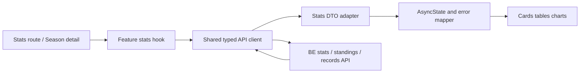

# 設計: frontend-statistics-quality

## 1. 方針

統計・順位・日次記録・チャートを、BEが返す統計DTOを表示する薄いfeatureへ整理する。データ取得は`frontend-foundation-ui`のtyped clientと共通AsyncStateを利用し、adapterは型・null・日時・表示形式の境界だけを担当する。rank、point、standing、aggregate、progressionの計算はFEに持たない。

## 2. 所有範囲

| 領域 | 本仕様の責務 | 委譲先 |
|---|---|---|
| stats API | typed wrapper、adapter、cache/request lifecycle | foundationのAPI client、BE AppType |
| 個人成績 | user statsの取得・表示 | backendのuser_stats契約 |
| standings/records | API配列を表として表示 | League/Season仕様のdetail導線 |
| daily records/progression | API seriesの表示・empty処理 | BE集計・repair |
| chart/table/card | feature固有のcomposition | foundationの共通primitive |
| 旧実装退役 | 参照調査、移行、削除、静的scan | 各featureの所有境界 |

## 3. データフロー

Hookは対象ID・期間・ユーザーIDを入力に持ち、リクエスト競合とretryを処理する。Viewは表示modelとstateだけを受け取り、sort・aggregate・rank生成を行わない。

## 4. 型・adapter

- request/response typeはHono `AppType`またはfoundationのAPI型から導出する。
- `UserStatsViewModel`、`StandingRowViewModel`、`DailyRecordViewModel`、`PointProgressionViewModel`などの画面modelは、nullableを保持した明示型にする。
- `null`、空配列、未計算フラグを同じ0値へ正規化しない。三麻のfourth系はnullのまま扱う。
- `rank`、`point`、`matchIndex`、`totalMatchCount`、集計値はread-only表示値とし、入力フォームや表示用再計算へ渡さない。
- 日時の表示変換は共通formatterに集約し、日付単位への丸めやtimezone変更を画面ごとに行わない。

## 5. 画面構成

| 画面・領域 | 表示 |
|---|---|
| 個人成績 | BE user statsの期間、対局数、順位、point、records、未計算状態 |
| standings | API配列順の順位表、user/member、rank、point、raw/record値 |
| daily records | BEが返した日付単位のrecordと対局情報 |
| point progression | APIのseries、凡例、単位、空・部分データ状態 |
| Season/League detail | 前段仕様が返すstandings、records、progressionのcomposition |

standingsやchartのクリックで別画面へ遷移する既存導線がある場合は維持する。新しい分析指標や専用detail routeは追加しない。

## 6. 共通UI・状態

- 表、カード、チャートはfoundationのprimitiveとdesign tokenを利用する。
- 正常な空配列はEmptyState、null/未計算はUncomputedState、通信・権限・対象エラーはErrorStateとして区別する。
- loading中は対象領域だけをplaceholderまたはloading表示にし、別対象の前回値を成功値として表示しない。
- 401はAuth boundary、403/404/409/validation/transportは共通error mapperへ委譲する。
- chartは共通の色token、凡例、tooltip、axis label、responsive containerを利用し、ページ固有の色定義を禁止する。

## 7. legacy移行戦略

1. stats/standings/daily-record/chartの全importとroute参照を棚卸しする。
2. typed API、adapter、hook、共通UIへ各画面を移行する。
3. 参照がなくなった手書き型、mock fallback、重複hook/component、不要Reduxを削除する。
4. `rg`で対象routeのdirect fetch、mock、console-only操作、FE集計を検出する。
5. Session/MatchとLeague/Season CRUDの参照を再確認し、共有資産は所有範囲を明記して残す。

削除は参照調査後に行い、一度に無関係な旧資産を全削除しない。移行中にAPI未接続の表示をmockで隠さない。

## 8. ルート・認証・metadata

- 既存の統計入口、Season detail内の統計領域、Header/navigationのrouteを棚卸しし、正規入口を一つにする。
- stats画面はfoundationのAuth boundaryを通し、未認証時に空の統計画面を表示しない。
- metadataのtitle/descriptionは共通の画面命名へ統一し、旧routeと同一画面の二重実装を残さない。

## 9. 検証方針

| 検証 | 内容 |
|---|---|
| contract | endpoint、status、`{ data }`、ErrorEnvelope、nullable、BE算出値を検証 |
| adapter/unit | null、empty、三麻/四麻、日時、seriesを検証 |
| UI | loading/error/empty/uncomputed、table/chart、retry、responsiveを検証 |
| smoke | Home/League/Seasonからstats、standings、daily、back/navigationを確認 |
| static | mock、direct fetch、console、旧型、FE再計算、未接続buttonをscan |
| project | `pnpm typecheck`、`pnpm lint`、`pnpm build` |

## 10. リスクと対策

- BE集計が未計算またはrepair中の場合、FEは前回値や0で補わず、未計算状態を表示する。
- 旧Reduxを早期に削除するとrecording flowが壊れるため、参照一覧と移行完了を確認してから削除する。
- APIのseries形式が画面ごとに異なる場合、FEで意味を作り替えず、contract差分を記録してBE契約または別仕様へ戻す。
