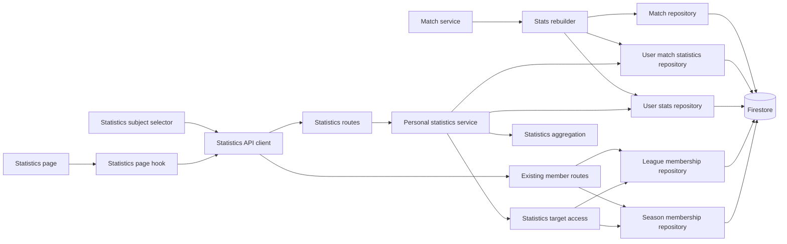
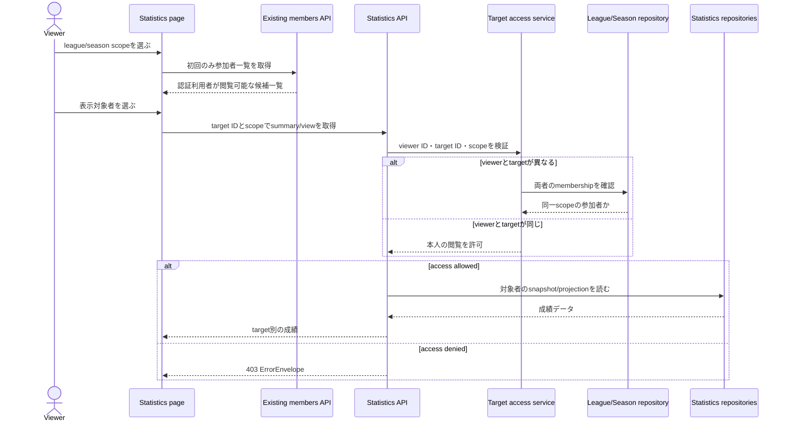

# 設計: frontend-statistics-quality

## 概要

記録済み対局から統計をサーバーで集計し、既存の`/stats`画面を共通フィルターと「概要／分析／対局履歴」の3タブで構成する。全体scopeでは本人のみ、リーグまたはシーズンscopeではそのscopeに参加する他ユーザーへ表示対象を切り替えられる。既存の対局結果を正本とし、順位・素点・最終ポイントの再計算を画面や統計集計で行わない。

### 目的

- 全体・リーグ・シーズン、期間、三麻・四麻を選んで成績を確認できる。
- 順位、スコア、記録、推移、席・相手・セッション・期間の内訳を同一対象範囲で見られる。
- 集計の更新と履歴検索をサーバー側で行い、画面は返却された数値を表示する。
- リーグ・シーズンの参加者選択では、本人と表示対象者の両方が同じscopeの参加者であることを確認する。

### 対象外

- 牌譜を必要とする局単位統計、Elo等のレーティング、相手強度補正、信頼区間。
- 対局の順位・点数を決めるルール、Match/League/Season/SessionのCRUD。
- 既存の認証・共通UI・統計API基盤の再設計、リアルタイム同期。

## Boundary Commitments

- **本仕様が所有するもの**: 個人成績ページ、表示対象切替と認可、個人成績用のAPI/集計契約、対局単位の統計read model、既存再集計への同期、read model用のFirestore定義とindex。
- **本仕様が所有しないもの**: 対局結果の採点・順位計算、対局登録フロー、League/Season/Session管理、共通認証・API client・UI primitive。
- **許可する依存**: Match/Session/League/Season/Userの既存domain/repository/service、既存league/season member API、`StatsRebuilder`、認証済みusers route、既存Hono `AppType`、FEの共通API client・design token・table/card/loading/error/empty、Recharts。
- **変更時に再確認する境界**: ゲーム形式ごとの順位定義、match結果の正本スキーマ、Firestoreのmatch配置、league/season membershipの定義、認証方式とviewer/target認可、`StatsRebuilder`が同期完了を保証する契約、`Asia/Tokyo`の日付境界。

### Out of Boundary

- Matchの順位・素点・最終ポイントを決める計算と、対局/league/season/sessionの登録・編集。
- 局単位の牌譜分析、Eloや相手強度補正、リアルタイム同期、他画面の分析機能。
- 共通認証、API client、共通UI primitiveの再設計。
- 全体scopeやscope外の他ユーザー成績へのアクセス。

### Allowed Dependencies

- backend: 既存Match/League/Season/Session/User repository、`StatsRebuilder`、Firestore Admin、Hono/Zod。
- frontend: 既存AppShell、typed API client、design token、card/table/select/button/loading/empty/error、Recharts。
- external dependency追加は行わない。

### Revalidation Triggers

- Matchが参加人数・席・順位・素点・最終ポイント・対局日時の正本を変更する場合。
- League/Season/Sessionが保持場所や識別子、参加者関係を変更する場合。
- 統計APIのviewer/target認可条件またはleague/season membershipの保存形式が変わる場合。
- 他ユーザーの統計に対するアクセス条件がleague/seasonの共同membership以外へ広がる場合。
- 日時集計のAsia/Tokyo固定をユーザー設定可能へ変える場合。

## アーキテクチャ

### 決定

1. 既存`user_stats`を既存API互換のまま拡張し、スコープごとの拡張サマリーと`personal_statistics_version`を同一documentに保存する。要約と既存の基本値は一回のdocument readで取得し、対局履歴・全期間の推移・相手別行など可変長データは保存しない。
2. 各ユーザー・各対局に1件の`user_match_statistics` read modelを置く。履歴、分析タブ、任意期間のサマリーは要求された表示対象者の投影をscope内で絞ってサーバー側で算出する。
3. 固定scope（overall/league/season）の拡張サマリーは`StatsRebuilder`で対局変更時に同期再構築し、既存`user_stats`へまとめて保存する。更新対象の全scopeを先にversion 0へ無効化し、projectionと既存rollupが成功した後でsnapshotとversion 1を公開する。失敗時は対象を未計算のままにする。bulk repairも全対象scopeを先に無効化し、全projectionを生成してから各scopeのrollupとサマリーを公開する。
4. 新規APIは現行`/stats`を壊さず、`/statistics`のsummary、analysis、matchesの3責務で提供する。analysisは選択された内訳と最大50対局の推移を一つの応答にまとめる。
5. 各対局の`results.length`を記録時の参加人数と形式の根拠にする。全体で三麻・四麻が混ざる場合、対局数・総ポイントのように意味が保てる合計だけをまとめ、順位・順位率・ラス・席別指標はゲーム形式ごとに返す。
6. 日付・曜日・時間帯の分類は`Asia/Tokyo`の暦にそろえる。時刻はUTC instantで保存し、期間境界と表示ラベルを同じゾーンで変換する。
7. 個人成績画面は1つの`/stats` route内に「概要／分析／対局履歴」の1段のタブを置く。対象選択フィルターは全タブで共有し、分析内の条件別指標は入れ子のタブにせず選択メニューで切り替える。
8. 初期表示では概要summaryだけを取得する。分析・対局履歴は該当タブを開いたときに取得し、画面内で同じqueryへ戻った場合は保持済みの結果を再利用する。
9. 統計routeは認証利用者を`viewerUserId`、pathの`:userId`を`targetUserId`として扱う。本人以外の対象はリーグまたはシーズンscopeに限り、認証利用者と対象者の両方が指定scopeの参加者である場合だけ許可する。全体scopeは本人のみに限定する。
10. 対象者候補は既存league/season member APIから取得する。候補はscope単位でFE内cacheし、対象者変更では新しい統計APIを増やさず、既存のsummary/analysis/matchesをtarget user ID付きで呼ぶ。

### 構成


```mermaid
flowchart LR
  MatchWrite[Match service]
  Rebuilder[Stats rebuilder]
  MatchRepo[Match repository]
  ProjectionRepo[User match statistics repository]
  UserStatsRepo[User stats repository]
  LeagueRepo[League membership repository]
  SeasonRepo[Season membership repository]
  MemberRoutes[Existing member routes]
  Firestore[(Firestore)]
  Route[Statistics routes]
  Access[Statistics target access]
  Service[Personal statistics service]
  Aggregation[Statistics aggregation]
  Client[Statistics API client]
  Subject[Statistics subject selector]
  Hook[Statistics page hook]
  Page[Statistics page]

  MatchWrite --> Rebuilder
  Rebuilder --> MatchRepo
  Rebuilder --> ProjectionRepo
  Rebuilder --> UserStatsRepo
  MatchRepo --> Firestore
  ProjectionRepo --> Firestore
  UserStatsRepo --> Firestore
  LeagueRepo --> Firestore
  SeasonRepo --> Firestore
  MemberRoutes --> LeagueRepo
  MemberRoutes --> SeasonRepo
  Route --> Service
  Service --> Access
  Access --> LeagueRepo
  Access --> SeasonRepo
  Service --> ProjectionRepo
  Service --> UserStatsRepo
  Service --> Aggregation
  Client --> Route
  Client --> MemberRoutes
  Subject --> Client
  Hook --> Client
  Page --> Hook
```

対局正本からread modelへの変換はbackend domain/service側が所有する。統計routeは認証・入力検証・response envelopeを担当し、集計関数はdomain層で純粋な値変換を行う。frontendはAPI adapterで型と表示用日時を整えるだけで、平均・率・順位・累計値を算出しない。

### 依存方向

`Frontend UI → FE API/adapter → Hono route/schema → Application service → Domain aggregation/repository interface → Firestore repository → Firestore`。

`StatsRebuilder`は既存domain repositoryを読み、`UserMatchStatisticsRepository`と`UserStatsRepository`へ書く。Firestore実装からapplication serviceやrouteをimportしない。frontendはbackendのFirestore実装やdomain計算をimportしない。

## 技術構成

| Layer | 使用技術 | 本機能での役割 |
|---|---|---|
| Backend HTTP | Hono `^4.12.7` | summary/analysis/history routeとtyped `AppType` |
| Backend validation | Zod `^4.3.6` | scope、日時、dimension、cursor/limitの境界検証 |
| Backend storage | Firebase Admin `^13.4.0` / Firestore | user-match projection、複合index、user stats readiness |
| Frontend | Next.js `15.5.19`, React `19.1.0` | 既存App Router `/stats`画面とquery lifecycle |
| Charts | Recharts `^3.8.1` | 累計ポイントline chartと順位bar chart |

新規依存、runtime、外部APIは追加しない。domain集計はTypeScriptで実装し、型はHono `AppType`からfrontendへ導出する。

## 性能・セキュリティ

- 固定scopeのsummaryデータは対象者の`user_stats` documentを1件読み、対局数に比例するprojection readを発生させない。本人の成績表示ではこの1 readが統計データのread pathとなる。他参加者の表示では、先にscope membershipを限定的に確認するため、そのread数を分けて記録する。対局履歴は既定50・最大100件のcursor pageで取得する。
- 任意期間のsummaryとanalysisの選択dimensionは`user_match_statistics`から都度集計するため、対象対局数に比例する。これらは必要なタブを開いた時だけ取得し、画面内では同じqueryの結果を再利用する。
- summaryには全対局の推移配列を含めない。analysis responseは選択されたdimensionと直近10/20/50戦の推移を返し、サイズを抑える。
- 性能SLOは承認済み要件にないので数値を新設しない。固定scope summaryのFirestore document read数、responseサイズ、p95応答時間と、分析/任意期間の同じ指標を記録し、読取経路ごとの負荷を比較する。
- 統計APIは認証利用者とpathの表示対象者を区別する。本人以外は、認証利用者と対象者の両方が同じleague/seasonに属する場合だけ許可し、全体scopeで本人以外を拒否する。他人の成績requestでは毎回server側のmembershipを確認し、FEからFirestoreへ直接アクセスしない。
- 対象者候補には既存のleague/season member APIを利用する。scopeごとに一覧を一度取得して画面内cacheし、対象者の切替でmember一覧APIを再発行しない。対象者変更時はtarget ID別の統計queryとしてsummaryと表示中viewを取得する。
- Scope/page queryが変わった時は進行中requestを無効化し、他scopeの結果を再利用しない。失敗時は共通ErrorEnvelopeと再試行を利用する。

## データモデルとAPI契約

### ユーザー対局統計投影

`user_match_statistics`トップレベルcollectionに、本人が参加したmatchごとに1文書を保存する。決定的な文書IDを`userId + leagueId + seasonId + sessionId + matchId`から作り、同じ再構築を繰り返しても重複させない。

| フィールド | 型 | 意味 |
|---|---|---|
| `id` | string | 決定的な投影ID |
| `user_id`, `user_name` | string | 本人IDと対局記録時の表示名 |
| `league_id`, `league_name` | string | リーグ識別子と表示名 |
| `season_id`, `season_name` | string | シーズン識別子と表示名 |
| `session_id`, `session_label` | string / nullable string | セッション識別子と任意ラベル |
| `match_id`, `match_index` | string / number | 正本の対局識別子とセッション内順序 |
| `played_at` | timestamp | 正本の対局日時 |
| `game_type`, `player_count` | `sanma | yonma`, 3 / 4 | 正本の結果行数から判別した対局形式と参加人数 |
| `wind`, `rank` | 風, number | 正本に保存された席と順位 |
| `raw_score`, `final_point` | number | 正本の素点と`MatchResult.point` |
| `chombo_count` | number | 当該対局内で本人がチョンボした記録数 |
| `opponents` | 参加者情報の配列 | 相手ID、記録名、順位、最終ポイント |
| `updated_at` | timestamp | 投影を更新した時刻 |

既存`user_stats`文書に`personal_statistics_version`と拡張サマリー`personal_statistics`を追加する。文書のキーは既存どおりユーザー×scopeで、overall/league/seasonそれぞれ1文書とする。

`personal_statistics`には既存`UserStats`で不足するsession数、最終ポイント平均・分布、形式別の全指標、順位別スコア、record、streak、直近10/20/50戦、順位前後とのポイント差を保存する。全体値と三麻・四麻別の値を保持し、`gameType`による絞り込みでも読み取り時に再集計しない。既存の基本値は既存フィールドを使う。全対局推移、任意の期間別行、相手/sessionの行、履歴一覧のように可変長のデータはこの文書へ入れない。

`personal_statistics_version: 1`は、そのscopeのprojectionと`UserStats`および拡張サマリーが同じ再構築で完了したことを表す。再構築開始時に影響するscopeをversion 0へ無効化し、projectionまたはrollupが失敗した場合もversion 0を維持する。固定scopeのsummary・analysis・history readerはversion 1未満を`uncomputed`として扱い、更新途中のprojectionを返さない。対局0件のscopeもversion 1の空snapshotを保存して`empty`と区別する。再構築の最後に既存基本値・拡張サマリー・versionを同じ`user_stats`文書へ書くため、計算済みsummaryは固定scopeで1 document readとなる。旧`/stats` APIのresponseは従来のフィールドだけを返し、追加項目によるresponse肥大を避ける。

対局順は既存`sortMatches`と同じ`playedAt → sessionId → matchIndex → matchId`で固定する。各対局の`results.length`が3なら三麻、4なら四麻として参加人数・形式を判別する。リーグルールは入力時の検証に使い、変更後の設定で過去の記録形式を塗り替えない。風や最終ポイントは正本の値をそのまま保持する。相手比較の累計・平均ポイント差は「本人の最終ポイント − 相手の最終ポイント」で集計する。

### API

新規routeはすべて`requireAuth`配下に置く。pathの`:userId`は表示対象者`targetUserId`、認証uidは`viewerUserId`としてserviceへ別々に渡す。本人の表示は許可し、他の表示対象者はleague/season scopeに限って両者のmembershipを確認する。全体scopeの他人指定、または片方が選択scopeの参加者でない場合は403を返す。成功応答は既存`{ data }`、失敗応答は`ErrorEnvelope`を使い、FE型は`AppType`から導出する。

共通queryには`scopeType=overall|league|season`、必要に応じた`leagueId`/`seasonId`、任意の`from`/`to` ISO datetime、`gameType=all|sanma|yonma`を使う。対象期間は`from`を含み`to`を含まない半開区間とする。リーグ/シーズンID必須条件と日時の順序はZod schemaで検証する。期間分類のタイムゾーンは`Asia/Tokyo`固定とし、任意入力で異なる分類にならないようにする。

| endpoint | responseの責務 |
|---|---|
| `GET /api/users/:userId/statistics` | 保存済みの対局数、session数、ポイント、形式別順位、スコア分布、順位別スコア、自己記録、連続記録、直近10/20/50戦 |
| `GET /api/users/:userId/statistics/analysis?dimension=...&windowSize=10\|20\|50` | 選択された条件別内訳と直近windowの累計推移。periodには`groupBy=day\|month\|year`、opponent/sessionにはoptional `limit`とopaque `cursor`を適用 |
| `GET /api/users/:userId/statistics/matches?limit=&cursor=` | 新しい日時順の対局履歴ページとopaque `nextCursor` |


```mermaid
sequenceDiagram
  actor Viewer
  participant UI as Statistics page
  participant Members as Existing members API
  participant Stats as Statistics API
  participant Access as Target access service
  participant Scope as League/Season repository
  participant Data as Statistics repositories

  Viewer->>UI: league/season scopeを選ぶ
  UI->>Members: 初回のみ参加者一覧を取得
  Members-->>UI: 認証利用者が閲覧可能な候補一覧
  Viewer->>UI: 表示対象者を選ぶ
  UI->>Stats: target IDとscopeでsummary/viewを取得
  Stats->>Access: viewer ID・target ID・scopeを検証
  alt viewerとtargetが異なる
    Access->>Scope: 両者のmembershipを確認
    Scope-->>Access: 同一scopeの参加者か
  else viewerとtargetが同じ
    Access-->>Stats: 本人の閲覧を許可
  end
  alt access allowed
    Stats->>Data: 対象者のsnapshot/projectionを読む
    Data-->>Stats: 成績データ
    Stats-->>UI: target別の成績
  else access denied
    Stats-->>UI: 403 ErrorEnvelope
  end
```

固定scope summaryのresponseは、選択条件、`generatedAt`、`timeZone`、`totalMatchCount`、`sessionCount`、`totalPoints`、`averageFinalPoint`、`byGameType[].ranks`、`rawScore`/`finalPoint`の平均・最大・最小・中央値・母標準偏差、符号別件数/率、順位別平均、`records`、`streaks`、`recentResults`とする。全対局の`progression[]`は含めず、未算出値は`null`、0件は`status: "empty"`で識別する。

`generatedAt`は対象scopeの`user_stats.updatedAt`を返す。scope文書がない、または`personal_statistics_version < 1`なら`status: "uncomputed"`の200 responseを返す。versionが1でmatch countが0なら`empty`、1件以上なら`ready`とする。scope自体が存在しない場合は404とし、未計算とは区別する。`from`/`to`がないsummaryは既存UserStats文書から返す。任意期間を指定したsummaryだけはprojectionを期間で絞って都度集計する。

analysisは`dimension`に対応する判別可能なbreakdown unionと、最大50件の推移点を一つのresponseで返す。`windowSize`は10/20/50とし、推移は同じ分析queryの対象範囲の新しい側を使う。割合には分母の件数を返す。analysisのbreakdownは選択scopeのprojectionからサーバー側で集計する。matches itemは日時、リーグ/シーズン名、セッション、ゲーム形式、本人の席・順位・素点・最終ポイント、同卓者を含む。履歴ページサイズの既定値は50、最大値は100とし、cursorはopaqueにする。

### 集計規則

- 順位の分母は当該形式・条件の対局数。トップ率=1位率、連対率=1位または2位、三麻のラス=3位、四麻のラス=4位、ラス回避率=1−ラス率。四麻の3着以内率は3位までの合計率。
- 三麻・四麻別の順位指標を返す。混合表示では合計対局数・総ポイントのみ共通サマリーに置き、平均順位や順位率は`byGameType`に限定する。三麻の4位項目や北家は該当なしとして省略/nullにし、0回と表示しない。
- 素点と最終ポイントを別々に集計する。中央値は昇順中央値（偶数件は中央2件の平均）、標準偏差は母標準偏差とする。標準偏差は2件未満でnull、中央値は0件でnull。
- プラス/マイナス/同点は未丸めの最終ポイントを基に`>0`、`<0`、`=0`で分類する。割合の分母は対象対局数。画面だけで丸めた数値を使って分類しない。
- 席別・対戦相手別の順位率は形式ごとに集計する。相手より上位だった割合の分母は同卓回数で、同順位も分母に含め、同順位回数は別に返す。
- session countは対象対局に登場した異なるセッション数とする。チョンボ件数はmatchごとのoffender event数の合計。
- 日付分類はAsia/Tokyo。曜日順は月曜から日曜、時間帯は`00–05 / 06–11 / 12–17 / 18–23`。day/month/yearは指定範囲内の各暦期間で分ける。
- 直近10/20/50戦は選択条件内の対局順で新しいものから該当件数を取る。累計ポイント推移は選択条件内の先頭対局からpointを加算し、各点に実際の日時と単位を付ける。
- 連続トップ/ラス/連対/プラス/マイナスは同じ順序列で計算する。現在値は末尾からの継続件数、最長値は期間全体での最大連続件数。ラス判定は各matchのplayerCountに従う。
- 自己記録の同値候補が複数ある場合は最も新しい対局を代表として返す。最大/最小は素点・最終ポイントごとに独立させる。
- 順位、最終ポイント、素点、席は正本の値を維持する。集計対象が1件以上でも値が存在しない指標はnull、対象がない指標はempty statusとして返す。

## 画面構成

画面はmainブランチの既存`/stats` routeのmobile-first構成を維持し、ヘッダー直下に共通フィルター、その下に3つのトップレベルタブを置く。初期タブは「概要」とする。ページhookが`activeView`、scope/期間/ゲーム形式、表示対象者、条件別dimension、履歴cursorを保持し、`StatisticsViewTabs`は選択状態と切替handlerを受け取る。タブ切替では対象・期間・ゲーム形式・表示対象者の選択を保持し、現在選択中のタブだけを表示する。タブは`tablist`/`tab`/`tabpanel`として実装し、キーボードで選択・移動できるようにする。

### mainブランチのデザイン踏襲

- 既存の中央寄せ`max-w-md`コンテナ、`px-4 py-8`、縦方向の`gap-6`、`AppShell`を継続する。デスクトップでも個人成績画面だけを独自に広幅化しない。
- 既存の2列KPI、`StatisticsMetricCard`、`Card`、`Table`、`Select`、`Button`を再利用する。追加情報も同じカード・見出し・余白・表の表現で構成し、順位/スコアなどの領域だけ別のレイアウト体系に変えない。
- 色は`bg-background`、`text-foreground`、`text-text-muted`、`text-brand-strong`、`bg-brand-50`、`border-border`、`bg-surface-muted`などmainブランチの既存tokenを使う。フォント、角丸、影、装飾用色、新しいUI依存を追加しない。
- 新しいタブは画面固有の`StatisticsViewTabs`として実装する。選択状態は既存ナビゲーションの`bg-brand-50`/`text-brand-strong`、非選択状態は`text-text-muted`と既存hover色で表し、既存のfocus-visible tokenを維持する。

1. **共通フィルター**: 全体/リーグ/シーズンの切替、リーグ・シーズン選択、全期間/期間指定、全て/三麻/四麻の形式フィルターに加え、リーグ/シーズン選択時だけ表示対象者のSelectを表示する。対象候補は既存`GET /api/leagues/:leagueId/members`または`GET /api/leagues/:leagueId/seasons/:seasonId/members`から取得し、認証利用者を初期選択とする。対象者名と期間をヘッダーにも表示する。scope変更で現在の対象者が新しいscopeに含まれない場合は本人へ戻す。対象者変更ではscope・期間・形式を維持し、summaryと表示中タブのanalysisまたはhistoryを新しいtarget IDで取得する。履歴cursorはリセットする。同一queryの取得結果は画面内で保持し、タブを戻るだけでは再取得しない。
2. **概要タブ**: 主要サマリー、順位・スコア、自己記録を表示する。対局数、総ポイント、平均順位（形式別または形式選択時）、トップ率を優先し、カードに単位と分母を添える。順位別件数/率は横棒グラフと表で比較し、素点/最終ポイントの平均・最高・最低・中央値・ばらつき・符号分布を示す。形式混在時は三麻・四麻を別パネルにする。自己記録には素点・最終ポイントの最高/最低、記録日時と対局リンク情報、連続5指標の現在数/最長数、チョンボ回数を含める。
3. **分析タブ**: 累計最終ポイントの推移と条件別成績を表示する。4点以上では既存Recharts line chartを使い、4点未満ではスコア概要を表示する。推移の表示範囲は直近10/20/50戦から選ぶ。条件別の切り口は期間/曜日/時間帯/席/相手/セッションから1つ選択する。期間を選んだ場合は日/月/年単位を追加選択し、選択内容に応じた表を表示する。選択dimensionとwindowの変更は同じanalysis API requestにまとめる。各表には対象名、対局数、割合の分母を含め、相手の少数母数は回数と併記する。
4. **対局履歴タブ**: 最新順リスト。日時、対象名、セッション、形式、席、順位、素点、最終ポイント、同卓者を表示し、追加読込でカーソルページングする。

初期表示ではoverview summaryだけを取得する。league/season scopeを初めて選んだ時は対応する既存members APIから候補一覧を1回取得し、同scope内で再利用する。そのscopeでの初回表示はmembers一覧とsummaryの2 requestとなり、targetを切り替えるたびにmembers一覧を再取得しない。members APIが失敗した場合はviewer本人の成績を表示可能なままにし、表示対象者の選択を一時無効化して一覧取得を再試行できる状態を示す。分析タブを初めて開くとanalysis APIを1回呼び、推移と現在選択中のdimensionを同時に取得する。履歴タブを初めて開くと履歴APIを1回呼ぶ。summary/analysis/historyのquery cache keyにはviewer ID、target ID、scope、期間、形式、必要に応じdimension/windowを含める。同じqueryはタブ移動や対象切替からの復帰時に再利用し、target IDを切り替えた時は対象者別の値を表示する。filterやtargetが変わった時は新しいqueryとして取得し、古い条件・対象者の値を表示しない。

全画面幅で既存の中央寄せ`max-w-md`と縦積み構成を保ち、KPIは既存同様2列で表示する。320 CSS pxでは3タブを表示したままページ全体の横スクロールを発生させない。幅が必要な表だけを既存Card内で領域スクロールにするか、カード行表示にする。操作ターゲットは44×44 CSS pxを目安とし、既存design tokenと色コントラストを利用する。全ての操作要素にlabel/keyboard focusを付ける。chartはhoverだけでなくfocus時にも値を表示し、同じ情報を表または読み上げ可能なテキストでも提供する。タブpanelには選択タブ名に対応した見出しを置く。loading placeholderは最終表示の領域を予約してレイアウト移動を抑える。

### 表示状態

- `loading`: 選択条件または表示対象者を変えた時点で以前の値を消し、現在条件のplaceholderを表示する。古いリクエスト結果は破棄する。
- `ready`: 選択中タブの内容を表示する。summary、analysis、historyの結果をquery keyごとに画面内で保持し、同じ条件へ戻った時に再利用する。
- `empty`: 選択対象に対局結果が0件であることを明示する。平均/率を0実績のように表示しない。
- `uncomputed`: 対象範囲の統計生成が確認できない状態を案内する。
- `error`: 対象領域の説明と再試行を表示する。別の条件の以前の結果を混在させない。
- `idle`: 条件選択前は成績値を表示しない。

### 承認済みUX改訂（2026-10）

以下は、既存の3タブ構成と共通フィルターを置き換える承認済み方針である。

- `/stats` は成績入口とし、参加中のアクティブシーズンを先に示し、その後にリーグ通算と全体成績への入口を置く。ホームのリーグカードからは本人のアクティブシーズン成績へ直接移動できる。
- シーズン順位表の参加者名からシーズン成績へ、リーグ詳細の参加者一覧からリーグ通算成績へ移動できる。遷移URLに対象scope・target・戻り先を持たせる。
- 詳細成績画面の先頭にscope/person/game typeのプルダウンを置かない。見出しに表示対象と範囲を示す。タブは「総合」「推移」「相手・席」「履歴」の4カテゴリとする。
- 他の参加者への切替は見出し横の「他の参加者」ボタンで開くシートで行う。選択後は現在のscope/tabを保ち、同じページ状態のまま表示対象を切り替える。URLはreplaceで更新し、参加者ごとにブラウザ履歴を積まない。ブラウザバックと明示的な戻り先リンクで元の一覧へ戻れる。
- 任意期間、直近対局数、曜日・時間帯などの切り口を選ぶプルダウンは表示しない。推移では月別・曜日別・時間帯別を同時に見せ、席別・相手別を同じカテゴリにまとめる。既存APIは切り口ごとに取得し、タブを開いたときだけ要求して画面内query cacheを再利用する。
- 総合は総合pt・対局数を先頭の主役にし、順位分布を主要グラフとして続ける。平均順位・トップ率・連対率などはコンパクトに示し、スコア詳細と自己記録は折りたたむ。その他の基本成績、スコープ順位、標準偏差、重複するラス回避率や割合分母の反復表示は外す。
- 推移は月別ポイントの棒グラフと全体推移の折れ線を主にし、曜日・時間帯は比較しやすい棒グラフにする。相手・席では席別ポイント差をグラフ化し、相手別成績は一覧で比較する。
- 履歴は日付・順位・最終ptを初期表示し、タップで素点・席・同卓者などを展開する。
- mainブランチの`AppShell`、`max-w-md`、既存色token、カード、余白、タイポグラフィを維持する。新しいUI依存は導入しない。

## Components & Interfaces

### Component summary

| Component | Domain | Intent | Requirements | 主な依存・contract |
|---|---|---|---|---|
| UserMatchStatistics projection | backend/domain + persistence | 1 user × 1 matchの検索用read modelを保持 | 1.2–1.4, 5.1–5.6, 6.1–6.5, 7.1–7.3, 8.1–8.3 | Match/League/Season/Session読み込み、Firestore repository |
| PersonalStatisticsSnapshot | backend/domain + persistence | fixed scopeの拡張サマリーを既存`user_stats`へmaterializeする | 3.1–3.5, 4.1–4.8, 7.1–7.3, 8.1–8.3 | `UserStats`, pure aggregation, readiness version |
| Statistics rebuild integration | backend/application | projection・既存基本値・拡張サマリーを同期再構築する | 8.1–8.3 | `StatsRebuilder`, projection repository, UserStats repository |
| StatisticsTargetAccessService | backend/application | 本人を許可し、他人のtargetはviewerとtargetが同一league/season参加者の場合だけ許可する | 9.8, 10.1, 10.2, 10.3 | League/Season membership repositories |
| PersonalStatisticsService | backend/application + domain | target scopeのsnapshot summary、on-demand analysis、履歴ページを返す | 1.1–1.4, 3.1–3.5, 4.1–4.8, 5.1–5.6, 6.1–6.5, 7.1–7.3, 8.2–8.4, 9.1–9.3, 9.8, 10.2–10.3 | Target access check, UserStats snapshot, Statistics repository, pure aggregation |
| Statistics API contract | backend/presentation | viewer/target separation、入力検証、typed response | 1.1–1.4, 8.1–8.4, 9.1–9.3, 9.8, 10.1–10.3 | Hono, Zod, existing ErrorEnvelope |
| Statistics query adapter and hook | frontend/features/statistics | target-aware lazy request lifecycle、query cache、API型を画面状態へ橋渡し | 1.1–1.4, 8.4, 9.1–9.3, 10.1–10.3 | `AppType`, shared API client, member APIs |
| Personal statistics page | frontend/app + feature UI | 共通フィルター、表示対象者、3タブの成績領域を表示・操作 | 2.1–2.3, 3.1–3.5, 4.1–4.8, 5.1–5.6, 6.1–6.5, 7.1–7.3, 9.4–9.8, 10.1–10.3 | Statistics hook, subject selector, shared UI primitives, Recharts |
| StatisticsSubjectSelector | frontend/features/statistics/ui | league/season参加者を選び表示対象を切り替える | 2.1, 8.4, 9.6, 9.7, 10.1–10.3 | Existing league/season member APIs, shared Select |
| StatisticsViewTabs | frontend/features/statistics/ui | 概要/分析/対局履歴のpanel切替とタブ操作 | 2.1–2.3, 9.5, 9.7 | `activeView`と選択handlerをpage hookから受け、tab keyboard interactionを提供 |
| Firestore schema/index | backend/docs + backend config | materialized `user_stats`と投影検索条件のindexを定義する | 5.1–5.6, 6.1–6.5, 8.1 | `user_stats`, `user_match_statistics` |

### Statistics API query/response type

公開I/Oは`backend/src/domain/statistics/types.ts`に明示し、Zod schemaとHono routeで共有する。`any`は使わない。API query契約の要点:

```ts
type StatisticsScope = {
  scopeType: "overall" | "league" | "season";
  leagueId?: string;
  seasonId?: string;
  from?: string;
  to?: string;
  gameType?: "all" | "sanma" | "yonma";
};

type StatisticsReadIdentity = {
  viewerUserId: string;
  targetUserId: string;
};

type BreakdownDimension =
  | "period"
  | "weekday"
  | "timeOfDay"
  | "seat"
  | "opponent"
  | "session";

type RateCount = {
  count: number;
  denominator: number;
  rate: number | null;
};

type NumericSummary = {
  matchCount: number;
  average: number | null;
  maximum: number | null;
  minimum: number | null;
  median: number | null;
  populationStandardDeviation: number | null;
};

type FormatSummary = {
  gameType: "sanma" | "yonma";
  matchCount: number;
  totalPoints: number;
  averageFinalPoint: number | null;
  averageRank: number | null;
  ranks: Array<{ rank: number; count: number; rate: number | null }>;
  topRate: number | null;
  topTwoRate: number | null;
  topThreeRate: number | null;
  lastRate: number | null;
  lastAvoidanceRate: number | null;
};

type PersonalStatisticsSummary = {
  status: "ready" | "empty";
  scope: StatisticsScope;
  generatedAt: string;
  timeZone: "Asia/Tokyo";
  totals: {
    totalMatchCount: number;
    sessionCount: number;
    totalPoints: number;
    averageFinalPoint: number | null;
    chomboCount: number;
  };
  byGameType: FormatSummary[];
  rawScore: NumericSummary;
  finalPoint: NumericSummary & {
    positive: RateCount;
    negative: RateCount;
    even: RateCount;
  };
  scoreByRank: Array<{
    gameType: "sanma" | "yonma";
    rank: number;
    matchCount: number;
    averageRawScore: number | null;
    averageFinalPoint: number | null;
  }>;
  records: {
    highestRawScore: { value: number; match: StatisticsMatchReference } | null;
    lowestRawScore: { value: number; match: StatisticsMatchReference } | null;
    highestFinalPoint: { value: number; match: StatisticsMatchReference } | null;
    lowestFinalPoint: { value: number; match: StatisticsMatchReference } | null;
  };
  streaks: Array<{
    type: "top" | "last" | "topTwo" | "positive" | "negative";
    currentCount: number;
    longestCount: number;
  }>;
  recentResults: Array<{
    windowSize: 10 | 20 | 50;
    matchCount: number;
    totalPoints: number;
    byGameType: FormatSummary[];
  }>;
  currentStanding: {
    rank: number;
    totalPoints: number;
    pointsBehindAbove: number | null;
    pointsAheadBelow: number | null;
    source: "season" | "activeSeason";
  } | null;
};

type StatisticsAnalysis = {
  status: "ready" | "empty";
  scope: StatisticsScope;
  generatedAt: string;
  timeZone: "Asia/Tokyo";
  windowSize: 10 | 20 | 50;
  progression: Array<{
    playedAt: string;
    matchId: string;
    matchIndex: number;
    gameType: "sanma" | "yonma";
    point: number;
    cumulativePoint: number;
  }>;
  breakdown: StatisticsBreakdown;
};

type PersonalStatisticsResult =
  | PersonalStatisticsSummary
  | {
      status: "uncomputed";
      scope: StatisticsScope;
      generatedAt: null;
      timeZone: "Asia/Tokyo";
    };

type StatisticsAnalysisResult =
  | StatisticsAnalysis
  | {
      status: "uncomputed";
      scope: StatisticsScope;
      generatedAt: null;
      timeZone: "Asia/Tokyo";
      windowSize: 10 | 20 | 50;
    };

type PersonalStatisticsSnapshot = {
  all: Omit<PersonalStatisticsSummary, "status" | "scope" | "generatedAt" | "timeZone">;
  byGameType: Array<{
    gameType: "sanma" | "yonma";
    summary: Omit<PersonalStatisticsSummary, "status" | "scope" | "generatedAt" | "timeZone" | "byGameType">;
  }>;
};

type StatisticsMatchReference = {
  matchId: string;
  leagueId: string;
  leagueName: string;
  seasonId: string;
  seasonName: string;
  sessionId: string;
  sessionLabel: string | null;
  playedAt: string;
};

type StatisticsMatchItem = {
  match: StatisticsMatchReference;
  gameType: "sanma" | "yonma";
  wind: "east" | "south" | "west" | "north";
  rank: number;
  rawScore: number;
  finalPoint: number;
  opponents: Array<{
    userId: string;
    userName: string;
    rank: number;
    finalPoint: number;
  }>;
};

type StatisticsMatchPage =
  | {
      status: "ready";
      scope: StatisticsScope;
      generatedAt: string;
      timeZone: "Asia/Tokyo";
      items: StatisticsMatchItem[];
      nextCursor: string | null;
    }
  | {
      status: "empty";
      scope: StatisticsScope;
      generatedAt: string;
      timeZone: "Asia/Tokyo";
      items: [];
      nextCursor: null;
    }
  | {
      status: "uncomputed";
      scope: StatisticsScope;
      generatedAt: null;
      timeZone: "Asia/Tokyo";
      items: [];
      nextCursor: null;
    };

type StatisticsBreakdown =
  | {
      dimension: "period" | "weekday" | "timeOfDay" | "seat";
      rows: Array<{
        key: string;
        label: string;
        gameType: "sanma" | "yonma";
        matchCount: number;
        denominator: number;
        totalPoints: number;
        averageRank: number | null;
        topRate: number | null;
        averageFinalPoint: number | null;
        rankCounts: Array<{ rank: number; count: number }>;
      }>;
      nextCursor: null;
    }
  | {
      dimension: "opponent";
      rows: Array<{
        userId: string;
        userName: string;
        gameType: "sanma" | "yonma";
        encounterCount: number;
        aboveRate: number | null;
        tieCount: number;
        totalPointDifference: number;
        averagePointDifference: number;
      }>;
      nextCursor: string | null;
    }
  | {
      dimension: "session";
      rows: Array<{
        sessionId: string;
        label: string;
        matchCount: number;
        totalPoints: number;
        averageRankByGameType: FormatSummary[];
        topCountByGameType: Array<{ gameType: "sanma" | "yonma"; count: number }>;
      }>;
      nextCursor: string | null;
    };

type UserMatchStatisticsRepository = {
  replaceSeason(input: {
    leagueId: string;
    seasonId: string;
    rows: UserMatchStatistics[];
  }): Promise<void>;
  deleteSeason(leagueId: string, seasonId: string): Promise<void>;
  deleteLeague(leagueId: string): Promise<void>;
  listForScope(query: StatisticsScope & { userId: string }): Promise<UserMatchStatistics[]>;
  listPage(query: StatisticsScope & {
    userId: string;
    limit: number;
    cursor?: string;
  }): Promise<StatisticsMatchPage>;
};

type StatisticsTargetAccessService = {
  assertAllowed(
    query: Pick<StatisticsScope, "scopeType" | "leagueId" | "seasonId"> &
      StatisticsReadIdentity,
  ): Promise<void>;
};

type PersonalStatisticsReader = {
  getSummary(
    query: StatisticsScope & StatisticsReadIdentity,
  ): Promise<PersonalStatisticsResult>;
  getAnalysis(
    query: StatisticsScope & StatisticsReadIdentity & {
      dimension: BreakdownDimension;
      groupBy?: "day" | "month" | "year";
      windowSize: 10 | 20 | 50;
      limit?: number;
      cursor?: string;
    },
  ): Promise<StatisticsAnalysisResult>;
  listMatches(
    query: StatisticsScope & StatisticsReadIdentity & {
      limit: number;
      cursor?: string;
    },
  ): Promise<StatisticsMatchPage>;
};
```

`PersonalStatisticsSummary`は`user_stats`の保存済み`PersonalStatisticsSnapshot`から構成する。`gameType=all`では`all`、形式指定時は該当する`byGameType` sliceを選び、固定scope summaryで再集計しない。`from`/`to`指定時だけprojectionから同じresponseを都度生成する。`StatisticsAnalysis`、`StatisticsBreakdown`、`StatisticsMatchPage`、投影型`UserMatchStatistics`も同じdomain type moduleで定義する。`RateCount.rate`と数値summaryは算出不可時にnullを保持する。breakdownのopponent/session行だけcursorを返し、曜日/時間帯/席の固定行はページングしない。

統計routeのpath `:userId`は表示対象者を表し、認証uidは別の`viewerUserId`としてserviceへ渡す。本人の表示は従来どおり許可する。他の対象者は`scopeType=league|season`に限り、表示者と対象者の両方が同じscopeに属する場合に`StatisticsTargetAccessService`が許可する。全体scopeで他の対象者を指定した場合、または片方がscope参加者でない場合は403とする。アクセス確認では統計projectionや対局を先に走査せず、leagueはmember subcollectionの対象ID、seasonはseason document内のmembersでviewer/targetを確認する。scope validationはoverall時にscope IDsを許さず、leagueはleagueId、seasonはleagueIdとseasonIdが必要。期間は`from <= to`とする。

summary readerは日付指定のないscopeでは既存`UserStatsRepository.get`を一度呼び、`personal_statistics_version`と保存済み値から応答する。任意期間が指定された場合だけprojectionを読み、同じ集計関数で期間内summaryを返す。analysis readerは選択dimensionの集計用にprojectionを一度読み、同じ結果から直近`windowSize`件の推移も生成する。Firestoreのhistory順は`playedAt desc → sessionId desc → matchIndex desc → matchId desc`でcursorを安定させる。認可成功後に`targetUserId`とscope/date/gameType条件をFirestore queryで絞り、FEへ全履歴を返さない。summary/analysis/history readerはいずれもprojectionまたは`user_stats`を読む前にtarget access checkを行う。

### Dependency contracts

| Dependency | Direction | Criticality | 契約 |
|---|---|---|---|
| Match/League/Season/Session repositories | Inbound | P0 | 正本の対局、形式、対象表示名とセッション内順序を取得する。League/Season repositoriesはtarget access用に対象IDのmembership lookupを提供する |
| UserMatchStatisticsRepository | Outbound | P0 | season単位upsert/prune、analysisと任意期間の検索、cursor付き履歴を提供する |
| Firestore Admin | External | P0 | 既存Firebase Admin接続、transaction外の同期read model write |
| Existing UserStatsRepository | Outbound | P0 | 既存基本値とpersonal statistics snapshotをscope単位の1 documentで取得・更新する |
| Existing League/Season member routes | Inbound | P0 | 認証利用者が閲覧できるscopeの参加者候補を返す。対象者一覧の新規routeは追加しない |
| Shared FE API client and primitives | Inbound | P1 | Auth headers、typed request、Async/Error/Empty/Card/Tableを再利用する |
| Recharts | External | P1 | frontendに既存導入済みの累計ポイント推移表示 |

### Error envelopes

- 400: scope/date/gameType/dimension/page queryの不正。
- 401: 未認証。
- 403: viewer/targetが指定scopeの参加者でない、または全体scopeで本人以外を指定した場合。
- 404: 指定されたLeague/Seasonが存在しない。統計未計算は200 responseの`status: "uncomputed"`で表す。
- 500: Firestore/read model読み込み失敗。共通ErrorEnvelopeで返し、FEにretryを表示する。
- 0件は404にせず、計算済みscopeなら`status: "empty"`を含む200 responseとする。

## 要件トレーサビリティ

| Requirement | Summary | Components | Contract/flow |
|---|---|---|---|
| 1.1, 1.2, 1.3, 1.4 | scope選択、全領域への同一filter、三麻/四麻の分離、選択条件の表示 | API contract, query adapter/hook, page, aggregation | summary/analysis/matches共通query |
| 2.1, 2.2, 2.3 | 7領域を3タブに配置、4つの優先指標、名称・単位・母数 | Personal statistics page | 共通scope header、概要/分析/履歴panel、KPIと内訳の見出し |
| 3.1, 3.2, 3.3, 3.4, 3.5 | 基本指標、順位分布・率、分母、三麻順位、順位と前後差 | PersonalStatisticsSnapshot, PersonalStatisticsService, page | saved summary snapshot / `byGameType` |
| 4.1, 4.2, 4.3, 4.4, 4.5, 4.6, 4.7, 4.8 | 素点/最終ptの要約・中央値・ばらつき・符号分布・順位別平均・チョンボ | Projection, aggregation, UserStats snapshot, page | score metricsとnull/empty規則 |
| 5.1, 5.2, 5.3, 5.4, 5.5, 5.6 | 推移、暦期間別、直近N戦、登録済み項目の履歴 | Projection, aggregation, analysis API, matches API, page | session matchIndexを含むsort、Asia/Tokyo、cursor |
| 6.1, 6.2, 6.3, 6.4, 6.5 | 席・相手・session等の比較と分母 | Projection, PersonalStatisticsService, analysis API, page | dimension union、opponents、session/seat rows |
| 7.1, 7.2, 7.3 | 最大最小記録、現在/最長streak、形式別ラス | Projection, aggregation, UserStats snapshot, page | record holder match、sorted streak input |
| 8.1, 8.2, 8.3, 8.4 | CRUD後の同期更新、正本値、null区別、scope/target変更時のstale防止 | Rebuild integration, API service, query hook | projection→summary rebuild、target-aware request identity |
| 9.1, 9.2, 9.3, 9.4, 9.5, 9.6, 9.7, 9.8 | empty/error/loading、chart説明、mobile、keyboard、読み上げ、scope participant access | Target access service, API contract, hook, page, charts/tables | status contract、scope membership check、retry、responsive/accessibility |
| 10.1, 10.2, 10.3 | 同scope内の表示対象選択、scope変更時の本人復帰 | StatisticsTargetAccessService, StatisticsSubjectSelector, hook, page | member list from existing routes、target-aware summary/analysis/history |

## File Structure Plan

| File | Change | Responsibility |
|---|---|---|
| `backend/src/domain/statistics/types.ts` | 新規 | query、投影、summary、breakdown、history pageの型 |
| `backend/src/domain/statistics/aggregation.ts` | 新規 | 順位率、score分布、推移、期間、席/相手/session、record/streakの純粋集計 |
| `backend/src/domain/statistics/repository.ts` | 新規 | user match projection read/write interface |
| `backend/src/domain/user/types.ts` | 変更 | `personalStatisticsVersion`と拡張summary snapshotの型を追加 |
| `backend/src/domain/user/repository.ts` | 再利用 | 既存UserStats scope lookup/upsert interface |
| `backend/src/domain/match/types.ts` | 再利用 | Match/MatchResult正本型 |
| `backend/src/domain/match/repository.ts` | 再利用 | 既存match read interface |
| `backend/src/domain/league/repository.ts` | 変更 | league member subcollectionの対象IDを使うmembership lookupを定義 |
| `backend/src/domain/season/repository.ts` | 変更 | season documentのmembersから対象IDを確認するmembership lookupを定義 |
| `backend/src/domain/session/repository.ts` | 再利用 | session label/member取得 |
| `backend/src/infrastructure/firestore/repositories/userStatsRepository.ts` | 変更 | nested snapshotのmappingと旧documentのversion=0 mapping |
| `backend/src/infrastructure/firestore/repositories/userMatchStatisticsRepository.ts` | 新規 | 投影のupsert/prune/query/cursorとFirestore mapping |
| `backend/src/infrastructure/firestore/repositories/matchRepository.ts` | 再利用 | season/league/all match正本の取得 |
| `backend/src/infrastructure/firestore/repositories/leagueRepository.ts` | 変更 | league member subcollectionからviewer/targetのmembershipを確認 |
| `backend/src/infrastructure/firestore/repositories/seasonRepository.ts` | 変更 | season documentのmembersからviewer/targetのmembershipを確認 |
| `backend/src/infrastructure/firestore/repositories/sessionRepository.ts` | 再利用 | セッションの表示情報取得 |
| `backend/src/infrastructure/firestore/client.ts` | 再利用 | Firebase Admin Firestore接続 |
| `backend/src/application/services/statisticsAccessService.ts` | 新規 | viewerとtargetのscope membershipを統計データ取得前に検証 |
| `backend/src/application/services/statisticsService.ts` | 新規 | target scope summaryの1 document read、任意期間fallback、analysis/history queryを統合 |
| `backend/src/application/services/statsRebuilder.ts` | 変更 | projectionとscope summaryを同期再構築し、bulk repairをprojection-firstで実行 |
| `backend/src/presentation/schemas/statistics.ts` | 新規 | query schemaとscope/dimension/date/page validation |
| `backend/src/presentation/routes/users.ts` | 変更 | viewer/targetを分けたsummary/analysis/history routeを登録 |
| `backend/src/presentation/dependencies.ts` | 変更 | repository/serviceをcomposition rootで生成 |
| `backend/src/presentation/app.ts` | 再利用 | authenticated users routeとHono `AppType` |
| `backend/src/presentation/middleware/auth.ts` | 再利用 | 既存requireAuth boundary |
| `backend/src/presentation/response.ts` | 再利用 | `{ data }` response envelope |
| `backend/src/presentation/openapi.ts` | 変更 | 新規3 endpointとresponse schemaを公開 |
| `backend/src/scripts/rebuildStats.ts` | 変更 | `all` repairで全projectionの後にUserStats summaryを再構築 |
| `backend/docs/firestore.yaml` | 変更 | `user_match_statistics`と`user_stats.personal_statistics`を記録 |
| `backend/firestore.indexes.json` | 変更 | user/scope/gameType/playedAt queryとcursor順の複合indexを追加 |
| `backend/src/domain/shared/aggregation.ts` | 変更 | 既存UserStatsと拡張summary snapshotを同じscope rebuildで作成 |
| `backend/package.json` | 再利用 | 既存Hono/Zod/Firebase Admin dependency versions |
| `frontend/src/features/statistics/api/index.ts` | 変更 | summary/analysis/historyと既存members APIのtyped wrapper |
| `frontend/src/features/statistics/model/adapter.ts` | 変更 | API contractからnullable保持view modelへのadapter |
| `frontend/src/features/statistics/ui/StatisticsScopeFilters.tsx` | 新規 | scope/period/game type選択 |
| `frontend/src/features/statistics/ui/StatisticsSubjectSelector.tsx` | 新規 | league/seasonの参加者を選び、成績の表示対象を切替 |
| `frontend/src/features/statistics/ui/StatisticsViewTabs.tsx` | 新規 | 概要/分析/対局履歴のアクセッシブルなタブとpanel切替 |
| `frontend/src/features/statistics/ui/StatisticsSummary.tsx` | 新規 | 主要KPIと対象情報 |
| `frontend/src/features/statistics/ui/RankDistribution.tsx` | 新規 | format別の順位回数/率と横棒グラフ |
| `frontend/src/features/statistics/ui/ScoreBreakdown.tsx` | 新規 | raw score/final pointの指標・符号・順位別平均 |
| `frontend/src/features/statistics/ui/StatisticsTrend.tsx` | 新規 | 累計point chart/table、期間・直近切替 |
| `frontend/src/features/statistics/ui/PersonalRecords.tsx` | 新規 | 自己記録、連続記録、チョンボ |
| `frontend/src/features/statistics/ui/StatisticsBreakdowns.tsx` | 新規 | 条件別切り口の選択メニューと期間/曜日/時刻/席/相手/sessionの表 |
| `frontend/src/features/statistics/ui/MatchHistory.tsx` | 新規 | match履歴とcursor pagination |
| `frontend/src/app/stats/hooks/index.ts` | 変更 | 選択条件・表示対象者、members cache、lazy tab request、target-aware query cache、stale request、retry、履歴ページを管理 |
| `frontend/src/app/stats/page.tsx` | 変更 | 共通フィルター、3タブと各領域のresponsive composition |
| `frontend/src/lib/api/core.ts` | 再利用 | Auth-aware typed API clientと共通request executor |
| `frontend/package.json` | 再利用 | 既存Next/React/Recharts dependency versions |
| `frontend/src/components/layout/app-shell/index.tsx` | 再利用 | 既存統計画面のapp shell |
| `frontend/src/features/statistics/ui/PointProgressionChart.tsx` | 再利用/変更 | 既存Recharts構成を推移表示に再利用し、accessibility/table連携を補う |
| `frontend/src/features/statistics/ui/StatisticsMetricCard.tsx` | 再利用 | 主要指標カードの既存primitive |
| `frontend/src/components/ui/card/index.tsx` | 再利用 | 共通カードcontainer |
| `frontend/src/components/ui/table/index.tsx` | 再利用 | 共通テーブルprimitive |
| `frontend/src/components/ui/loading-state/index.tsx` | 再利用 | Loading state |
| `frontend/src/components/ui/empty-state/index.tsx` | 再利用 | Empty/uncomputed state |
| `frontend/src/components/ui/error-state/index.tsx` | 再利用 | Error/retry state |
| `frontend/src/components/ui/select/index.tsx` | 再利用 | Scope/period/game type selectors |
| `frontend/src/components/ui/button/index.tsx` | 再利用 | Retry、追加履歴読込、選択操作 |

File planの`.ts/.tsx`はTypeScript source fileを表す。既存ファイルに型推論で契約が揃う場合、`contracts.ts`は変更しない。画面・service・repositoryは上表の責任を越えて相互の集計を実装しない。

## Integration & Migration Notes

1. 現行`user_stats` APIとresponseを保ったまま新しい`statistics` routeを追加する。旧APIは従来のresponse fieldだけを返し、拡張snapshotは新APIから読む。
2. `StatsRebuilder`は変更に影響するseason/league/overallの全scopeを先にversion 0へ無効化する。その後、既存のordered Match一覧からprojectionを決定的IDでbatch upsert/pruneし、season→league→overallの既存同期順序で既存rollupと拡張summaryを再構築する。各scopeのprojectionとrollupが成功した後に限り、既存基本値・snapshot・version 1を同一`user_stats` documentへupsertする。途中失敗したscopeはversion 0のまま残す。
3. League/Season削除では既存`user_stats` scope文書と対象projectionを削除する。再構築失敗時は更新成功を返さず、scopeをrepair対象としてログに残す。
4. `backend/firebase.json`が参照する既存`firestore.indexes.json`に、projectionのanalysis/history query用複合indexを追記し、emulator/productionの両方で同じindexを適用する。
5. `all` repairは全対象scopeをversion 0へ無効化してから全league/season projectionを再生成し、その後season/league/overall `user_stats` summaryを順に再構築する。全projection完了前はreadyにせず、失敗したscopeはversion 0のまま残す。
6. 固定scope summaryは1 document readで返し、任意期間summaryだけprojectionから都度集計する。analysisタブでは選択dimensionと直近10/20/50戦の推移を一回のAPI呼び出しで返す。
7. FEはoverviewだけ初期取得し、analysis/historyはタブ選択時に取得する。同じscope/queryへの画面内再訪ではcacheを使い、新しいqueryへは古い値を再利用しない。
8. League/Season participant optionsは既存members routeからscope単位で取得し画面内cacheする。対象者切替ではmembers routeを再発行せず、統計APIをtarget ID付きで取得する。scope membershipはbackendで統計データ読取前に検証する。
9. FEは既存AppShell、`StatisticsMetricCard`、共通Table/Card、Loading/Error/Emptyを再利用する。新規チャート依存は追加しない。

## Validation Hooks

設計に対応する検証項目を実装時に用意する。実装中のテスト実行範囲は実装承認/タスクで決める。

- Domain: 三麻/四麻順位分布、denominator、偶数中央値、母標準偏差null、符号、同率相手、席別、時差境界、streak末尾/最長、同点record representative。
- Snapshot: 全体・形式別値、既存`UserStats`値、record/streak/recent windowsの一致、version publication、既存versionなしからのrepair、固定scope summaryが`listForScope`を呼ばず1 `user_stats` document readで返ること。
- Projection repository: create/update/deleteの再構築、idempotent upsert、stale prune、フィルターindex、cursor重複/欠落なし、batch分割。
- Service/route: scope/date/game type validation、同scopeのviewer/targetを許可しscope外・overall他人を403で拒否、拒否時に統計projectionを読まないこと、uncomputedとemptyの差、summary/analysis/historyのresponse union/error envelope、任意期間summaryのfallback。
- Performance: summary/analysis/historyのdoc read数・response bytes・p95を同じデータセットで記録し、summary snapshotの固定readとanalysis/date-filter scanを別に報告する。
- Frontend: 初期表示がsummary一回、analysis/historyのlazy request、同一query tab再訪でrequestを再発行しないこと、条件変更時のstale値破棄、retry/loading/empty、表とchartの同値、keyboard/assistive label、320px viewport。
- Target switching: 既存members routeから候補を取得すること、scope単位cache、target切替でscope/期間/形式を維持すること、summaryと表示中viewのquery keyにviewer/target IDを含むこと、scope変更で対象者を維持できない場合は本人へ戻すこと。
- Lifecycle: Match create/update/delete後のprojectionとsnapshot反映、League/Season削除とrepair後の一致。

## Open Questions / Risks

- **同期再構築のコスト**: `StatsRebuilder`はseason、league、overallを同期的に再構築する。拡張summaryの計算・同一`user_stats`への保存が加わるため、match登録/更新応答とFirestore write数は増える。一方で固定scopeのsummary readは1 documentに抑えられる。両方のp95を計測し、ユーザーが優先した読取速度との実測tradeoffを確認する。
- **部分失敗**: Match正本のwrite後に集計再構築が失敗すると、一時的にread modelが古くなる可能性がある。API操作は再構築成功前に成功応答を返さず、失敗時はログと既存repair scriptで復旧できるようにする。完全なtransaction/outbox化は本仕様に含まない。
- **Firestore indexes**: 既存index fileにuser-match query用の複合indexを追記し、Firestore query combinationsと一致することを確認する。
- **スコープ順位**: Season順位は既存Season standingsを参照する。League選択時は既存`UserStats.currentRank`の意味（active season standings）を明示し、リーグ通算ポイント順位を新たに発明しない。Leagueにactive seasonがない場合は順位なしとする。
- **日時境界**: `Asia/Tokyo`は現在の日本語UIに基づく初期設計決定。将来ユーザー別zoneを追加する場合、API query、日別集計、キャッシュキー、過去表示の再現性を再検証する。
- **任意期間・analysisの読み取り量**: 任意期間summaryと選択dimensionのanalysisはprojectionを走査し、対象match数に比例する。該当タブを開いた時だけ取得し、同一queryを画面内cacheする。p95またはread数が実測で問題になった場合は日次/条件別snapshotの追加を別判断する。
- **API responseの大きさ**: summaryに推移全件や履歴を入れない。analysisは推移を最大50点、historyは最大100行で返す。相手/session breakdownのresponseはcursorとlimitを適用する。
- **参加者認可の追加read**: 他人の成績では各statistics requestの前にviewer/targetのmembershipをbackendで検証する。league member subcollectionは指定IDのみをlookupし、seasonは該当season document内のmembersを検査する。候補一覧は既存members routeをscope単位でFE cacheする。本人表示と他人表示のmembership read数・p95は別々に計測する。
