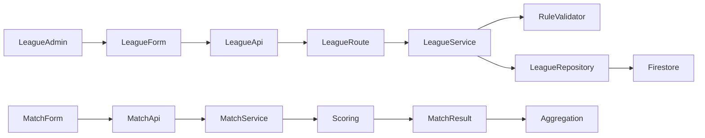
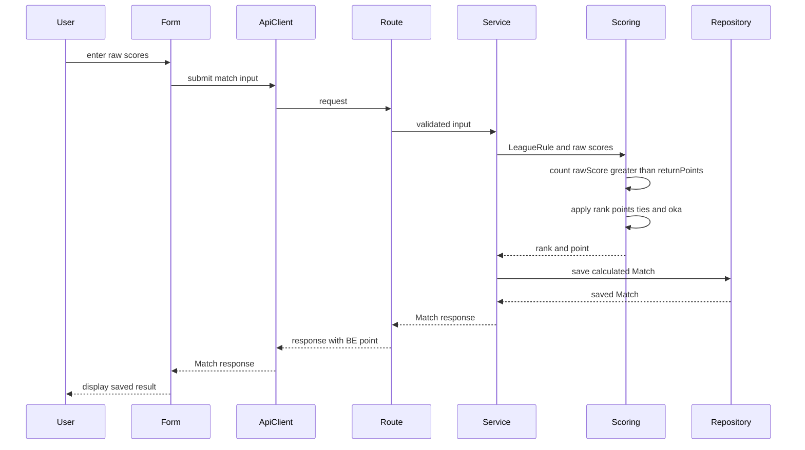

# 技術設計: variable-rank-points

## 1. Overview

### Summary

League ruleのumaに固定方式と浮き人数別方式を追加する。BEはraw scoreから返し点超過人数を数え、対応する順位点行を既存の同点処理・oka計算と合成する。FEはLeague作成・編集で方式と配点表を設定し、League詳細で表を表示する。既存Firestore ruleは方式なしを固定方式として読み込み、保存済みMatch結果は変更しない。

### Goals

- yonmaで0〜4人浮き別の1〜4位順位点を設定・計算する。
- 浮き判定、順位、同点、oka、丸めをBEで決定し、FEは結果を表示する。
- 既存の固定uma、Firestore文書、Match履歴と互換を保つ。

### Non-Goals

- Sanmaの浮き人数別順位点。
- League rule以外のMatch単位設定や独立rule master。
- 過去Match、user_stats、集計済み値の再計算・一括migration。
- 連盟公式ルール全体のpreset化。

## 2. Boundary Commitments

### This spec owns

- `LeagueRule.uma` の固定/浮き人数別unionとAPI・Firestore契約。
- 浮き人数別のLeague rule検証とMatch point算出。
- FEのLeague作成・編集・詳細画面における順位点の入力、検証、表示。
- OpenAPI、静的API/Firestore文書、seedの契約同期。

### Out of Boundary

- Sanma用の浮き人数別配点。
- Matchの入力項目、rank/point response shape、aggregateの算出方法の変更。
- 既存Match point・League/Season/UserStatsの一括再計算。
- `backend-integrity-lifecycle` が定めた最初のMatch後のrule lock変更。

### Allowed Dependencies

| 方向 | 依存先 | Criticality | 契約 |
|---|---|---:|---|
| Inbound | `backend-foundation` | P0 | League rule、Hono route、ErrorEnvelope、Firestore snake_case正本 |
| Inbound | `backend-integrity-lifecycle` | P0 | BE point計算、同点順位、oka、Match結果保存、rule lock |
| Inbound | `frontend-foundation-ui` | P0 | Hono RPC型、API client、FEの入力検証・error表示規約 |
| Inbound | `frontend-league-season` | P0 | League create/edit/detail routeとフォームの既存責務 |
| Outbound | Firestore | P0 | 既存League document内のembedded rule |
| External | Hono/Zod/React | P1 | 既存のroute入力検証とフォーム描画 |

### Revalidation Triggers

- `LeagueRule.uma` のmode名、union shape、`pointsByFloatingCount` のkeyまたはnull semanticsの変更。
- 浮き判定を `returnPoints` 以外に結び付ける変更、strict greater-thanの変更。
- 固定uma/動的表のゼロサム検証、同点配分、okaの適用、丸め許容値の変更。
- League rule lock、Firestore mapper、OpenAPI、Hono RPC型の変更。
- BE pointを利用する `frontend-session-match` または `frontend-statistics-quality` の表示・集計変更。

## 3. Architecture

### Technology Alignment

| Layer | Existing technology | Role |
|---|---|---|
| Backend | TypeScript、Hono、Zod | League rule型、route schema、point calculation |
| Persistence | Firebase Admin SDK、Firestore | embedded ruleの保存とlegacy読み込み |
| Frontend | Next.js 15.5.4、React 19、Tailwind CSS 4 | League rule入力と詳細表示 |
| API typing | Hono RPC `AppType` | FE request/response型をBE routeから導出 |

新規依存は導入しない。既存のLeague CRUD routeとフォームを拡張する。

### Components and Data Flow





League ruleの作成・編集は既存のLeague routeを通る。Match APIに新しいrouteや入力fieldは追加しない。

### Canonical Rule Model

Domain/APIのumaは次の判別可能unionとする。固定方式のrank valueは既存shapeを保ち、`mode`だけを明示する。浮き人数別方式はyonma専用で、全5行を必須とする。

```ts
type FloatingCount = 0 | 1 | 2 | 3 | 4;

type RankPoints = {
  first: number;
  second: number;
  third: number;
  fourth: number;
};

type FixedYonmaUma = {
  mode: "fixed";
  first: number;
  second: number;
  third: number;
  fourth: number;
};

type FixedSanmaUma = {
  mode: "fixed";
  first: number;
  second: number;
  third: number;
  fourth: null;
};

type FloatingCountUma = {
  mode: "floatingCount";
  pointsByFloatingCount: Record<FloatingCount, RankPoints>;
};

type UmaRule = FixedSanmaUma | FixedYonmaUma | FloatingCountUma;

type LeagueRule =
  | {
      gameType: "sanma";
      uma: FixedSanmaUma;
      oka: { startingPoints: number; returnPoints: number };
    }
  | {
      gameType: "yonma";
      uma: FixedYonmaUma | FloatingCountUma;
      oka: { startingPoints: number; returnPoints: number };
    };
```

`LeagueRule` の検証は `gameType` と `uma.mode` の組み合わせも確認する。`sanma` は `mode: "fixed"` かつ `fourth: null`、`yonma/fixed` は4つの順位点、`yonma/floatingCount` は0〜4人の各4順位点を持つ。順位点は現行のLeague rule入力と同じ整数とする。

### Calculation Contract

`calculateMatchPoints(rule, results)` は既存の計算入口を維持し、入力にrankや浮き人数を追加しない。入力の形は既存実装どおり、各要素が `{userId, userName, wind, rawScore}` である。

1. 現行どおりplayer count、wind、userId、raw score合計を検証する。
2. 浮き人数を `results.filter(result => result.rawScore > rule.oka.returnPoints).length` で算出する。返し点と同点の人は浮きに数えない。
3. raw score降順からcompetition rankingを決定する。
4. fixed modeでは現行の順位別uma、floatingCount modeでは算出した人数に対応する順位点行を選ぶ。
5. 同点者には占有する順位帯の順位点を平均配分する。okaは現行どおり1位slotに加算して同点者間で配分する。
6. 素点（`rawScore - returnPoints`）と配分済み順位点を合算し、小数第1位に丸める。既存の合計0許容検証を維持する。

配点行はすべて合計0とするため、返し点の異なる設定でも既存のoka計算と合成した総pointは丸め誤差内で0になる。例のstartingPoints/returnPointsがともに25,000点の場合、okaは0になる。

### Persistence and API Compatibility

API/DomainのfieldはcamelCase、Firestoreのfieldはsnake_caseを維持する。API responseと新FEの送信値では `mode` を明示する。既存API利用者向けには、modeを含まない現在のfixed requestもfixedとして受理し、Domainでは `mode: "fixed"` に正規化する。Firestoreも同様に旧文書のmode欠落をfixedとして読み、書き込み時は明示modeを保存する。

| Uma mode | API/Domain | Firestore |
|---|---|---|
| Fixed | `mode: "fixed"` と `first/second/third/fourth` | `mode: "fixed"` と既存の順位field |
| Floating | `mode: "floatingCount"` と `pointsByFloatingCount` の0〜4行 | `mode: "floating_count"` と `points_by_floating_count` の0〜4行 |

新規・更新APIのcanonical ruleとresponseにはmodeを含め、Hono RPCのFE型もunionを導出する。API requestではmodeを省略した既存fixed shapeも受け入れる。既存Firestore文書でmodeが欠落する場合だけ、Repository mapperが固定方式として読み取る。読み込みだけではFirestoreを書き換えず、一括migrationを行わない。書き込みが発生したruleは新しい明示modeで保存する。

floatingCountのAPI例は次の形とする。`pointsByFloatingCount` の5 keyをすべて必須にし、各行は1〜4位の整数を持つ。

```json
{
  "gameType": "yonma",
  "uma": {
    "mode": "floatingCount",
    "pointsByFloatingCount": {
      "0": { "first": 0, "second": 0, "third": 0, "fourth": 0 },
      "1": { "first": 12, "second": -1, "third": -3, "fourth": -8 },
      "2": { "first": 8, "second": 4, "third": -4, "fourth": -8 },
      "3": { "first": 8, "second": 3, "third": 1, "fourth": -12 },
      "4": { "first": 0, "second": 0, "third": 0, "fourth": 0 }
    }
  },
  "oka": { "startingPoints": 25000, "returnPoints": 25000 }
}
```

リーグrule詳細responseに全テーブルを含める。Match responseは現在どおりBE算出のrank/pointを返し、集計は保存済みMatch結果を使用する。

## 4. Components and Interfaces

### Component Summary

| Component | Intent | Requirements | Key dependency | Contracts |
|---|---|---|---|---|
| League Rule Contract | fixed/floatingCount umaとGameTypeのcanonical typeを定義する | 1.1-1.5, 4.1 | League domain | Type, API |
| Rule Validator | mode、人数行、ゼロサム条件を永続化前に検証する | 3.1-3.3 | League Rule Contract | Service |
| Match Scoring | 浮き人数、順位slot、同点、okaからpointを決定する | 2.1-2.4 | League Rule Contract | Service |
| Rule Persistence Mapper | legacy fixed文書をcanonical ruleへ変換し、新modeを保存する | 4.1 | Firestore | Data |
| HTTP Contract Publication | Zod/OpenAPI/Hono RPCにunionを公開する | 1.1-1.5, 3.2 | Rule Validator | API, Type |
| League Rule UI and Form Integration | ルールを入力・編集・詳細表示する | 1.1-1.5, 3.3, 4.3 | FE League API | UI, State |
| Rule Lock Compatibility | 最初のMatch後のルール固定と保存済みpointを維持する | 4.2 | League/Match repositories | State |

### League Rule Contract

- `backend/src/domain/league/types.ts` の `LeagueRule.uma` を上記 `UmaRule` unionにする。
- `backend/src/domain/league/repository.ts` とFEのHono RPC由来DTOはこのcontractを利用する。
- 同じLeagueRule typeをscoring層が受け、scoring専用の固定uma typeを重複定義しない。

### Rule Validator

```ts
validateLeagueRule(rule: LeagueRule): void;
```

- fixed/sanmaはfirst+second+thirdを0にし、fourthをnullとする。
- fixed/yonmaは4順位の合計を0にする。
- floatingCount/yonmaは0〜4すべての行を要求し、各行の4順位合計を0にする。
- floatingCount/sanma、欠落行、非整数、非ゼロ合計は `ValidationError` とし、League repositoryへ書き込まない。
- 動的行の合計違反detailsは `field: "rule.uma"`、`mode: "floatingCount"`、`floatingCount`、`expectedTotal: 0`、`actualTotal` を含める。

### Match Scoring

`calculateMatchPoints(rule: LeagueRule, results: Array<{userId: string; userName: string; wind: Wind; rawScore: number}>): MatchResult[]` を計算契約とする。`MatchService.buildMatchResults` はLeagueRepositoryから取得したcanonical LeagueRuleを渡し、requestからrank/float countを受け取らない。浮き人数の選択は全4人のraw scoreから行い、順位tie処理は現行のcompetition rankingとoccupied rank slotsの平均配分を維持する。

### Rule Persistence Mapper

- `mapLeagueRule` はFirestore `uma.mode` が無い既存documentをfixedとして解釈する。
- `mode: "fixed"` は既存のfirst/second/third/fourth leaf fieldsを保持する。
- `mode: "floating_count"` は0〜4のkeyごとに4順位点を読み書きする。
- 不正なmode、欠損値、非数値は必須データ違反としてfail fastにし、0や空表へ補完しない。
- `seedFirestore.ts` は新しいfixed modeを明示してseedする。

### Rule Lock Compatibility

- League作成時の `rule_locked: false`、Match作成transactionでの `rule_locked: true`、locked Leagueへのrule update時のHTTP conflictを維持する。
- 新しいrule unionをmapperで読み書きしてもlifecycle metadataをAPI/Domain DTOへ露出しない。
- 保存済みMatchの `rank` / `point` と既存aggregateには触れない。Match登録後の編集画面は既存のrule lock errorを表示し、別ruleへの移行や再計算は提供しない。

### HTTP Contract Publication

- `leagueRuleSchema` は固定umaと浮き人数別umaのdiscriminated unionを検証する。League rule全体でgameType/mode整合を検証する。既存形式のmodeなしfixed requestは固定方式としてcanonical Domain型に変換する。
- create/update routeはLeagueServiceのdomain validatorをRepository write前に実行する。domain sum errorはHTTP 400 `validation_error` と既存ErrorEnvelopeを使用する。
- OpenAPI responseはcanonical `UmaRule` の `oneOf` と `mode` discriminator、全人数行、integer rank pointsを記載する。requestは新canonical unionに加えて既存modeなしfixed shapeも受け付けることを記載する。
- API route/statusを増やさない。`AppType` からFE request/responseを導出する。

### League Rule Editor and Summary

| UI state | 表示 |
|---|---|
| Yonma + fixed | 現行の4順位点入力とmode selector |
| Yonma + floatingCount | 0〜4人浮きの5行、各1〜4位入力、提示された初期値 |
| Sanma | 現行の3順位点入力。floating modeは選択不可 |
| Rule detail | fixed値、または全5行の順位点と「返し点を超えた人数」の説明 |

- `frontend/src/features/league/ui/league-rule-editor.tsx` はcreate/editで共用する。form stateは既存ページhooksが所有し、表示componentはprops/callbackで受け渡す。固定値と浮き人数別表の状態を保持し、mode切替時に入力済みの別modeの値を失わない。初回に浮き人数別を選択した時はissue記載の初期表を表示する。
- 四麻から三麻へ切り替えるとmode selectorを隠して固定順位点を表示し、三麻のまま送信する場合は固定ruleを送る。下書き中の浮き人数別表と四麻のmodeは保持し、四麻へ戻すと再表示する。
- 浮き人数別の初期値は `0: [0, 0, 0, 0]`、`1: [12, -1, -3, -8]`、`2: [8, 4, -4, -8]`、`3: [8, 3, 1, -12]`、`4: [0, 0, 0, 0]` とする。入力中の空欄を扱えるよう、FE form stateは文字列で保持し、送信時に整数へ変換する。
- 大画面では見出し付きtable、小画面では浮き人数別cardに順位入力を2列で配置し、横スクロールを発生させない。
- 各入力は可視labelとし、行合計とエラーをその行に出す。エラーfieldは `aria-describedby` で関連付ける。submit error summaryから不正行へ移動できるようにする。
- 送信中loading、API error表示、入力値保持を既存フォームの状態規約に従って行う。
- `frontend/src/features/league/ui/league-rule-summary.tsx` はLeague詳細で全配点と基準点を表示する。FEはpointを計算しない。

## 5. File Structure Plan

| Component | Path | Responsibility |
|---|---|---|
| League Rule Contract | `backend/src/domain/league/types.ts` | `UmaRule` と `LeagueRule` のunion |
| Rule Validator | `backend/src/domain/league/rule.ts` | fixed/floatingCount mode、gameType、各行の合計検証 |
| Match Scoring | `backend/src/domain/shared/scoring.ts` | 浮き人数、選択行、同点・oka・point計算 |
| Rule Persistence Mapper | `backend/src/infrastructure/firestore/repositories/leagueRepository.ts` | legacy mapping、snake_case mode/tableの読書き |
| Rule Persistence Mapper | `backend/src/scripts/seedFirestore.ts` | 明示fixed modeによるseed生成 |
| HTTP Contract Publication | `backend/src/presentation/schemas/league.ts` | fixed/floating request union、旧fixed request正規化 |
| HTTP Contract Publication | `backend/src/presentation/openapi.ts` | LeagueRule oneOf/discriminatorとAPI schema |
| HTTP Contract Publication | `backend/docs/api-design.md` | rule shape、mode、計算境界 |
| HTTP Contract Publication | `backend/docs/api-reference.md` | League create/update/detail example |
| HTTP Contract Publication | `backend/docs/firestore.yaml` | fixed/floating rule保存形とlegacy read note |
| HTTP Contract Publication | `backend/docs/rule-validation-contract.md` | floating row validation detail契約 |
| Rule Validator | `backend/src/domain/league/rule.test.ts` | sanma/fixed/yonma/5行/invalid modes |
| Match Scoring | `backend/src/domain/shared/scoring.test.ts` | count 0〜4、strict threshold、ties、oka、zero-sum |
| Rule Lock Compatibility | `backend/src/infrastructure/firestore/repositories/lifecycle.emulator.test.ts` | rule lock regressionとMatch lifecycle contract |
| League Rule UI and Form Integration | `frontend/src/features/league/model/validation.ts` | fixed/floating rowsのFE事前検証 |
| League Rule UI and Form Integration | `frontend/src/features/league/ui/league-rule-editor.tsx` | create/edit共有mode selectorと順位点入力 |
| League Rule UI and Form Integration | `frontend/src/features/league/ui/league-rule-summary.tsx` | League詳細のrule表示 |
| League Rule UI and Form Integration | `frontend/src/app/league/new/hooks/index.ts`、`page.tsx` | create state、payload、editor接続 |
| League Rule UI and Form Integration | `frontend/src/app/league/[leagueId]/edit/hooks/index.ts`、`page.tsx` | rule読込、edit state、payload、editor接続 |
| League Rule UI and Form Integration | `frontend/src/app/league/[leagueId]/page.tsx` | fixed/floating detail summary接続 |
| Rule Lock Compatibility | `backend/src/application/services/leagueService.ts`、`backend/src/infrastructure/firestore/repositories/leagueRepository.ts`、`backend/src/infrastructure/firestore/repositories/matchRepository.ts` | 既存の初回Match後のrule lockを維持 |

## 6. Integration and Migration Notes

1. Domain/API type union、Zod schema、OpenAPIを同一の契約変更として合わせる。
2. Firestore mapperをlegacy fixed read対応にし、新規/更新writeとseedにmodeを付ける。既存文書へのbatch backfillはしない。
3. BE validator/scoringを更新し、既存rule lockと保存済みMatch pointを保つ。
4. FE API型をHono routeから導出し、League create/edit hooksとeditor、detail summaryを更新する。
5. `frontend-session-match` と `frontend-statistics-quality` は既存rank/point/aggregate shapeを引き続き読み、BEで算出済みの値を表示する。

API responseにmodeを追加する。modeなしfixed requestは引き続き受理し、floatingCount requestはmodeと全5行を必須とする。FE/BEを同じリリース単位で更新する。既存Firestore documentはmapperがlazy normalizeするため、切替前のデータ移行は不要である。

## 7. Validation Strategy

| Validation area | 確認内容 | Requirements |
|---|---|---|
| Rule domain validation | fixed sanma 3値、fixed yonma 4値、floatingCount 5行、欠落/非整数/非ゼロ合計、sanma floating拒否 | 1.3, 3.1, 3.2, 4.1 |
| Scoring | 0〜4人の選択、`rawScore === returnPoints`、strict greater、同順位が隣接slotを跨ぐ配分、oka別計算、小数第1位、合計0 | 2.1-2.4 |
| Persistence | mode無し旧文書がfixedになること、floating table roundtrip、invalid stored shape fail-fast、一括更新なし | 4.1 |
| Rule lock lifecycle | 最初のMatch作成transaction後のrule updateがconflictとなり、Match削除後もlockと既存pointが維持される | 4.2 |
| HTTP contract | fixed/floatingCount union、gameTypeとmode整合、validation details、OpenAPI一致 | 1.1-1.5, 3.1-3.2 |
| FE form | new/edit初期値、全5行入力、mode切替時の値保持、行別合計error、返し点基準説明、詳細表示、API error時の入力保持、keyboard/accessibility | 1.1-1.5, 3.3, 4.3 |
| End-to-end flow | floatingCount League作成、Match登録、BE point responseの結果/集計表示、legacy fixed Leagueの閲覧 | 2.1-2.4, 4.1-4.3 |

検証は既存のbackend `node:test` suite、frontend typecheck/lint/build、League作成からMatch結果表示までのsmoke flowを使う。新規テスト基盤やscore calculation libraryは導入しない。

## 8. Open Questions and Risks

- **API同期リスク**: Hono response DTOにdiscriminatorを追加するため、FE/BEは同じ変更単位で出す。既存clientのmodeなしfixed requestはfixedとして受理し、mode migrationによる既存clientへの影響を抑える。
- **legacy data risk**: 既存Firestore umaにmodeが無い。Mapperはこの形だけ固定として読む。dynamic modeと判断する推測や自動backfillはしない。
- **rule edit lock**: Match登録後は現行どおりLeague ruleを変更できないため、dynamic設定を既存の記録済みLeagueへ後付けする移行は本仕様では提供しない。
- **rounding/tie**: 既存の同順位帯平均配分と小数第1位丸めを維持する。table行合計0とoka別計算でtotal point zero-sumを保つ。

## 9. Requirements Traceability

| Requirement | Summary | Components | Interfaces / Flows |
|---|---|---|---|
| 1.1 | 四麻でfixed/floatingCountを選択 | League Rule Contract, League Rule UI and Form Integration | League create/edit |
| 1.2 | 0〜4人の全順位点入力と初期値 | League Rule Contract, League Rule UI and Form Integration | Floating count editor |
| 1.3 | 三麻でfixed設定を維持 | League Rule Contract, League Rule UI and Form Integration | Sanma League form |
| 1.4 | 保存済みfloating表を再表示 | Rule Persistence Mapper, League Rule UI and Form Integration | Firestore -> League detail -> edit form |
| 1.5 | 詳細に全表と判定基準を表示 | League Rule UI and Form Integration | League detail |
| 2.1 | 返し点を厳密に超えたraw scoreの人数を数える | Match Scoring | LeagueRule.returnPoints → calculateMatchPoints |
| 2.2 | 浮き人数に対応する行を順位別に適用する | Match Scoring | selected row + raw score rank → MatchResult |
| 2.3 | okaを独立適用し、同点帯で等分して小数第1位へ丸める | Match Scoring | rank slots -> point |
| 2.4 | 同じ入力の結果を決定し、合計0を保つ | Match Scoring | calculateMatchPoints invariant |
| 3.1 | fixed値またはfloating各行の合計0 | Rule Validator | LeagueService validation before repository write |
| 3.2 | 欠落行・非数値・非ゼロ合計の保存拒否 | Rule Validator, HTTP Contract Publication | Zod -> LeagueService -> ErrorEnvelope |
| 3.3 | FEで合計エラー、BEが最終判定 | League Rule UI and Form Integration, HTTP Contract Publication | Form validation -> League API -> LeagueService |
| 4.1 | modeなし既存Leagueをfixedとして読む | Rule Persistence Mapper, Match Scoring | Firestore legacy doc -> canonical LeagueRule -> same scoring |
| 4.2 | rule lockと既存Match/aggregate保持 | Rule Lock Compatibility | Match create transaction locks rule; later update returns conflict |
| 4.3 | FEはBE保存pointを表示 | League Rule UI and Form Integration | MatchResult -> existing Session/Match and statistics screens |
